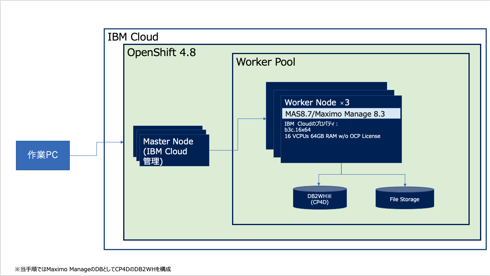

# 構成と前提

### 前提
* 当手順はMacまたはLinuxから実施する想定の手順となっております。主に構築手順の検証にはMacを利用しています。作業PCがWindowsの場合は、WSL等を利用して、Linuxから実施することをご検討ください。WSL2(Ubuntu 20.04.4 LTS)を使用して構築できることは確認済です。

* TechzoneのROKS環境(IBM Cloud)に導入する手順を記載しています。利用できるストレージクラスなどは各環境に依存するため、適宜読み替えて実施ください。
* MASはインストールモジュールを利用して導入する手順になります。アップデート時は同様にマニュアルでの対応が必要な手順になります。

    Upgrading Maximo Application Suite

    https://www.ibm.com/docs/en/mas87/8.7.0?topic=upgrading

* ManageのデータベースとしてDB2WHを利用するために、CP4Dを導入しています。データベースを別途用意する場合、CP4Dの導入は不要です。その場合、各データベースに応じたセットアップ手順を実施ください。

    Preparing your database for deployment

    https://www.ibm.com/docs/en/maximo-manage/8.3.0?topic=database-preparing-your-deployment

    Setting up your database

    https://www.ibm.com/docs/en/maximo-manage/8.3.0?topic=deploy-setting-up-your-database

### 構成

### 次項
- [01 事前準備](../01_prereqs/index.md)
