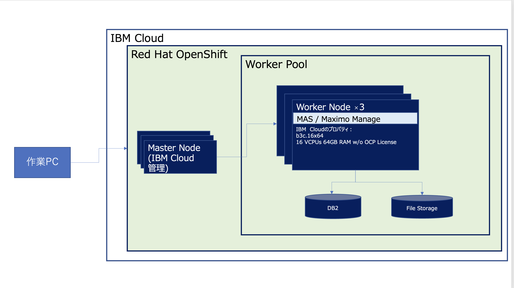

# 構成と前提

### 前提
* 当手順はMacまたはLinuxから実施する想定の手順となっております。主に構築手順の検証にはMacを利用しています。作業PCがWindowsの場合は、WSL等を利用して、Linuxから実施することをご検討ください。WSL2(Ubuntu 20.04.4 LTS)を使用して構築できることは確認済です。

### 構成

### 前項
- [トップページ](../README.md)

### 次項
- [01 事前準備](../01_prereqs/index.md)
