## 1.事前準備

### 1.Techzone ROKS 環境作成手順 - MAS 8.7

Red Hat OpenShift on IBM Cloud 環境を [Techzone](https://techzone.ibm.com/) から作成します。

1. Techzone https://techzone.ibm.com/ 

2. "ROKS"で検索して、[Custom ROKS & VMware requests](https://techzone.ibm.com/collection/custom-roks-vmware-requests) を開きます。
   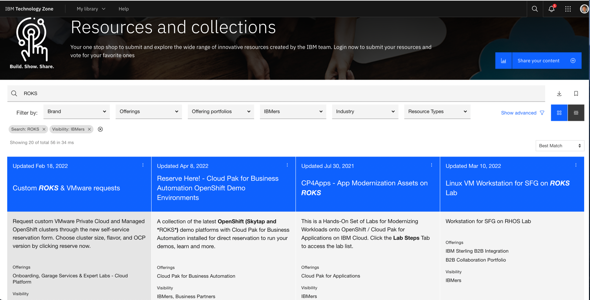

   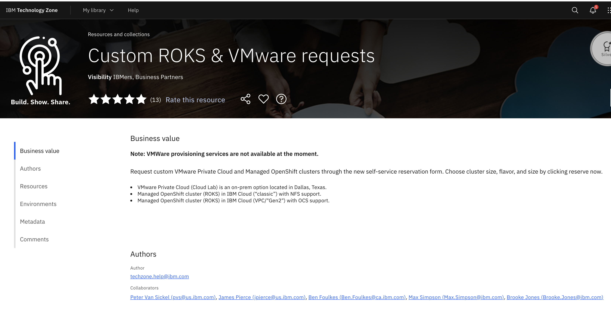

3. Environments セクションから IBM RedHat Openshift Kubernates Service (ROKS) を選択します。

*TeckzoneのROKSには(ROKS)と(VPC Gen2 with OCS)があり今回の手順では(ROKS)を利用しております。(VPC Gen2 with OCS)を活用してのインストールも可能ですが、ストレージクラスなどの設定が異なります。その詳細について同手順書では記載しておりません。
   
   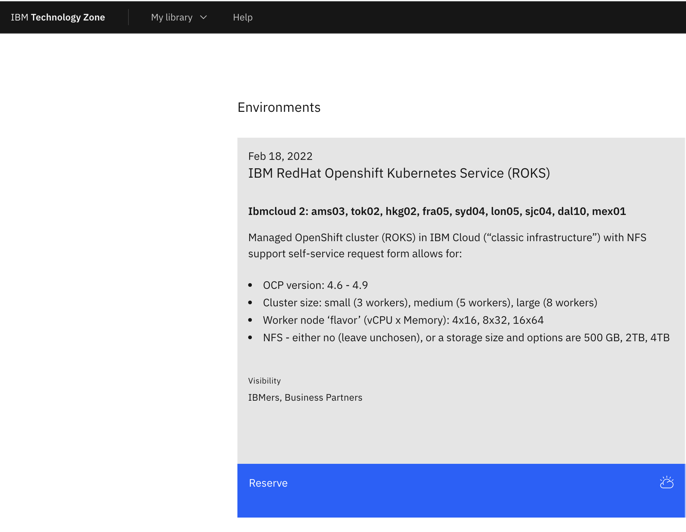

4. 環境が必要な日付を選択する。"Reservce now"  OR  "Schedule for later"
   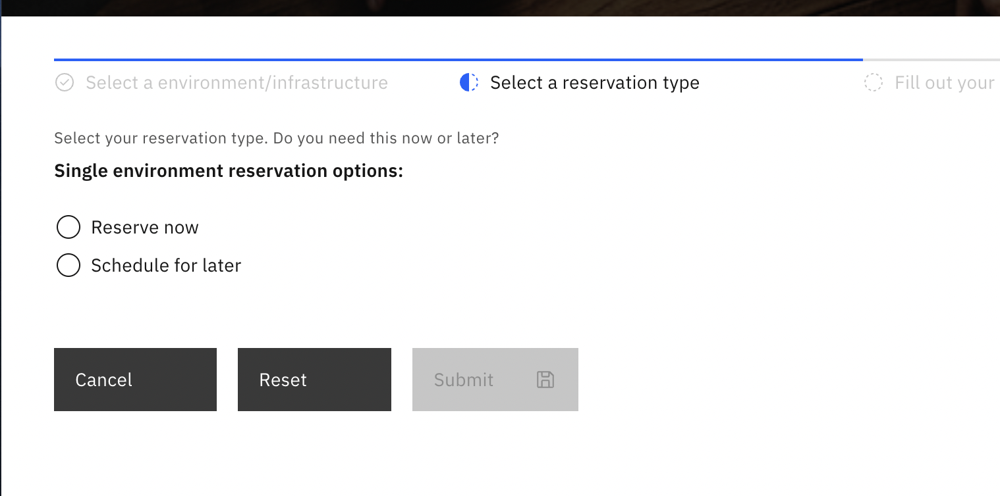

5. Name, Purpose, Preferred Geography, Notes を選択、記入して、Submitします。
   終了日は、最長2週間まで選択可能です。 また、ISCの案件番号を入力してPoT, PoCなどのPurposeを選ぶと最大3ヶ月の利用ができますが、その場合は毎週延長処理が必要です。

   | Name                    | IBM RedHat Openshift Kubernetes Service (ROKS) |
   | ----------------------- | ---------------------------------------------- |
   | **Purpose**             | Practice / Self-Education                      |
   | **Preferred Geography** | Select your Geography                          |
   | **Worker Node Count**   | 8                                              |
   | **Worker Node Flavor**  | 16 CPU x 64 GB (300GB Secondary Storage)                                |
   | **NFS Size**            | 2 TB                                           |
   | **OpenShift Version**   | 4.8 (MAS 8.7の場合)                        |

   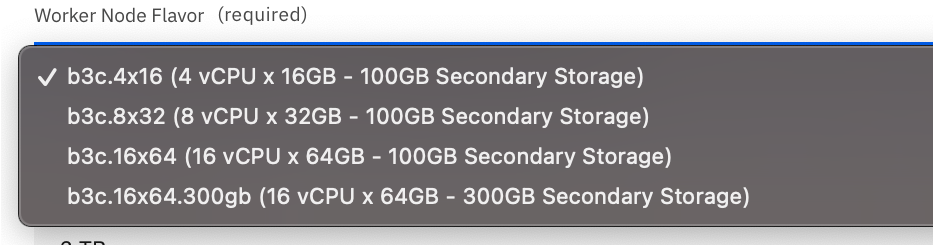
   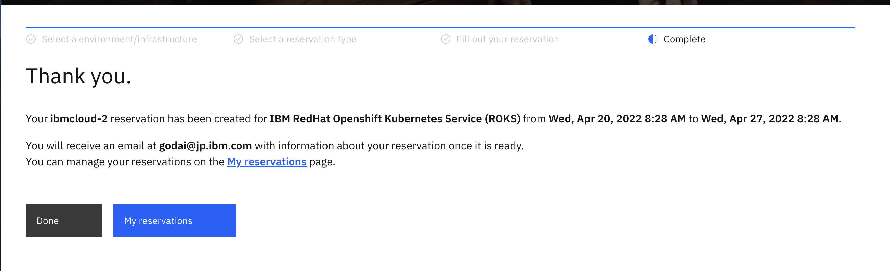

6. IBM Cloud より ITZ - V2 アカウントへの招待メールが届くので参加
   

7. 40分ほどでデプロイ完了メールが届きます。
   
   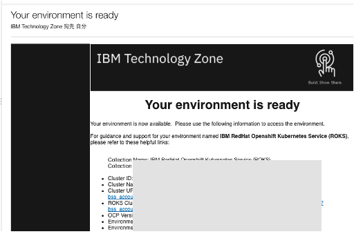

8. IBM Cloud にログイン後、参加したアカウントに切り替えて、OpenShift クラスターを表示
   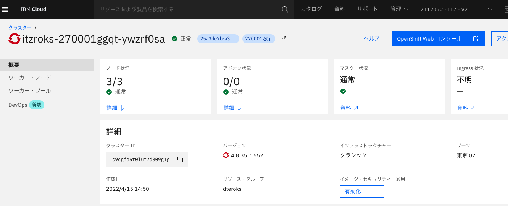


### 2.Maximo Application Suiteのインストールモジュールのダウンロード

以下はIBM社員向け手順になります。パートナー様はPassport Advantageからのダウンロードを実施ください。

1. https://w3.ibm.com/w3publisher/software-downloads にアクセス
2. Software Downloadsをクリック
3. Agree
4. 以下の条件でSearch
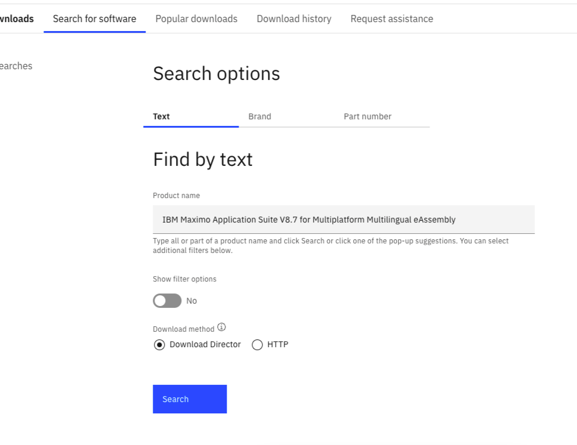
- Product name
  - IBM Maximo Application Suite V8.7 for Multiplatform Multilingual eAssembly
- Show filter options
  - No
- Download method
  - Download Director (Download Directorを導入している場合)
5. IBM Maximo Application Suite V8.7 for Multiplatform Multilingualを選択し、I Agreeの上ダウンロード
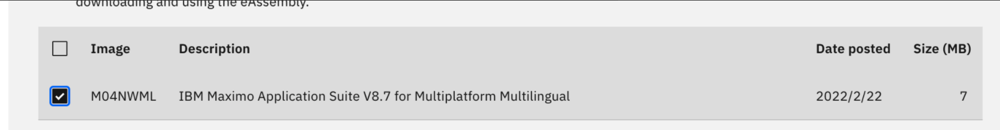

### 3.oc cliの導入
OpenshiftのWebコンソールの「?」からコマンドラインツールをダウンロードし、パスを通します。
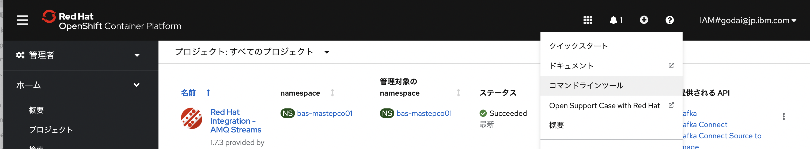


ocコマンドのパスが通っていることを確認 (Macの場合の例)
```bash
% oc
OpenShift Client

This client helps you develop, build, deploy, and run your applications on any
OpenShift or Kubernetes cluster. It also includes the administrative
commands for managing a cluster under the 'adm' subcommand.

To familiarize yourself with OpenShift, login to your cluster and try creating a
sample application:

    oc login mycluster.mycompany.com
    oc new-project my-example
    oc new-app django-psql-example
    oc logs -f bc/django-psql-example

To see what has been created, run:

    oc status

and get a command shell inside one of the created containers with:

    oc rsh dc/postgresql

To see the list of available toolchains for building applications, run:

    oc new-app -L

Since OpenShift runs on top of Kubernetes, your favorite kubectl commands are
also present in oc,
allowing you to quickly switch between development and debugging. You can also
run kubectl directly
against any OpenShift cluster using the kubeconfig file created by 'oc login'.

For more on OpenShift, see the documentation at https://docs.openshift.com.

To see the full list of commands supported, run 'oc --help'.
```

### 4.cfsslコマンドのインストール
BASのインストールで利用するコマンドを導入します。

Macの場合のインストールコマンドの例:
```bash
brew install cfssl
```

cfsslが導入されたことを以下のコマンドで確認

```bash
% cfssl version
Version: 1.2.0
Revision: dev
Runtime: go1.8.1
```

### 5.gitの導入
git コマンドを導入します。

https://git-scm.com/book/en/v2/Getting-Started-Installing-Git

gitが導入されたことを以下のコマンドで確認

```bash
% git version
git version 2.32.0 (Apple Git-132)
```

### 6.Javaの導入
Java 8以上を導入します。各端末の環境に準じた手順を実施します。

### 7.IBM IDの取得
以下のサイトからIBM IDを取得します。

https://cloud.ibm.com/registration

### 8.CP4D導入の前提準備
「IBM CloudPak for Data (CP4D)」の章に記載

### 次項
- [02_IBM Operator Catalog の追加](../02_isc/index.md)
