## 1.事前準備

※Windows環境の場合はWSLなどのLinux環境の導入が必要となり、シェルコマンドはLinux環境から実行することになります。  
WSLの導入手順については[こちら](https://docs.microsoft.com/ja-jp/windows/wsl/setup/environment)を参照してください。

### 1.Techzone ROKS 環境作成手順 - MAS 8.8

Red Hat OpenShift on IBM Cloud 環境を [Techzone](https://techzone.ibm.com/) から作成します。

1. Techzone https://techzone.ibm.com/

2. "ROKS"で検索して、[Custom ROKS & VMware requests](https://techzone.ibm.com/collection/custom-roks-vmware-requests) を開きます。
   

   

3. Environments セクションから IBM RedHat Openshift Kubernates Service (ROKS) を選択します。

*TeckzoneのROKSには(ROKS)と(VPC Gen2 with OCS)があり今回の手順では(ROKS)を利用しております。(VPC Gen2 with OCS)を活用してのインストールも可能ですが、ストレージクラスなどの設定が異なります。その詳細について同手順書では記載しておりません。

   

4. 環境が必要な日付を選択する。"Reservce now"  OR  "Schedule for later"
   

5. Name, Purpose, Preferred Geography, Notes を選択、記入して、Submitします。
   終了日は、最長2週間まで選択可能です。 また、ISCの案件番号を入力してPoT, PoCなどのPurposeを選ぶと最大3ヶ月の利用ができますが、その場合は毎週延長処理が必要です。

   | Name                    | IBM RedHat Openshift Kubernetes Service (ROKS) |
   | ----------------------- | ---------------------------------------------- |
   | **Purpose**             | Practice / Self-Education                      |
   | **Preferred Geography** | Select your Geography                          |
   | **Worker Node Count**   | 8                                              |
   | **Worker Node Flavor**  | 16 CPU x 64 GB (300GB Secondary Storage)       |
   | **NFS Size**            | 2 TB                                           |
   | **OpenShift Version**   | 4.8 (MAS 8.8の場合)                            |

   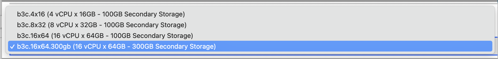
   

6. IBM Cloud より ITZ - V2 アカウントへの招待メールが届くので参加します。
   

7. 40分ほどでデプロイ完了メールが届きます。

   

8. IBM Cloud にログイン後、参加したアカウントに切り替えて、OpenShift クラスターを表示します。
   


### 2.インストール実行環境の準備

1. インターネット接続可能なdockerまたはpodmanコマンドが使用可能な環境を用意します。  
  当手順では以降podmanを使用して手順を進めます。

    podmanの導入方法は以下リンク先のPodman Installation Instructionsを参照してください。  
    https://podman.io/getting-started/installation

    WindowsやMacでpodmanを使用する方は、事前に下記のコマンドでpodmanをstartしておいてください。  
    ```bash
    podman machine start
    ```
    詳細はpodmanのドキュメントをご参照ください  
    https://docs.podman.io/en/latest/markdown/podman-machine-start.1.html
 


### 3.コンテナイメージのダウンロード

下記の手順でコンテナイメージをダウンロードします。  今回は「ibm-mas/cli: 2.1.2」のコンテナを使用しています。  
このコンテナであれば、MAS8.8とMAS8.7のインストールに成功しています。(2022/8/19時点)
最新のビルドを利用していただいても構いません。

1. https://quay.io/ibmmas/cli にブラウザーでアクセスします。

    左の「Tags」タブからコンテナイメージの一覧を表示します。

    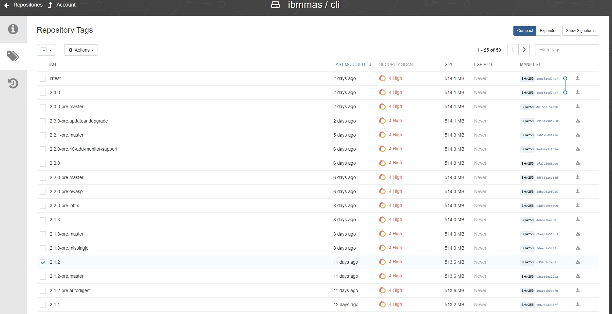

2. 「ibm-mas/cli: 2.1.2」のコンテナをチェックして右のダウンロードマークをクリックします。

    Podman Pull(by tag)を選択します。

    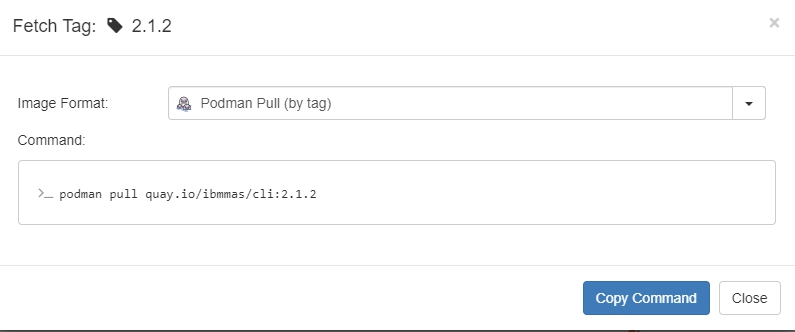

3. cli実行環境のターミナルにコマンドをペーストして実行します。


    ```bash
    masenv@IBM-PF39YTN4:~$ podman pull quay.io/ibmmas/cli:2.1.2
    ```

<details>
<summary>実行ログ</summary>

```bash
masenv@IBM-PF39YTN4:~$ podman pull quay.io/ibmmas/cli:2.1.2
Trying to pull quay.io/ibmmas/cli:2.1.2...
Getting image source signatures
Copying blob 1880e99bc671 done
Copying blob 2f557b52d9c6 done
Copying blob c00285895a5c done
Copying blob 0a915135d050 done
Copying blob b913d1abf24f done
Copying blob 99a39ffc6054 done
Copying blob 7f0de1523086 done
Copying blob b01f7afb8e56 done
Copying blob 63c22efcd3c2 done
Copying blob fe91c5d3cd7c done
Copying blob 1eea09ffb3de done
Copying blob cd81894a17e0 done
Copying blob ab87d4cfc977 done
Copying blob 99069f3a55e5 done
Copying blob 4faca937f684 done
Copying blob ff469c7f24df done
Copying blob 5dcbe75d5c28 done
Copying config bb65336e27 done
Writing manifest to image destination
Storing signatures
bb65336e27e4fa45e25f41bf73461bc4b5a61680fe7ee72b19bb1ee4aef797f5
```

</details>


4. ダウンロードしたコンテナイメージの確認します。

    ```bash
    masenv@IBM-PF39YTN4:~$ podman images
    REPOSITORY                     TAG         IMAGE ID      CREATED        SIZE
    quay.io/ibmmas/cli             2.1.2       bb65336e27e4  8 days ago     1.78 GB
    ```

### 4.MASライセンスファイルの取得

社内利用では、MASのライセンスファイルはLicense Key Centerから取得します。  
お客さま環境構築やPOC用のライセンスを持っている場合は以下の操作をスキップしてください。

1. ランダムな12桁の16進数形式の文字列を用意します。

    ここで生成した文字列(Host ID)はインストール時にも必要になるため控えておいてください。  

    ```bash
    ■Host IDとは：
    Host IDとは、ライセンス・キーを登録するマシンのハードウェアを識別するために用いられる用語になります。  
    License Key Centerでは、Host IDにはイーサネットアドレスを入力するように案内されています。  
    ただし、OpenShiftクラスター環境の今回のインストール方式(ibm/cli)では、Host IDはMAS installの段階で作成されるため、MAS install前に取得することはできません。  
    その為、事前に乱数などを利用してHost IDを作成する必要があります。
    ```
    参考までに、ランダムな12桁の16進数形式の文字列を生成するコマンドを記載します。


    ```bash
    masenv@IBM-PF39YTN4:~$ openssl rand -hex 6
    89df95c30014
    ```


2. License Key Centerへアクセスしてログインします。

    https://www.ibm.com/support/pages/ibm-support-licensing-start-page

3. Get keysより、IBM AppPoint Suites を開きます。

    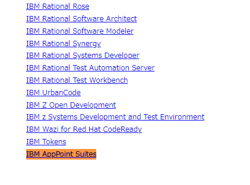

4. IBM MAXIMO APPLICATION SUITE AppPOINT LIC を選択します。

    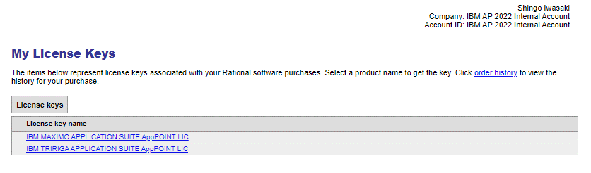

5. Nextボタンをクリックします。

6. 必要項目を入力します。


    | 項目                                          | 値                                                  |
    | --------------------------------------------- | --------------------------------------------------- |
    | **IBM MAXIMO APPLICATION SUITE AppPOINT LIC** | 150 （必要に応じて変更）                            |
    | **Override License Expiration Date**          | （空欄）                                            |
    | **Version**                                   | IBM Maximo Application Suite AppPoint Lic           |
    | **Existing hosts**                            | Use existing host                                   |
    | **Server Configuration**                      | Single License Server                               |
    | **Host ID Type**                              | Ethernet Address (Windows, Linux, UNIX, or Solaris) |
    | **Host ID**                                   | （1. で作成したランダムな12桁文字列）               |
    | **Hostname**                                  | host                                                |
    | **Port**                                      | 27000                                               |
    | **Description**                               | （空欄）                                            |


    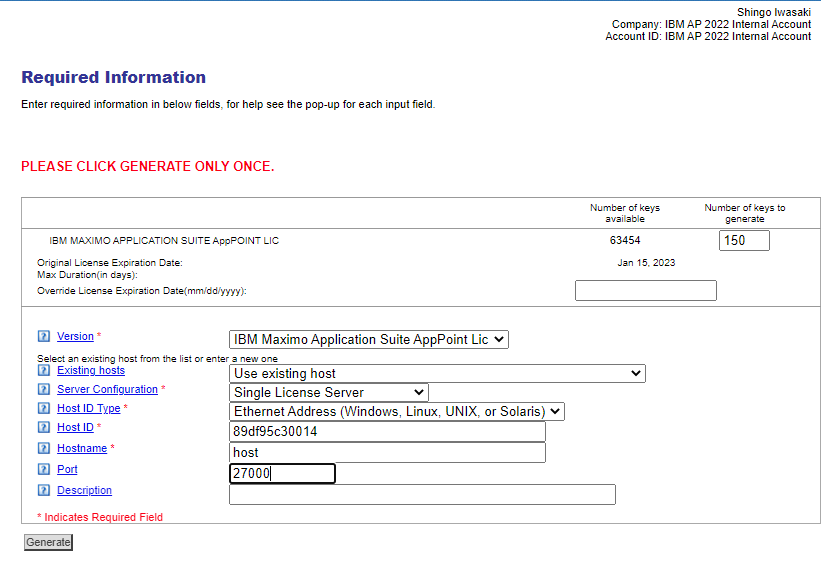

7. Generateボタンをクリックします。

8. Download License Kyesボタンをクリックします。

    「license.dat」 という名前のファイルがダウンロードされます

9. 「entitlement.lic」 というファイル名に変更してcliインストール実行環境にコピーします。

    ```bash
    > pwd
    /work
    > ls
    entitlement.lic
    ```


### 5.IBM Entitlement Keyの取得

IBM Container Library にログインしてEntitlement Keyを取得します。

1. 下記にアクセスしてログインします

    https://myibm.ibm.com/products-services/containerlibrary

2. Copy keyボタンをクリックします。

    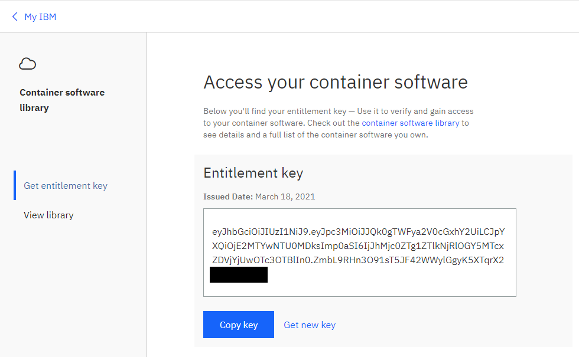

3. テキストファイルなどに貼り付けて保存します。


### 6.IBM Cloud APIキーの取得

1. 下記にアクセスしてログインします。

    https://cloud.ibm.com

2. 画面上部のメニューより 管理 → アクセス(IAM) を選択します。

    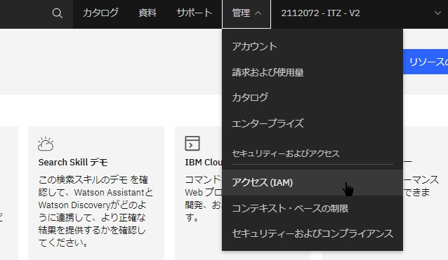

3. APIキーを選択します。


4. APIキーが作成されていない場合は、IBM Cloud API キーの作成ボタンをクリックして作成します。

    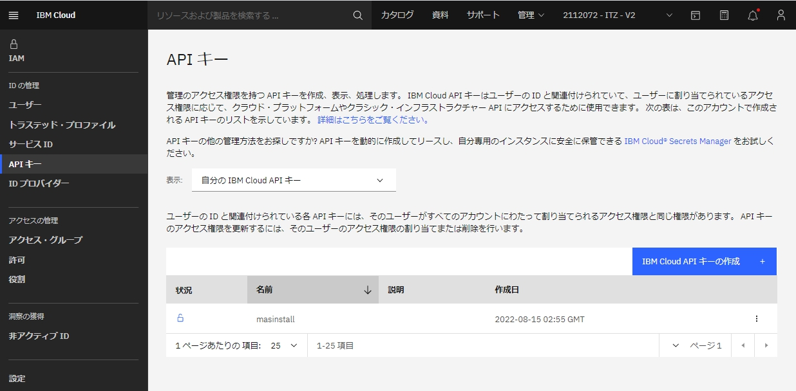

5. APIキーをコピーします。  
   
   APIキーの再表示は不可のため注意してください。


6. テキストファイルなどに貼り付けて保存します。

    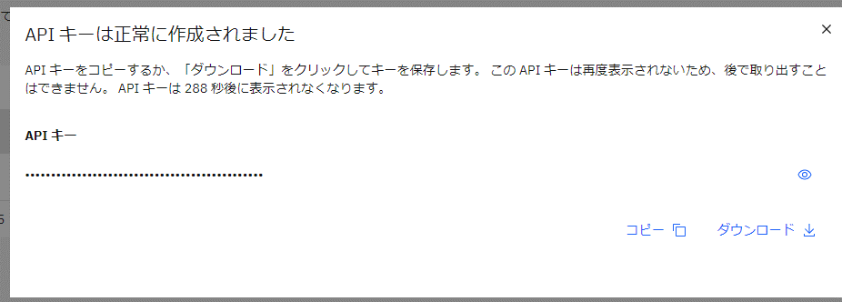


### 7.OCPクラスター名、バージョンの取得

1. 下記にアクセスしてログインします。

    https://cloud.ibm.com


2. ご使用のアカウントを選択します。

    ここではTechZONE環境の「ITZ - V2」を選択しています。


3. OpenShift → クラスターを開きます。


4. クラスターの名前とバージョンをメモします。

    ここでは下記の「クラスター名」(itzroks-2700034gbd-ug2zv49t、「バージョン」(4.8)を控えておきます。

    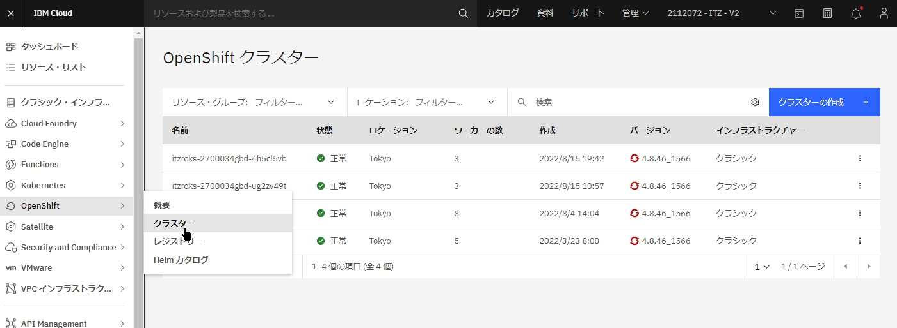

5. ゾーンをメモします。

    「Datacenter」のtok05などの値は、対象のクラスターをクリックするとその中で「Zone(ゾーン)」として記載されているので控えておきます。


### 8.OCP環境情報の取得

OCP環境のServer URLとTokenを取得します。  

Tokenは数分毎で更新されるため、都度最新の値を確認します。


1. IBM CloudにログインしてOpenShiftクラスターを開きます。

2. OpenShift Web コンソールボタンをクリックします。

    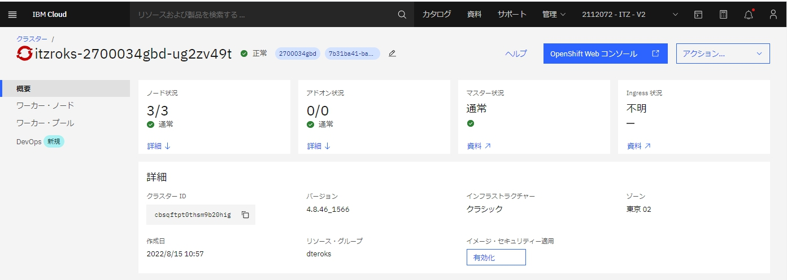

3. 画面左上メニューからCopy login command を開きます。

    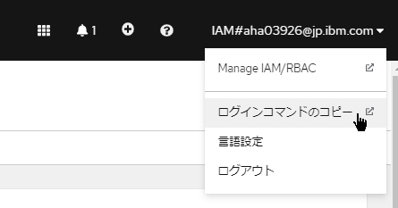


4. Display Tokenのリンクをクリックします。

    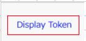

5. Server URLとAPI tokenをメモしておきます。


   | 項目           | 値                                                   |
   | -------------- | ---------------------------------------------------- |
   | **Server URL** | https://c115-e.jp-tok.containers.cloud.ibm.com:32726 |
   | **API token**  | sha256~uXQGjIu-EfltVtTiVmeYO8lDiwatVQpXkglXXXXXXXX   |

    

    Server URlとAPI Tokenの例：
    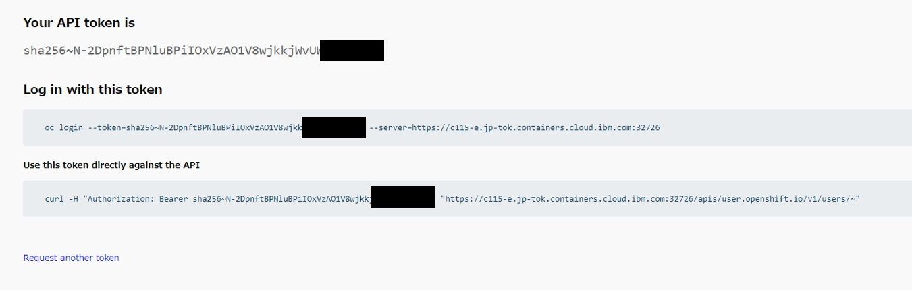


### 前項
- [ 00_構成と前提 ](../00_architecture/index.md)

### 次項
- [ 02_MASインストール前準備 ](../02_preparation/index.md)
