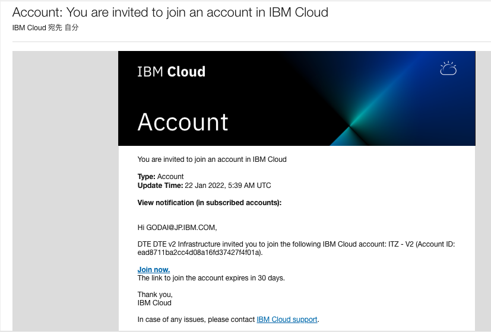

## 1.事前準備

※Windows環境の場合はWSLなどのLinux環境の導入が必要となり、シェルコマンドはLinux環境から実行することになります。  
WSLの導入手順については[こちら](https://docs.microsoft.com/ja-jp/windows/wsl/setup/environment)を参照してください。

### 1.Techzone ROKS 環境作成手順

Red Hat OpenShift on IBM Cloud 環境を [Techzone](https://techzone.ibm.com/) から作成します。

1. Techzone https://techzone.ibm.com/

2. "ROKS"で検索して、[Custom ROKS & VMware requests](https://techzone.ibm.com/collection/custom-roks-vmware-requests) を開きます。
   

   

3. Environments セクションから IBM RedHat Openshift Kubernates Service (ROKS) を選択します。

*TeckzoneのROKSには(ROKS)と(VPC Gen2 with OCS)があり今回の手順では(ROKS)を利用しております。(VPC Gen2 with OCS)を活用してのインストールも可能ですが、ストレージクラスなどの設定が異なります。その詳細について同手順書では記載しておりません。

   

4. 環境が必要な日付を選択する。"Reservce now"  OR  "Schedule for later"
   

5. Name, Purpose, Preferred Geography, Notes を選択、記入して、Submitします。
   終了日は、最長2週間まで選択可能です。 また、ISCの案件番号を入力してPoT, PoCなどのPurposeを選ぶと最大3ヶ月の利用ができますが、その場合は毎週延長処理が必要です。

   | Name                    | IBM RedHat Openshift Kubernetes Service (ROKS) |
   | ----------------------- | ---------------------------------------------- |
   | **Purpose**             | Practice / Self-Education                      |
   | **Preferred Geography** | Select your Geography                          |
   | **Worker Node Count**   | 8                                              |
   | **Worker Node Flavor**  | 16 CPU x 64 GB (300GB Secondary Storage)       |
   | **NFS Size**            | 2 TB                                           |
   | **OpenShift Version**   | 4.8 (本手順の場合。4.8/4.10がサポートバージョン)                            |

   
   

6. IBM Cloud より ITZ - V2 アカウントへの招待メールが届くので参加します。
   

7. 40分ほどでデプロイ完了メールが届きます。

   

8. IBM Cloud にログイン後、参加したアカウントに切り替えて、OpenShift クラスターを表示します。
   


### 2.インストール実行環境の準備

1. インターネット接続可能なdockerまたはpodmanコマンドが使用可能な環境を用意します。  
  当手順では以降podmanを使用して手順を進めます。

    podmanの導入方法は以下リンク先のPodman Installation Instructionsを参照してください。  
    https://podman.io/getting-started/installation

    WindowsやMacでpodmanを使用する方は、事前に下記のコマンドでpodmanをstartしておいてください。  
    ```bash
    podman machine start
    ```
    詳細はpodmanのドキュメントをご参照ください  
    https://docs.podman.io/en/latest/markdown/podman-machine-start.1.html
 


### 3.コンテナイメージのダウンロード

下記の手順でコンテナイメージをダウンロードします。  本手順では「ibm-mas/cli: 3.3.0」のコンテナを使用しています。最新のビルドを利用することをおすすめします。

1. https://quay.io/ibmmas/cli にブラウザーでアクセスします。

    左の「Tags」タブからコンテナイメージの一覧を表示します。

    

2. 「ibm-mas/cli: 3.3.0」のコンテナをチェックして右のダウンロードマークをクリックします。

    Podman Pull(by tag)を選択します。

    

3. cli実行環境のターミナルにコマンドをペーストして実行します。


    ```bash
    masenv@IBM-PF39YTN4:~$ podman pull quay.io/ibmmas/cli:3.3.0
    ```

<details>
<summary>実行ログ</summary>

```bash
MAS-install-JP % podman pull quay.io/ibmmas/cli:3.3.0
Trying to pull quay.io/ibmmas/cli:3.3.0...
Getting image source signatures
Copying blob sha256:abad0ae438f5c496ba70df91ab0a61511c12a85d9c3179d99c8a876dec9cf3cc
Copying blob sha256:713161046dc1e7441023a3d1c6a13fd2a75bc7b88e474e4297d60b00551c941a
Copying blob sha256:9e96762da6cb35f35e402307856fbff3362b0c6871a0e46501ada462d0451085
Copying blob sha256:9f0da687ee7b86b7f14c6f94bbc6f094cb1287afc8e037bd44a6896811a7c664
Copying blob sha256:421b7e0d07adb7fb417a341c86b13c208fd9933a86c1d850976e19f1a40f4b29
Copying blob sha256:92ce66f764dcd6b27bb521a860bb4ef9bf2bc04a1908710ed6831b0896f984cf
Copying blob sha256:51ff9f0936afde17a59eac0dda3789057d311c845971b49437bd4351dbdd297b
Copying blob sha256:d5993b011c495772e0c5a23b3893f8ffa70e1b8e7e80010563ae0381f930773f
Copying blob sha256:ab87d4cfc9775f23025e4c40beea251d79eaa50b706f36c43496a4990b4727fd
Copying blob sha256:99069f3a55e56e5d82fe045b3ff4683a873e346e29a3f821c76a0320e2c221f0
Copying blob sha256:8496ea1f0736c50b4bddddfcc76a9a56d587961a66969e6c4c06005f7c104a77
Copying blob sha256:e432633c0afabbfb5dba95f0a95528cfe2bf4e1d5eebf50324c38cca88dfc310
Copying blob sha256:17f82a3a1d05a39fd74887f68d76d731d01310147a71fb7eb6adaf7e7e2d04ff
Copying blob sha256:5ca33d9c3e9b32df195c61cdedcb014da404ac9c6708f93333271077b59cc404
Copying blob sha256:27170d1509cc6f04f90e492be0de19db8aad628fc6166980236a43b69edd1aa1
Copying blob sha256:470ab693e1d2c4192b0c437d9c61126b4c3a482fb10d2830e5dbb8599bc52e15
Copying config sha256:9423125df1413dc5126292c5c3407b4fe5b794739888575bfdd2b7ccd58ac93e
Writing manifest to image destination
Storing signatures
WARNING: image platform ({amd64 linux  [] }) does not match the expected platform ({arm64 linux  [] })
9423125df1413dc5126292c5c3407b4fe5b794739888575bfdd2b7ccd58ac93e
```

</details>


4. ダウンロードしたコンテナイメージの確認します。

    ```bash
    MAS-install-JP % podman images
    REPOSITORY          TAG                IMAGE ID      CREATED       SIZE
    quay.io/ibmmas/cli  3.3.0              104260da5049  2 weeks ago   2.05 GB
    ```

### 4.MASライセンスファイルの取得

社内利用では、MASのライセンスファイルはLicense Key Centerから取得します。  
お客さま環境構築やPOC用のライセンスを持っている場合は以下の操作をスキップしてください。

1. ランダムな12桁の16進数形式の文字列を用意します。

    ここで生成した文字列(Host ID)はインストール時にも必要になるため控えておいてください。  

    ```bash
    ■Host IDとは：
    Host IDとは、ライセンス・キーを登録するマシンのハードウェアを識別するために用いられる用語になります。  
    License Key Centerでは、Host IDにはイーサネットアドレスを入力するように案内されています。  
    ただし、OpenShiftクラスター環境の今回のインストール方式(ibm/cli)では、Host IDはMAS installの段階で作成されるため、MAS install前に取得することはできません。  
    その為、事前に乱数などを利用してHost IDを作成する必要があります。
    ```
    参考までに、ランダムな12桁の16進数形式の文字列を生成するコマンドを記載します。


    ```bash
    masenv@IBM-PF39YTN4:~$ openssl rand -hex 6
    89df95c30014
    ```


2. License Key Centerへアクセスしてログインします。

    https://www.ibm.com/support/pages/ibm-support-licensing-start-page

3. Get keysより、IBM AppPoint Suites を開きます。

    

4. IBM MAXIMO APPLICATION SUITE AppPOINT LIC を選択します。

    

5. Nextボタンをクリックします。

6. 必要項目を入力します。


    | 項目                                          | 値                                                  |
    | --------------------------------------------- | --------------------------------------------------- |
    | **IBM MAXIMO APPLICATION SUITE AppPOINT LIC** | 150 （必要に応じて変更）                            |
    | **Override License Expiration Date**          | （空欄）                                            |
    | **Version**                                   | IBM Maximo Application Suite AppPoint Lic           |
    | **Existing hosts**                            | Use existing host                                   |
    | **Server Configuration**                      | Single License Server                               |
    | **Host ID Type**                              | Ethernet Address (Windows, Linux, UNIX, or Solaris) |
    | **Host ID**                                   | （1. で作成したランダムな12桁文字列）               |
    | **Hostname**                                  | host                                                |
    | **Port**                                      | 27000                                               |
    | **Description**                               | （空欄）                                            |


    

7. Generateボタンをクリックします。

8. Download License Kyesボタンをクリックします。

    「license.dat」 という名前のファイルがダウンロードされます

9. 「entitlement.lic」 というファイル名に変更してcliインストール実行環境にコピーします。

    ```bash
    > pwd
    /work
    > ls
    entitlement.lic
    ```


### 5.IBM Entitlement Keyの取得

IBM Container Library にログインしてEntitlement Keyを取得します。

1. 下記にアクセスしてログインします

    https://myibm.ibm.com/products-services/containerlibrary

2. Copy keyボタンをクリックします。

    

3. テキストファイルなどに貼り付けて保存します。


### 前項
- [ 00_構成と前提 ](../00_architecture/index.md)

### 次項
- [ 02_MASインストール ](../02_masinstall/index.md)
