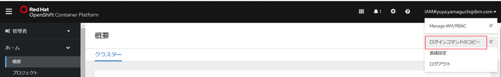
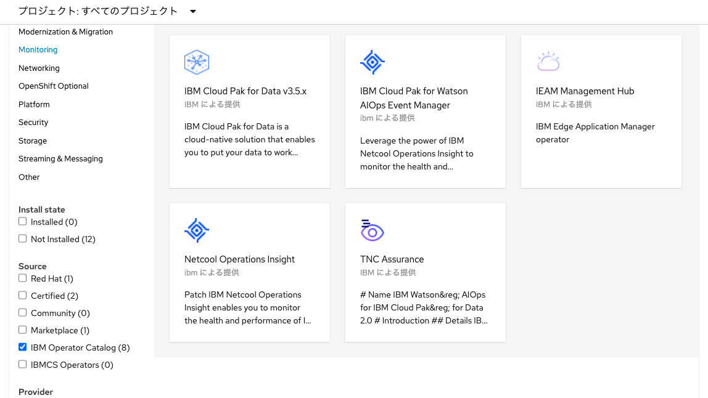

## 2.IBM Operator Catalog の追加

下記手順をMASのインストールモジュール解凍後に作成される作業PCのibm-masディレクトリ内で実行します。


1. oc ログインの実行
    ```bash
    oc login OpenShift_URL:port
    ```

    参考. 「OpenShift_URL:port」は以下の手順で確認

    Openshift Webコンソールへログインし、ユーザー名のドロップダウンから「ログインコマンドのコピー」をクリック
    

    「Display Token」をクリック

    

    トークン付きのURLをコピー

    .png)

2. インストールコマンドの実行

    コマンド:
    ```bash 
    ./install-operatorcatalog.sh
    ```

    実行結果:
    ```bash 
    ./install-operatorcatalog.sh

    IBM Operator Catalog Installer
    ======================================================================
    - Kubernetes Namespace ... openshift-marketplace
    - Install Direction ...... /work/mas-infra87/ibm-mas/operatorcatalog
    - Log File ............... /work/mas-infra87/ibm-mas/operatorcatalog/logs/install-catalog.log

    Install IBM Operator Catalogs
    ----------------------------------------------------------------------
    - Installing IBM Operator Catalogs

    IBM Operator Catalog and Common service catalog Installation Complete
    ```

    IBM operator Catalogが追加されます。
    

### 次項
  [03_Service Binding Operator(SBO) のインストール](../03_sbo/index.md)
