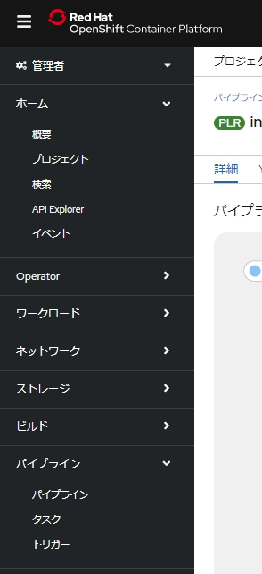
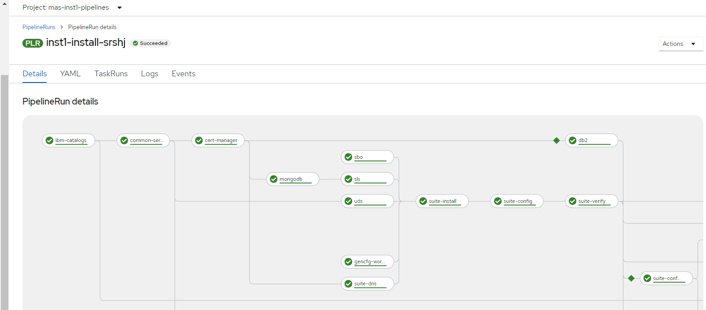

## 3.MASのインストール

ibmmas/cliコンテナイメージ内で、mas installを実行します。  
「02_MASインストール前準備」のコンテナを再活用していただいても構いませんし、新規にコンテナイメージから実行いただいても問題ありません。


### 1. ibmmas/cliコンテナイメージの起動

1. cli の後ろに: とTAG名を指定してコンテナを起動します。

    -vオプションを指定することで、コンテナイメージの/home/localにライセンスファイルを配置したディレクトリをマウントできます。  
    ここでは、ubuntu上の/workにentitlement.licを配置しており、そのディレクトリをコンテナ上の/home/localにマウントしています。

    コマンド:
    ```bash
    masenv@IBM-PF39YTN4:/work$ podman run -ti -v /work:/home/local cli:2.1.2
    ```


### 2. MASライセンスファイルの確認

1. コンテナ上の「/home/local」に「entitlement.lic」が存在するかを確認します。

    コマンド:
    ```bash
    [ibmmas/cli:2.1.2]mascli$ cd /home/local
    [ibmmas/cli:2.1.2]local$ ls -l
    total 7848
    -rw-r--r-- 1 root root    9085 Aug 15 03:23 entitlement.lic
    ・
    ・
    ```

### 3. インストールの実行

1. 「/home/local」上で下記コマンドを用い、masをインストールコマンドを実行します。

    コマンド:
    ```bash
    [ibmmas/cli:2.1.2]local$ mas install
    ```

2. 下記の表を参考に対話式に入力します。
   
    今回はMAS Manage の最小構成の環境構築を目的としているので、applicationは「Manage」のみｙとします。

    | 項目                                        | 設定する値                                                     |
    | ------------------------------------------- | -------------------------------------------------------------- |
    | **Connect to a different cluster**          | N(表示されたクラスターが異なる場合は今回のクラスターURLを指定) |
    | **MAS Instance ID**                         | inst1(任意のインスタンスID)                                    |
    | **MAS Version**                             | 1(今回は8.8を指定)                                             |
    | **Configure Custom Domain**                 | N                                                              |
    | **Application Selection**                   | 本手順ではInstall Manageのみ「y」にしております                |
    | **Choose your own storage classes anyway?** | y                                                              |
    | - Storage class (ReadWriteOnce):            | ibmc-block-gold                                                |
    | - Storage class (ReadWriteMany):            | ibmc-file-gold                                                 |
    | **License ID**                              | 「01.事前準備」で準備した12桁の文字列                          |
    | **License File**                            | /home/local/entitlement.lic                                    |
    | **UDS Contact Email**                       | 任意のe-mailアドレスを設定                                     |
    | **UDS Contact First Name**                  | 任意の値を設定                                                 |
    | **UDS Contact Last Name**                   | 任意の値を設定                                                 |
    | **Wait for PVCs to bind?**                  | Y                                                              |


    実行ログ：
    ```bash
    [ibmmas/cli:2.1.2]local$ mas install
    IBM Maximo Application Suite Installer
    Powered by https://github.com/ibm-mas/ansible-devops/ and https://tekton.dev/

    Current Limitations
    1. Support for airgap installation is limited to MAS 8.8 (core only) at present


    2. Set Target OpenShift Cluster
    Connected to OCP cluster:
    https://console-openshift-console.itzroks-2700034gbd-ug2zv4-6ccd7f378ae819553d37d5f2ee142bd6-0000.jp-tok.containers.appdomain.cloud
    Connect to a different cluster [y/N] N

    1. Install OpenShift Pipelines Operator
    OpenShift Pipelines Operator is installed and ready

    1. Configure Installation
    MAS Instance ID > inst1
    MAS Version:
    1. 8.8
    2. 8.7
    3. 8.6
    Select Subscription Channel > 1

    1. Configure Domain & Certificate Management
    Configure Custom Domain [y/N] N

    1. Application Selection
    Install IoT [y/N] N
    Install Manage [y/N] y
    Install Optimizer [y/N] N
    Install Visual Inspection [y/N] N
    Install Predict [y/N] N
    Install Health & Predict - Utilities [y/N] N
    Install Assist [y/N] N

    1. Configure Storage Class Usage
    Maximo Application Suite and it's dependencies require storage classes that support ReadWriteOnce (RWO) and ReadWriteMany (RWX) access modes:
    - ReadWriteOnce volumes can be mounted as read-write by multiple pods on a single node.
    - ReadWriteMany volumes can be mounted as read-write by multiple pods across many nodes.

    Storage provider auto-detected: IBMCloud ROKS
    - Storage class (ReadWriteOnce): ibmc-block-gold
    - Storage class (ReadWriteMany): ibmc-file-gold

    Choose your own storage classes anyway? [y/N] y

    Select the ReadWriteOnce and ReadWriteMany storage classes to use from the list below:
    - default
    - ibmc-block-bronze
    - ibmc-block-custom
    - ibmc-block-gold
    - ibmc-block-retain-bronze
    - ibmc-block-retain-custom
    - ibmc-block-retain-gold
    - ibmc-block-retain-silver
    - ibmc-block-silver
    - ibmc-file-bronze
    - ibmc-file-bronze-gid
    - ibmc-file-custom
    - ibmc-file-gold
    - ibmc-file-gold-gid
    - ibmc-file-retain-bronze
    - ibmc-file-retain-custom
    - ibmc-file-retain-gold
    - ibmc-file-retain-silver
    - ibmc-file-silver
    - ibmc-file-silver-gid
    - managed-nfs-storage

    Enter 'none' for the ReadWriteMany storage class if you do not have a suitable class available in the cluster, however this will limit what can be installed

    ReadWriteOnce (RWO) storage class > ibmc-block-gold
    ReadWriteMany (RWX) storage class > ibmc-file-gold

    1. Configure IBM Container Registry
    3OTBlIn0.ZmbL9RHn3O91sT5JF42WWylGgyK5XTqrX2WCikQ6_wgiJJQk0gTWFya2V0cGxhY2UiLCJpYXQiOjE2MTYwNTU0MDksImp0aSI6IjJhMjc0ZTg1ZTlkNjRlOGY5MTcxZDVjYjUwOTc3

    1. Configure Product License
    License ID > 89df95c30014
    License File > /home/local/entitlement.lic

    1. Configure UDS
    UDS Contact Email > XXXXXXXX@jp.ibm.com
    UDS Contact First Name > <your First Name>
    UDS Contact Last Name > <your Last Name>

    1.  Prepare Installation
    If you are using using storage classes that utilize 'WaitForFirstConsumer' binding mode choose 'No' at the prompt below

    Wait for PVCs to bind? [Y/n] Y

    Namespace 'mas-inst1-pipelines' is ready

    Installed Task Definitions
    NAME                                    IMAGE
    mas-devops-appconnect                   quay.io/ibmmas/cli:2.1.2
    mas-devops-cert-manager                 quay.io/ibmmas/cli:2.1.2
    mas-devops-cluster-monitoring           quay.io/ibmmas/cli:2.1.2
    mas-devops-common-services              quay.io/ibmmas/cli:2.1.2
    mas-devops-cos                          quay.io/ibmmas/cli:2.1.2
    mas-devops-cp4d                         quay.io/ibmmas/cli:2.1.2
    mas-devops-cp4d-service                 quay.io/ibmmas/cli:2.1.2
    mas-devops-db2                          quay.io/ibmmas/cli:2.1.2
    mas-devops-gencfg-workspace             quay.io/ibmmas/cli:2.1.2
    mas-devops-ibm-catalogs                 quay.io/ibmmas/cli:2.1.2
    mas-devops-kafka                        quay.io/ibmmas/cli:2.1.2
    mas-devops-mongodb                      quay.io/ibmmas/cli:2.1.2
    mas-devops-nvidia-gpu                   quay.io/ibmmas/cli:2.1.2
    mas-devops-sbo                          quay.io/ibmmas/cli:2.1.2
    mas-devops-sls                          quay.io/ibmmas/cli:2.1.2
    mas-devops-suite-app-config             quay.io/ibmmas/cli:2.1.2
    mas-devops-suite-app-install            quay.io/ibmmas/cli:2.1.2
    mas-devops-suite-config                 quay.io/ibmmas/cli:2.1.2
    mas-devops-suite-db2-setup-for-manage   quay.io/ibmmas/cli:2.1.2
    mas-devops-suite-dns                    quay.io/ibmmas/cli:2.1.2
    mas-devops-suite-install                quay.io/ibmmas/cli:2.1.2
    mas-devops-suite-mustgather             quay.io/ibmmas/cli:2.1.2
    mas-devops-suite-verify                 quay.io/ibmmas/cli:2.1.2
    mas-devops-uds                          quay.io/ibmmas/cli:2.1.2

    Installed Pipeline Definitions
    NAME                   AGE
    mas-install-pipeline   2m3s

    quay.io/ibmmas/cli:2.1.2 is available from the target OCP cluster

    1.  Review Settings

        IBM Maximo Application Suite
        Instance ID ............... inst1
        Catalog Source ............ ibm-operator-catalog
        Subscription Channel ...... 8.8.x
        IBM Entitled Registry ..... cp.icr.io/cp
        IBM Open Registry ......... icr.io/cpopen
        Entitlement Username ...... cp
        Entitlement Key ........... eyJhbGci<snip>

        IBM Maximo Application Suite Applications
        IoT ...................... Skip Installation
        - Monitor ............... Skip Installation
        - Safety ................ Skip Installation
        Manage ................... ibm-operator-catalog/8.4.x
        - Predict ............... Skip Installation
        Optimizer ................ Skip Installation
        H & P Utilities .......... Skip Installation
        Assist ................... Skip Installation
        MVI ...................... Skip Installation

        IBM Suite License Service
        Catalog Source ............ ibm-operator-catalog
        License ID ................ 89df95c30014
        License File .............. /workspace/entitlement/entitlement.lic
        IBM Entitled Registry ..... cp.icr.io/cp
        IBM Open Registry ......... icr.io/cpopen
        Entitlement Username ...... cp
        Entitlement Key ........... eyJhbGci<snip>

        IBM User Data Services
        Contact Email ............. XXXXXXXX@jp.ibm.com
        First Name ................ <your First Name>
        Last Name ................. <your Last Name>

        IBM Cloud Pak Foundation Services
        Catalog Source ............ ibm-operator-catalog

        Storage Class Configuration
        Storage Class Provider ... custom
        ReadWriteOnce ............ ibmc-block-gold
        ReadWriteMany ............ ibmc-file-gold

    Proceed with these settings [y/N] y

    1.  Launch Installation
    Installation started successfully

    View progress:
    https://console-openshift-console.itzroks-2700034gbd-ug2zv4-6ccd7f378ae819553d37d5f2ee142bd6-0000.jp-tok.containers.appdomain.cloud/pipelines/ns/mas-inst1-pipelines
    ```


3. コマンドプロンプトが帰ってきたらコンテナイメージを終了させます。

    ```bash
    [ibmmas/cli:2.1.2]local$ exit
    exit
    ```

### 4. 途中経過の確認

OCP Webコンソール上でインストール状況が確認できます。

注意事項：
- ブラウザの言語設定を英語にしないと進捗がリアルタイムに表示されませんでした。

1. OCP Webコンソールにログインします。  
   
2. パイプライン(Pipelines) → パイプライン(Pipelines)を開きます。  
    プロジェクトは「mas-inst1-pipelines」に設定してください。  
    (inst1部分は「MAS Instance ID」に合わせてください)  

    

3. Last runのリンクを開きます。

    パイプライン(今回は「inst1-install-srshj」)のステータスがSucceededになっていることを確認してください。  
    選択するアプリケーションによってはSkipされるモジュールもある為、すべてにチェックが入っていなくても大丈夫です。

    


### 前項
- [ 02_MASインストール前準備 ](../02_preparation/index.md)

### 次項
- [ 04_管理者ユーザーの作成 ](../04_maxadmin/index.md)
