## 5.Behaviour Analytics Service (BAS)　のインストール
BASを導入します。BASについてのFAQはこちらに記載されています。

https://developer.ibm.com/openlabs/mock/support/faq

BASについて問い合わせが必要な場合、上記の「Support」-「Contact US」からメールにて問い合わせることができます。

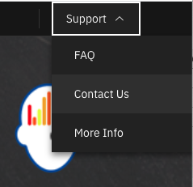

※当手順で導入しているBASのバージョンは [はじめに](../README.md#はじめに) に記載しています。

### 準備.oc loginの実行
    ```bash
    oc login OpenShift_URL:port
    ```

### 1. https://developer.ibm.com/openlabs/behavior-analytics-services にアクセス

### 2. LaunchLabをクリック
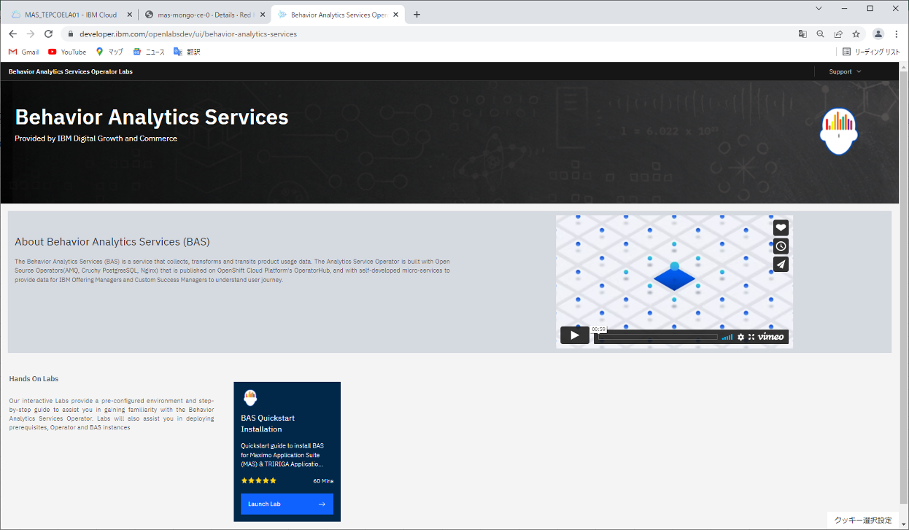
### 3. Sign inをクリック
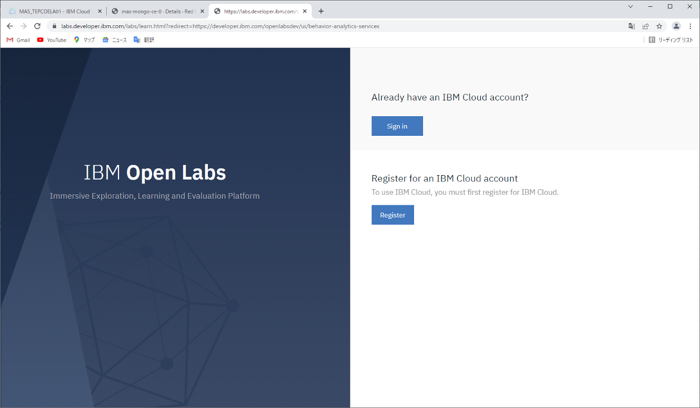

### 4. 画面右上のサブメニューからサイト閲覧時間を3時間延長


### 5. Lab-BAS Instration Stepsをクリック
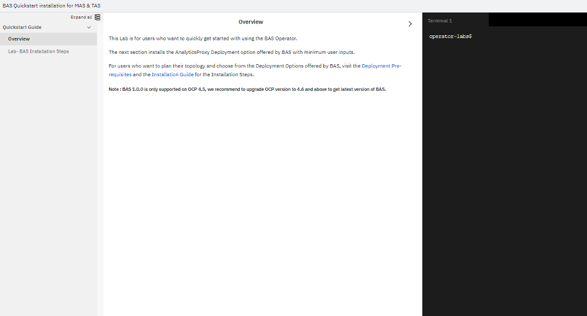
### 6.画面の手順に沿ってターミナルで実行
cr.propertiesを環境に応じて修正
特にストレージクラスについて確認、修正します。

https://developer.ibm.com/openlabsdev/guide/behavior-analytics-services/course/deployment-prerequisites/04.01

当手順では以下を設定しています。

```bash
projectName="bas-mas01"
storageClassKafka="ibmc-block-bronze"
storageClassZookeeper="ibmc-block-bronze"
storageClassDB="ibmc-block-bronze"
storageClassArchive="ibmc-file-bronze-gid"
dbuser=basdbuser
dbpassword=basdbpassword
grafanauser=grafanauser
grafanapassword=grafanapassword
####Keeping the values of below properties to default is advised.
storageSizeKafka=5G
storageSizeZookeeper=5G
storageSizeDB=10G
storageSizeArchive=10G
eventSchedulerFrequency='*/10 * * * *'
prometheusSchedulerFrequency='@daily'
envType=lite
ibmproxyurl='https://iaps.ibm.com'
airgappedEnabled=false
imagePullSecret=bas-images-pull-secret
``` 

インストールが終了すると画面にURLが表示されるので控えておきます。


### 手動セットアップ(以下手順は6までの手順でインストールが失敗した場合のオプション)
(注)画像のように「Behavior Analytics Services Operator installation failed.」で失敗した場合、この手順を実施します。
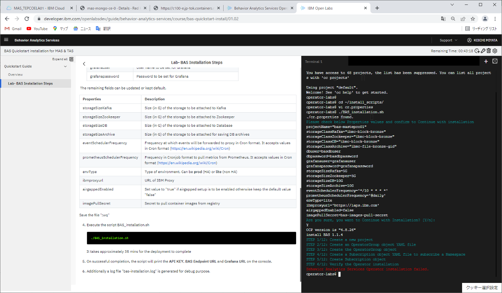


1. オペレータ選択
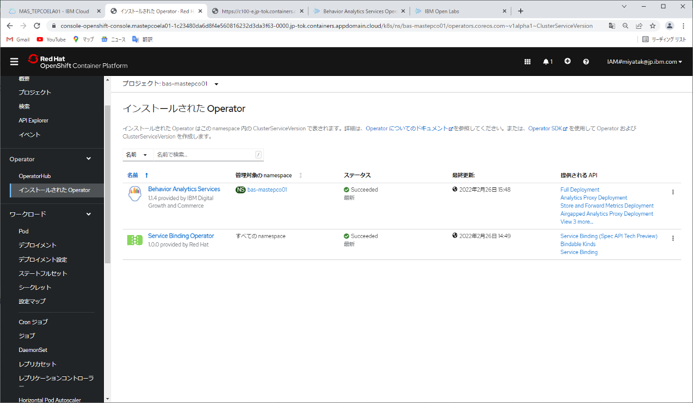

2. dashboardを選択
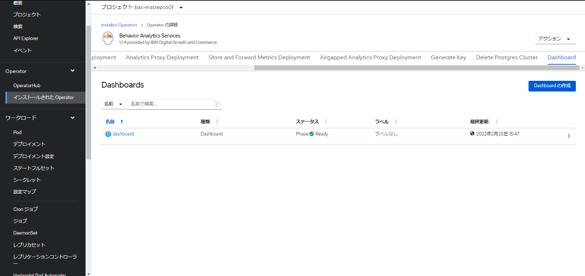

3. Dashboard の URL クリック
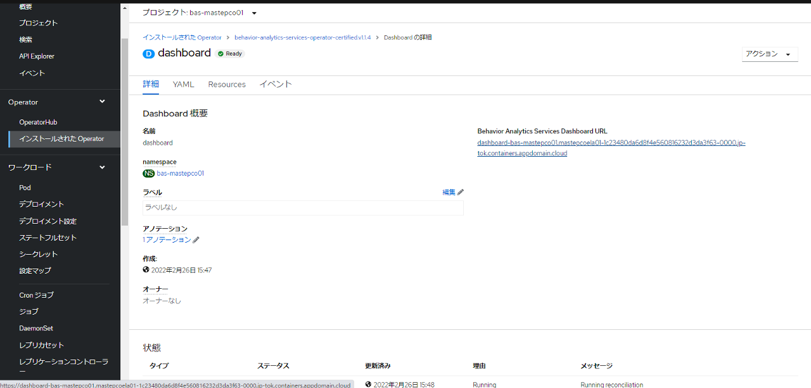

4. Login with OpenShift
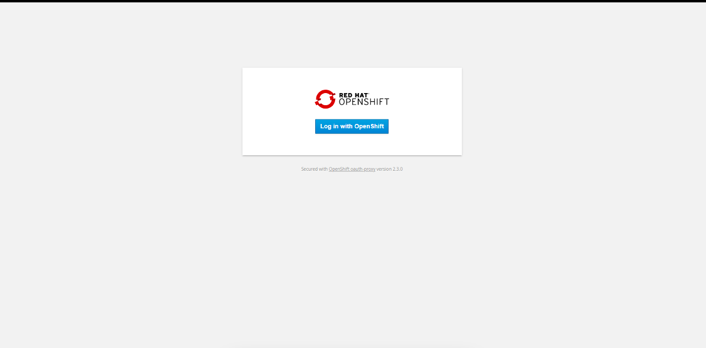

5. Allow selected permissions
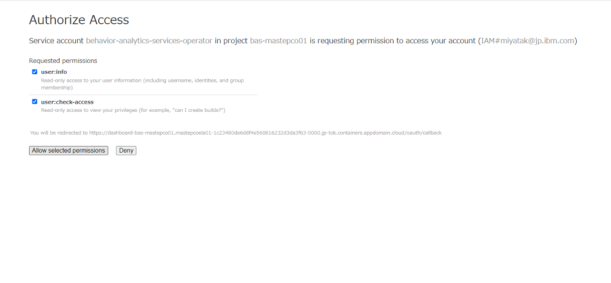

6. Full Deployment で Create Instance
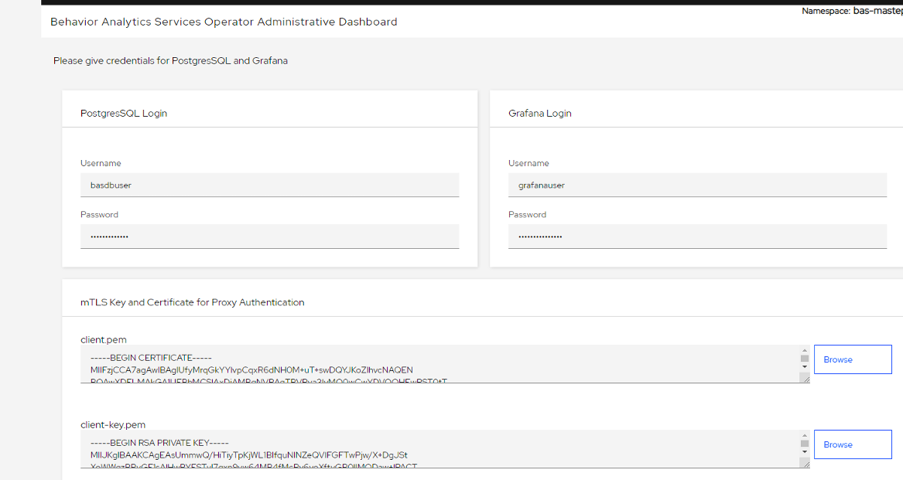

- dbuser=basdbuser
- dbpassword=basdbpassword
- grafanauser=grafanauser
- grafanapassword=grafanapassword

7. TLSキーの準備
   1. ca-csr.jsonの作成
      ```bash
      {
         "CN": "Access Testing CA",
         "key": {
            "algo": "rsa",
            "size": 4096
         },
         "names": [
            {
            "C": "US",
            "L": "Austin",
            "O": "Access Testing",
            "OU": "TX",
            "ST": "Texas"
            }
         ]
      }
      ```
   2. ca-config.jsonの作成
      ```bash
      {
         "signing": {
            "default": {
            "expiry": "8760h"
            },
            "profiles": {
            "server": {
               "usages": ["signing", "key encipherment", "server auth"],
               "expiry": "8760h"
            },
            "client": {
               "usages": ["signing", "key encipherment", "client auth"],
               "expiry": "8760h"
            }
            }
         }
      }
      ```
   3. `cfssl gencert -initca ca-csr.json | cfssljson -bare ca`を実行
   4. `ca.pem`と`ca-key.pem`が出力される

8. `ca.pem`の内容を`client.pem`欄に転記

9. `ca-key.pem`の内容を`client-key.pem`欄に転記

10. YAMLは編集せずcreate
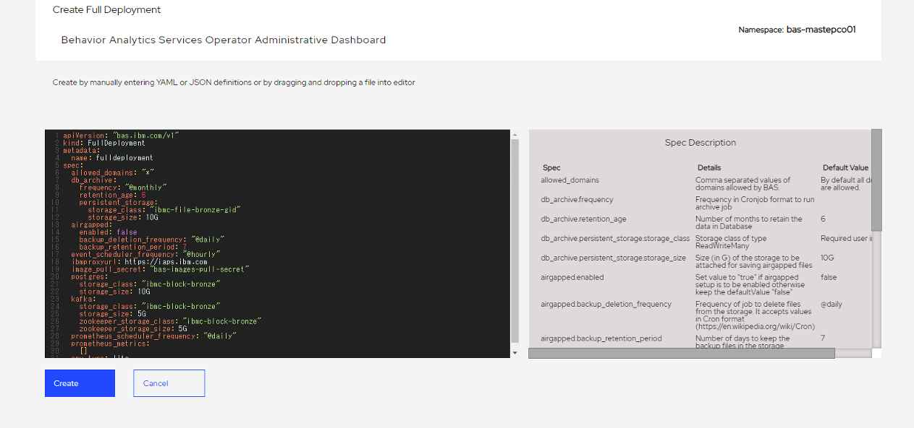

11. OK画面が表示され、15分ほどで生成されます。

12. Genarate API key
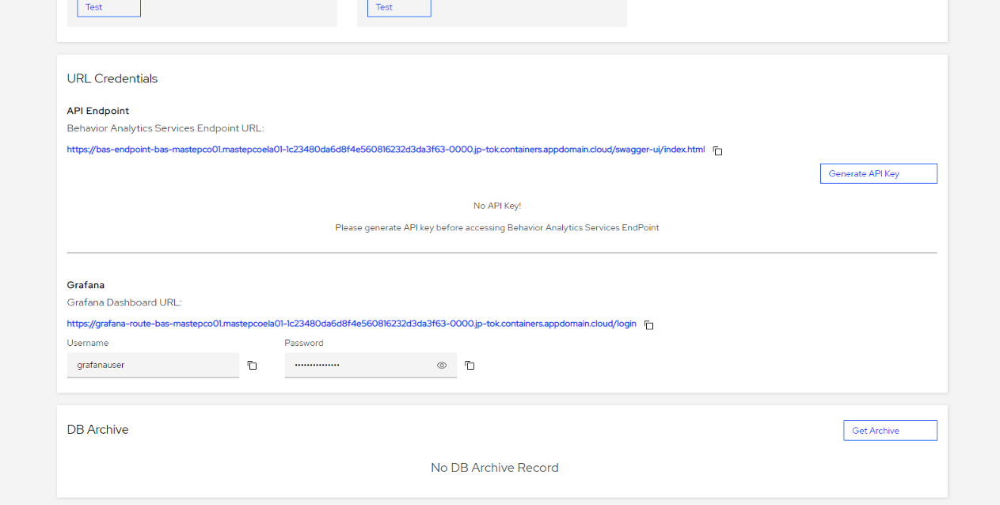

13. Genagete

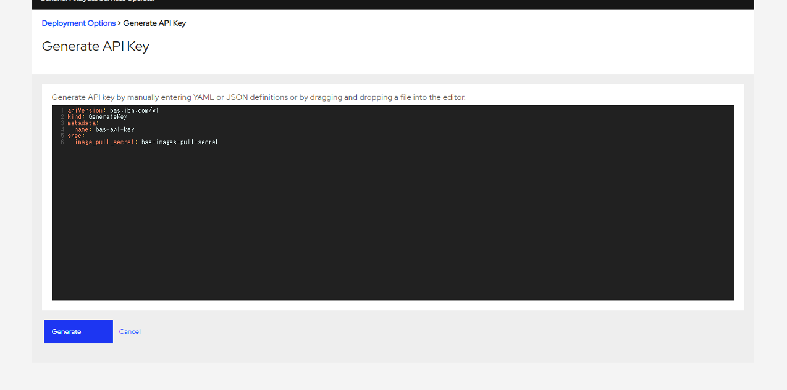

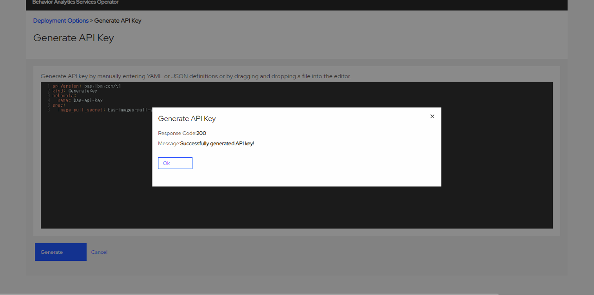

生成されたAPIキーは後段の手順で利用するため、控えておきます。

14.  Test APIの実施

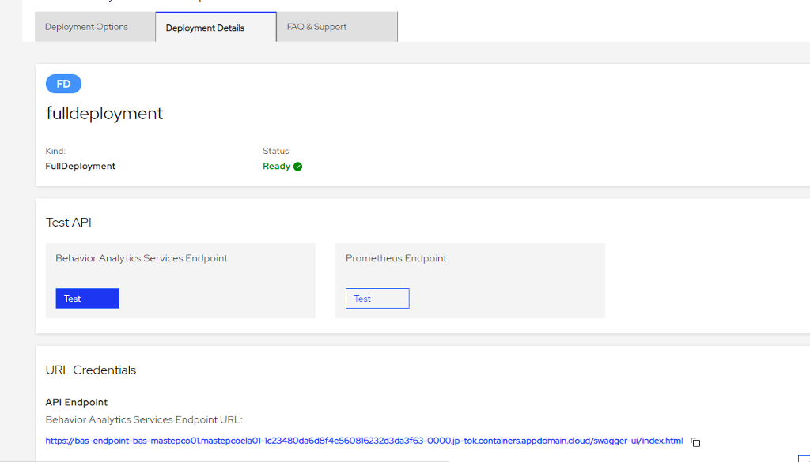
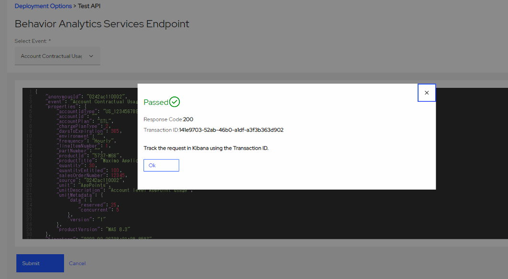

### 次項
- [06_MongoDB のインストール](../06_mongo/index.md)
