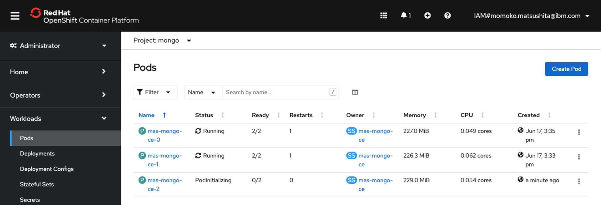

## 6.MongoDB のインストール

参考手順：MongoDB Quick Start Guide

https://github.com/ibm-watson-iot/iot-docs/blob/master/mongodb/README.md

### 1. インストール 
1. 必要なファイルのダウンロード

    コマンド:
    ```bash
    git clone https://github.com/ibm-watson-iot/iot-docs
    ```

    実行結果:
    ```bash
    Cloning into 'iot-docs'...
    remote: Enumerating objects: 213, done.
    remote: Counting objects: 100% (150/150), done.
    remote: Compressing objects: 100% (114/114), done.
    remote: Total 213 (delta 56), reused 102 (delta 28), pack-reused 63
    Receiving objects: 100% (213/213), 55.32 MiB | 15.98 MiB/s, done.
    Resolving deltas: 100% (72/72), done.
    ```

2. 秘密鍵の生成 

    「MONGO_PASSWORD」にて、DBのパスワードを、「MONGODB_STORAGE_CLASS」にて適切なストレージクラスを指定します。当手順ではそれぞれ「MongoAdminPassword」と「ibmc-block-gold」を指定しています。

    コマンド:
    ```bash
    export IOT_DOCS_ROOT="$(pwd)/iot-docs"
    export MONGO_PASSWORD="MongoAdminPassword"
    export MONGO_NAMESPACE=mongo
    export MONGODB_STORAGE_CLASS="ibmc-block-gold"
    cd iot-docs/mongodb/certs/
    ./generateSelfSignedCert.sh
    ```

    実行結果:
    ```bash
    Generating a RSA private key
    ..................................................................................................+++++
    .........................................................................................................................................................................................................................................................................................................................................................+++++
    writing new private key to 'ca.key'
    -----
    Generating a RSA private key
    .............+++++
    .........+++++
    writing new private key to 'server.key'
    -----
    Signature ok
    subject=C = US, ST = NY, L = New York, O = "Example, LLC", CN = *.mas-mongo-ce-svc.mongo.svc.cluster.local, emailAddress = test@example.com
    Getting CA Private Key
    Generating a RSA private key
    ......................+++++
    ..................+++++
    writing new private key to 'client.key'
    -----
    Signature ok
    subject=C = US, ST = NY, L = New York, O = "Example, LLC", CN = Mongo Client
    Getting CA Private Key
    ```


3. MongoDBのインストール

    コマンド:
    ```bash
    cd ..
    ./install-mongo-ce.sh
    ```

    実行結果:
    ```bash
    Now using project "mongo" on server "https://c100-e.jp-tok.containers.cloud.ibm.com:31666".

    You can add applications to this project with the 'new-app' command. For example, try:

        oc new-app rails-postgresql-example

    to build a new example application in Ruby. Or use kubectl to deploy a simple Kubernetes application:

        kubectl create deployment hello-node --image=k8s.gcr.io/serve_hostname

    customresourcedefinition.apiextensions.k8s.io/mongodbcommunity.mongodbcommunity.mongodb.com created
    serviceaccount/mongodb-kubernetes-operator created
    role.rbac.authorization.k8s.io/mongodb-kubernetes-operator created
    rolebinding.rbac.authorization.k8s.io/mongodb-kubernetes-operator created
    clusterrole.rbac.authorization.k8s.io/system:openshift:scc:anyuid added: "default"
    clusterrole.rbac.authorization.k8s.io/system:openshift:scc:anyuid added: "mongodb-kubernetes-operator"
    deployment.apps/mongodb-kubernetes-operator created
    - Waiting for MongoDB CE Operator   configmap/mas-mongo-ce-cert-map created
    secret/mas-mongo-ce-cert-secret created
    mongodbcommunity.mongodbcommunity.mongodb.com/mas-mongo-ce created
    secret/mas-mongo-ce-admin-password created
    Error from server (NotFound): statefulsets.apps "mas-mongo-ce" not found
    -usage: sleep seconds
    \usage: sleep seconds
    |usage: sleep seconds
    /usage: sleep seconds
    -usage: sleep seconds
    ```
 
    ※インストール中、「sleep seconds」ログが続きます。

### 2. インストールの確認
   
以下をそれぞれ実行、リソース定義やロールなどが作成されていることを確認します。

```bash
oc get crd/mongodbcommunity.mongodbcommunity.mongodb.com

NAME                                            CREATED AT
mongodbcommunity.mongodbcommunity.mongodb.com   2022-02-26T06:10:09Z
```

```bash
oc get role mongodb-kubernetes-operator

NAME                          CREATED AT
mongodb-kubernetes-operator   2022-02-26T06:10:10Z
```

```bash
oc get rolebinding mongodb-kubernetes-operator

NAME                          ROLE                               AGE
mongodb-kubernetes-operator   Role/mongodb-kubernetes-operator   15m
```

```bash
oc get serviceaccount mongodb-kubernetes-operator

NAME                          SECRETS   AGE
mongodb-kubernetes-operator   2         16m
```

```bash
oc get MongoDBCommunity -n mongo -o 'jsonpath={..status.mongoUri}'

mongodb://mas-mongo-ce-0.mas-mongo-ce-svc.mongo.svc.cluster.local:27017,mas-mongo-ce-1.mas-mongo-ce-svc.mongo.svc.cluster.local:27017,mas-mongo-ce-2.mas-mongo-ce-svc.mongo.svc.cluster.local:27017[root@maseladb01 mongodb]
```

上記の応答のmongoDBのURLを控えておく。

### 3. レプリカセットへの接続確認
1. OpenShift Webコンソールからmongoのどれか1つのPodを開きます。


2. メンバーのPodのコンソールから以下のコマンドを実行
    「mas-mongo-ce:PRIMARY> 」のプロンプトが表示されれば正常にレプリカセットへの接続ができています。
    
    　コマンド:
    ※Mongo DBのurl/passwordは必要に応じ修正

    ```bash
    mongo "mongodb://mas-mongo-ce-0.mas-mongo-ce-svc.mongo.svc.cluster.local:27017,mas-mongo-ce-1.mas-mongo-ce-svc.mongo.svc.cluster.local:27017,mas-mongo-ce-2.mas-mongo-ce-svc.mongo.svc.cluster.local:27017/?replicaSet=mas-mongo-ce" --username admin --password MongoAdminPassword --authenticationDatabase admin --ssl --sslAllowInvalidCertificates
    ```

    　実行結果:

    ```bash
    mas-mongo-ce:PRIMARY>
    ```


### 次項
- [07_IBM Suite License Service (SLS) のインストール](../07_sls/index.md)
