## 7.IBM Suite License Service (SLS) のインストール
当手順で導入しているSLSのバージョン,MASのサポート対象のバージョンは [はじめに](../README.md#はじめに) に記載しています。

### 1. OperetaorHubで IBM Suite License Service 検索
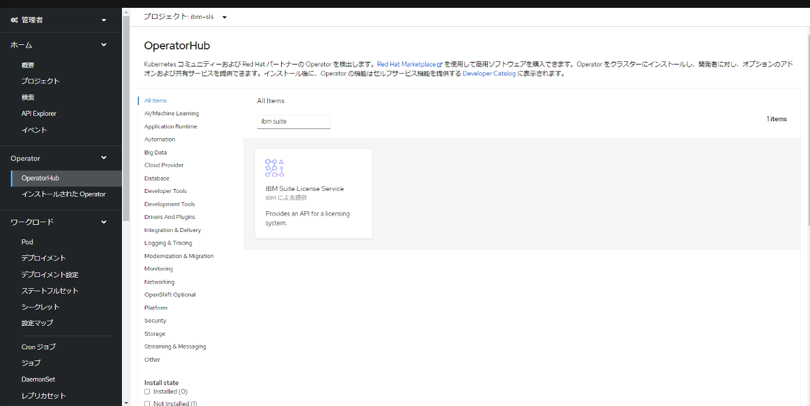
### 2. オペレータのインストール実行
1. インストール
  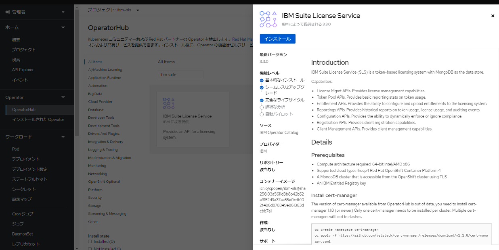
   当手順では「更新の承認」は手動としています。
  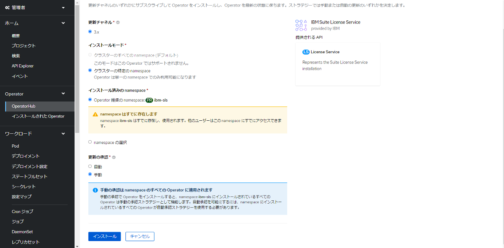
  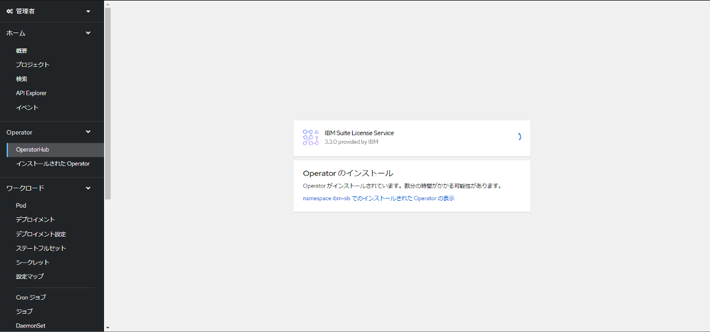

1. 承認
  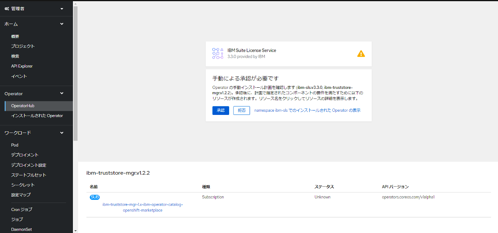

### 3. Entitlement keyのSecret作成
ER_KEYは https://myibm.ibm.com/products-services/containerlibrary から取得

コマンド:
```bash
ER_KEY=eyxxxx
oc project ibm-sls
oc -n ibm-sls create secret docker-registry ibm-entitlement --docker-server=cp.icr.io --docker-username=cp --docker-password=$ER_KEY
```

実行結果:
```bash
oc project ibm-sls

Now using project "ibm-sls" on server "https://c100-e.jp-tok.containers.cloud.ibm.com:31343".

oc -n ibm-sls create secret docker-registry ibm-entitlement --docker-server=cp.icr.io --docker-username=cp --docker-password=$ER_KEY

secret/ibm-entitlement created
```

シークレットにibm-entitlementが追加されます。
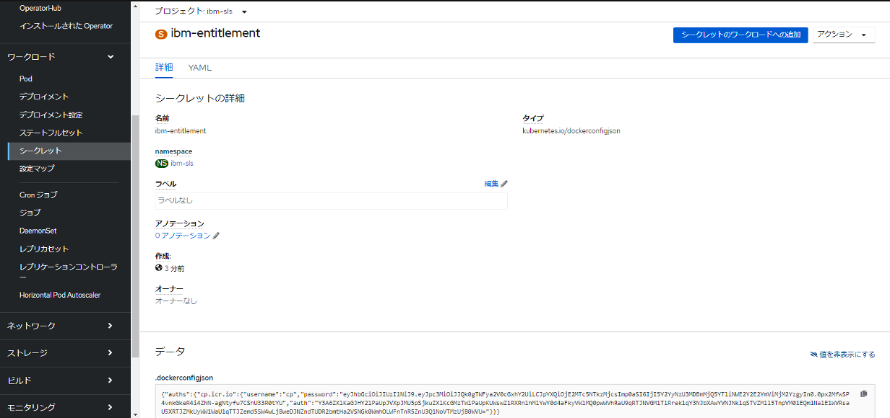

### 4. mongoDBのSecret作成
1. シークレットからソース:YAMLを選択
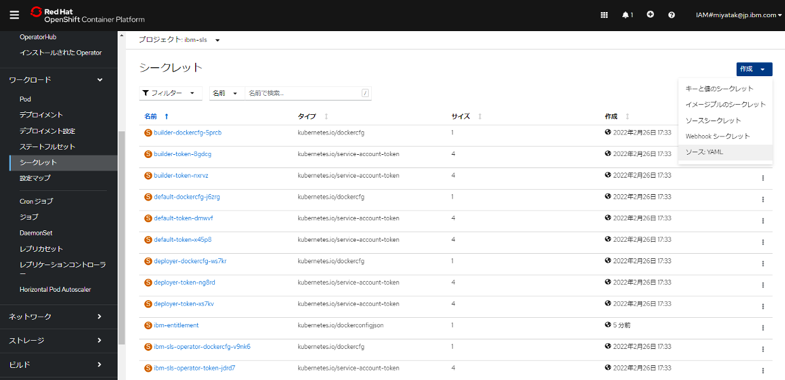
2. 下記のYAMLで作成をクリック (パスワードはmongoの導入時に作成したもの)
```bash
apiVersion: v1
kind: Secret
metadata:
  name: sls-mongo-credentials
  namespace: ibm-sls
type: Opaque
stringData:
  username: 'admin'
  password: 'MongoAdminPassword'
```
3. シークレットにsls-mongo-credentialsが追加されます。
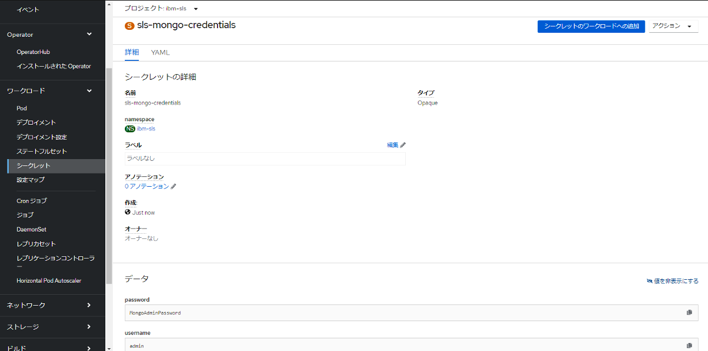
### 5. SLSインスタンス作成
1. LicenseService の作成
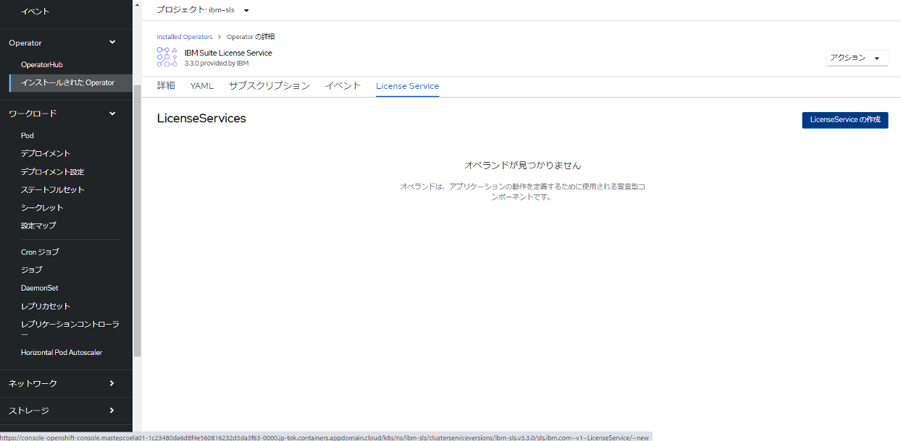

2. Create License Service > YAML viewより、詳細画面Introductionの内容(以下)をコピーしてCreateする。以下の設定を変更します。			
* license: -accept:true
* domain: クラスタの ingresサブドメイン設定
* mongo: 作成したmongoDBのホスト名とポートを設定
* ca: - secretName: ca-keypair は削除

参考)クラスターのingresサブドメインはここから確認可能
  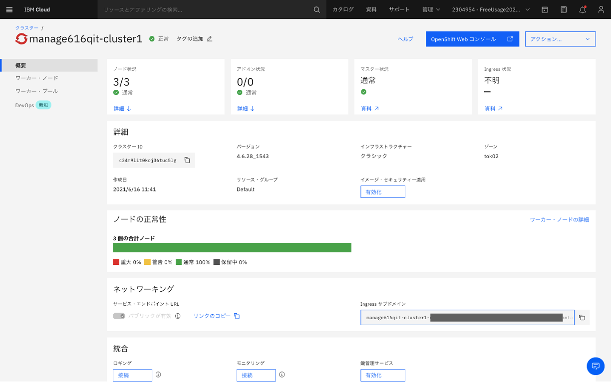

```
apiVersion: sls.ibm.com/v1
kind: LicenseService
metadata:
  name: sls
  labels:
    app.kubernetes.io/instance: ibm-sls
    app.kubernetes.io/managed-by: olm
    app.kubernetes.io/name: ibm-sls
  namespace: ibm-sls
spec:
  domain: >-
    itzroks-50x6wchyyb-xxxxxx-6ccd7f378ae819553d37d5f2ee1xxxxx-0000.jp-tok.containers.appdomain.cloud
  license:
    accept: true
  mongo:
    configDb: admin
    nodes:
      - host: mas-mongo-ce-0.mas-mongo-ce-svc.mongo.svc.cluster.local
        port: 27017
      - host: mas-mongo-ce-1.mas-mongo-ce-svc.mongo.svc.cluster.local
        port: 27017
      - host: mas-mongo-ce-2.mas-mongo-ce-svc.mongo.svc.cluster.local
        port: 27017
    secretName: sls-mongo-credentials
  rlks:
    storage:
      class: ibmc-file-bronze-gid
      size: 20G
  settings:
    auth:
      enforce: true
    compliance:
      enforce: false
    reconciliation:
      enabled: true
      reconciliationPeriod: 1800
    registration:
      open: true
    reporting:
      maxDailyReports: 90
      maxHourlyReports: 24
      maxMonthlyReports: 12
      reportGenerationPeriod: 3600
      samplingPeriod: 900
```
1. しばらく待つと下記画面のようになります。
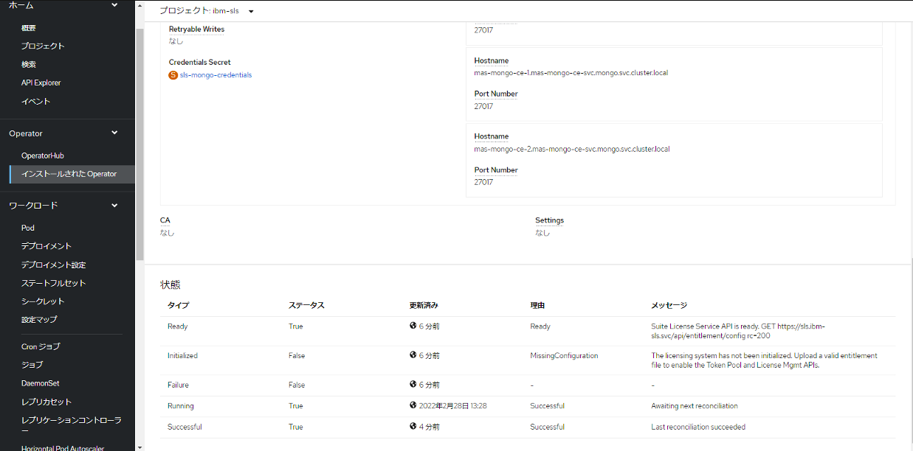

4. 「SLS API URL」、「SLS Registrationkey」、「SLS LicenseID」と、「SLS CA Certificate」のca.crt の値を控えておきます。

### 次項
- [08_Maximo Application Suite(MAS) のインストール](../08_mas_core/index.md)
