## 9.IBM CloudPak for Data (CP4D)
Cloud Pak For Dataのインストール手順について記載します。<br />
当手順では MAS ManageのデータベースとしてCloud Pak For Data の DB2 Warehouseを利用します。もし、DBを別途用意する場合、当手順は不要です。

参考. Cloud Pak For Data のインストール手順 (https://www.ibm.com/docs/en/cloud-paks/cp-data/4.0?topic=installing )

### 手順前提
当手順では Intel MacOS 12.2 にて実施　※WSL2(Ubuntu 20.04.4 LTS)でも動作確認済

1. python3の導入

    pythonを導入し、pipによりPyYAML, argparseを導入する。当手順では以下のバージョンで実施  
    ※pythonはpython3コマンドではなく、pythonコマンドで確認すること。pythonコマンドでcommand not foundなどのエラーとなる場合は、pythonコマンドがpython3を参照するように環境を確認すること。
    ```bash
    $ python --version
    Python 3.8.12
    $ pip3 install PyYAML
    Requirement already satisfied: PyYAML in ./.local/lib/python3.8/site-packages (6.0)
    $ pip3 install argparse
    Collecting argparse
      Using cached argparse-1.4.0-py2.py3-none-any.whl (23 kB)
    Installing collected packages: argparse
    Successfully installed argparse-1.4.0

    ```

2. IBM Cloud Pak CLI のインストール

    https://github.com/IBM/cloud-pak-cli/ からパッケージをダウンロードし、cloudctl として /usr/local/bin に配置

    MacOSの場合、以下のコマンドにより取得　※WSL(Linux)の場合は上記リンク内のLinux x86-architectureを参照

    ```bash
    curl -L https://github.com/IBM/cloud-pak-cli/releases/latest/download/cloudctl-darwin-amd64.tar.gz -o cloudctl-darwin-amd64.tar.gz
    ```

3. Entitlement keyの取得
    IBM Container Library ( https://myibm.ibm.com/products-services/containerlibrary )にアクセスして取得

    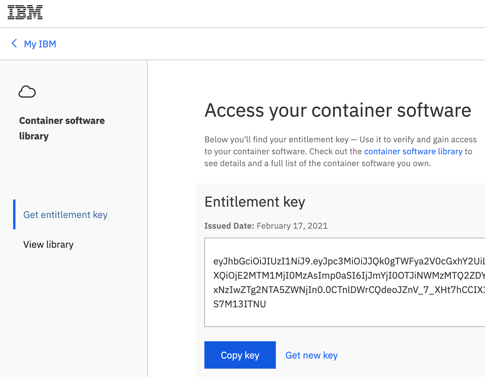


### 1. Pre-installation tasks の実行
1. openshift-config プロジェクトのシークレット pull-secret を開きます。

    参考手順 : https://www.ibm.com/docs/en/cloud-paks/cp-data/4.0?topic=tasks-configuring-your-cluster-pull-images

    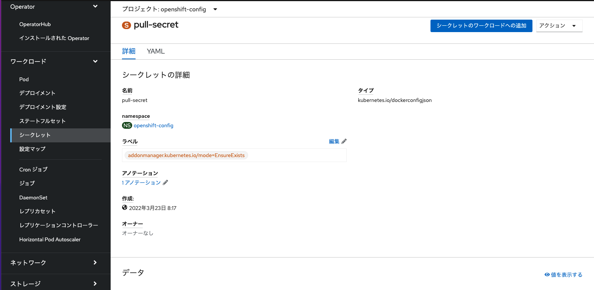

2. アクション>シークレットの編集 をクリック

    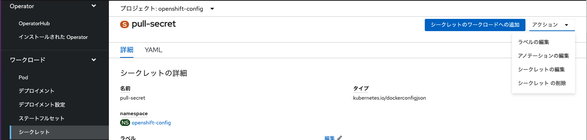

3. 認証情報の追加 をクリック

    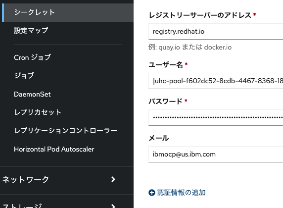

4. 以下の情報を入力して、保存する
    <InlineNotification>
    * レジストリーサーバーのアドレス: cp.icr.io
    * ユーザー名: cp
    * パスワード: Entitlement Key
    </InlineNotification>

    ※Entitlement Keyの取得方法は手順前提に記載

    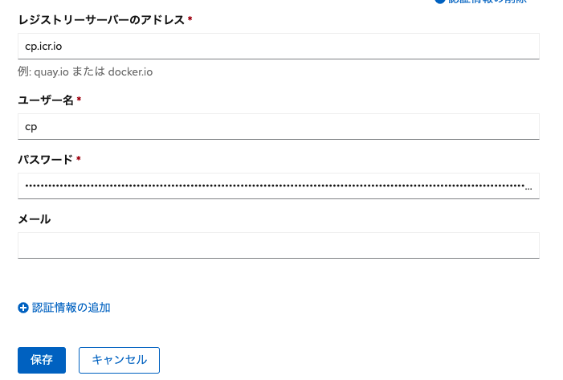

5. ノードの再起動

    global の image pull secretを変更した場合、ノードの再起動が必要になります。IBM Cloudの場合、手動で再ロードする必要があります。

    引用元 : https://www.ibm.com/docs/en/cloud-paks/cp-data/4.0?topic=tasks-configuring-your-cluster-pull-images#preinstall-cluster-setup__pull-secret
    >Important: When you change the global image pull secret, each node in the cluster is automatically restarted so that the Machine Config Operator can apply the changes. This restart process happens one node at a time. The cluster will wait for a node to restart before starting the process on the next node. In some situations, it takes more than 30 minutes for all of the nodes to be restarted. During this process, you might notice that resources are temporarily unavailable.
    If your deployment is on IBM Cloud, you must manually reload the worker nodes in your cluster for the changes to take effect.

    (IBM Cloudの場合)Openshiftのコンソールから、「ワーカー・ノード」 > 再ロードするノードをチェック > 「再ロード」をクリックします。一度にすべてのノードを再ロードは行えないため、分けて実行します。

    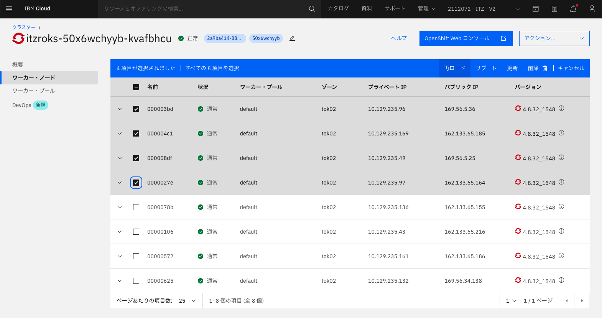

    数十分〜数時間程度かかる場合があります。(状況が途中で重大に変わる場合がありますが、その後通常に遷移します。)
    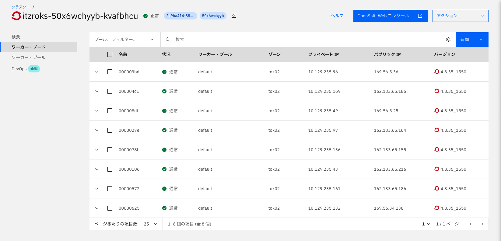


## CASE Package のダウンロードとCatalog sourceの作成

1. oc loginを実行
```bash
oc login OpenShift_URL:port
```

2. CASEで利用するディレクトリの作成と設定
```bash
mkdir -p $HOME/offline/cpd
mkdir -p $HOME/offline/cpfs

export CASE_REPO_PATH=https://github.com/IBM/cloud-pak/raw/master/repo/case
export OFFLINEDIR=$HOME/offline/cpd
export OFFLINEDIR_CPFS=$HOME/offline/cpfs
```


3. IBM Cloud Pak for Data platform operatorのダウンロード

コマンド:
```bash
cloudctl case save \
--repo ${CASE_REPO_PATH} \
--case ibm-cp-datacore \
--version 2.0.10 \
--outputdir ${OFFLINEDIR} \
--no-dependency
```

※ダウンロードにあたっては、ネットワーク回線がある程度高速である必要があります。以下のエラーが発生する場合、 https://www.ibm.com/docs/en/cloud-paks/cp-data/4.0?topic=registry-mirroring-images-bastion-node 参照(10Mbps程度の回線速度で以下エラーが発生することを確認しています)
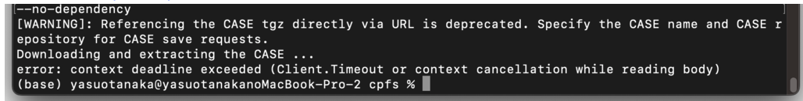


実行結果:
```bash
[WARNING]: Referencing the CASE tgz directly via URL is deprecated. Specify the CASE name and CASE repository for CASE save requests.
Downloading and extracting the CASE ...
- Success
Retrieving CASE version ...
- Success
Validating the CASE ...
Validating the signature for the ibm-cp-datacore CASE...
- Success
Creating inventory ...
- Success
Finding inventory items
- Success
Resolving inventory items ...
Parsing inventory items
Resolve dependencies has been set to false, no dependent CASEs will be resolved.
- Success
```


4. DB2WHのダウンロード

コマンド:
```bash
cloudctl case save \
--repo ${CASE_REPO_PATH} \
--case ibm-db2wh \
--version 4.0.8 \
--outputdir ${OFFLINEDIR}
```

実行結果:
```bash
[WARNING]: Referencing the CASE tgz directly via URL is deprecated. Specify the CASE name and CASE repository for CASE save requests.
Downloading and extracting the CASE ...
- Success
Retrieving CASE version ...
- Success
Validating the CASE ...
Validating the signature for the ibm-cp-datacore CASE...
- Success
Creating inventory ...
- Success
Finding inventory items
- Success
Resolving inventory items ...
Parsing inventory items
Resolve dependencies has been set to false, no dependent CASEs will be resolved.
- Success
```

5. Catalog source のダウンロード

コマンド:
```bash
cloudctl case save \
--repo ${CASE_REPO_PATH} \
--case ibm-cp-common-services \
--version 1.11.0 \
--outputdir ${OFFLINEDIR_CPFS}
```

実行結果:
```bash
[WARNING]: Referencing the CASE tgz directly via URL is deprecated. Specify the CASE name and CASE repository for CASE save requests.
Downloading and extracting the CASE ...
- Success
Retrieving CASE version ...
- Success
Validating the CASE ...
Validating the signature for the ibm-cp-common-services CASE...
- Success
Creating inventory ...
- Success
Finding inventory items
- Success
Resolving inventory items ...
Parsing inventory items
Signature previously validated for ibm-auditlogging CASE
Signature previously validated for ibm-cert-manager CASE
Signature previously validated for ibm-cs-commonui CASE
Signature previously validated for ibm-crossplane-bundle CASE
Signature previously validated for ibm-events-operator CASE
Signature previously validated for ibm-cs-healthcheck CASE
Signature previously validated for ibm-cs-iam CASE
Signature previously validated for ibm-cpp CASE
Signature previously validated for ibm-zen CASE
Signature previously validated for ibm-licensing CASE
Signature previously validated for ibm-management-ingress CASE
Signature previously validated for ibm-cs-mongodb CASE
Signature previously validated for ibm-cs-monitoring CASE
Signature previously validated for ibm-platform-api-operator CASE
- Success
```

参考.ダウンロードファイルの確認1
コマンド:
```bash
$ ls $HOME/offline/cpd
caseDependencyMapping.csv		ibm-cp-datacore-2.0.10.tgz		ibm-db2wh-4.0.8-charts.csv
charts					ibm-db2uoperator-4.0.10-charts.csv	ibm-db2wh-4.0.8-images.csv
ibm-cp-datacore-2.0.10-charts.csv	ibm-db2uoperator-4.0.10-images.csv	ibm-db2wh-4.0.8.tgz
ibm-cp-datacore-2.0.10-images.csv	ibm-db2uoperator-4.0.10.tgz		resourceIndexes
```

参考.ダウンロードファイルの確認2
コマンド:
```bash
ls $HOME/offline/cpfs
caseDependencyMapping.csv			ibm-crossplane-bundle-1.4.0.tgz			ibm-events-operator-3.15.0-charts.csv
charts						ibm-cs-commonui-1.13.0-charts.csv		ibm-events-operator-3.15.0-images.csv
ibm-auditlogging-1.12.0-charts.csv		ibm-cs-commonui-1.13.0-images.csv		ibm-events-operator-3.15.0.tgz
ibm-auditlogging-1.12.0-images.csv		ibm-cs-commonui-1.13.0.tgz			ibm-licensing-1.12.0-charts.csv
ibm-auditlogging-1.12.0.tgz			ibm-cs-healthcheck-1.11.0-charts.csv		ibm-licensing-1.12.0-images.csv
ibm-cert-manager-1.11.0-charts.csv		ibm-cs-healthcheck-1.11.0-images.csv		ibm-licensing-1.12.0.tgz
ibm-cert-manager-1.11.0-images.csv		ibm-cs-healthcheck-1.11.0.tgz			ibm-management-ingress-1.11.0-charts.csv
ibm-cert-manager-1.11.0.tgz			ibm-cs-iam-1.11.0-charts.csv			ibm-management-ingress-1.11.0-images.csv
ibm-cp-common-services-1.11.0-charts.csv	ibm-cs-iam-1.11.0-images.csv			ibm-management-ingress-1.11.0.tgz
ibm-cp-common-services-1.11.0-images.csv	ibm-cs-iam-1.11.0.tgz				ibm-platform-api-operator-1.11.0-charts.csv
ibm-cp-common-services-1.11.0.tgz		ibm-cs-mongodb-1.10.0-charts.csv		ibm-platform-api-operator-1.11.0-images.csv
ibm-cpp-1.3.0-charts.csv			ibm-cs-mongodb-1.10.0-images.csv		ibm-platform-api-operator-1.11.0.tgz
ibm-cpp-1.3.0-images.csv			ibm-cs-mongodb-1.10.0.tgz			ibm-zen-2.6.0-charts.csv
ibm-cpp-1.3.0.tgz				ibm-cs-monitoring-1.11.0-charts.csv		ibm-zen-2.6.0-images.csv
ibm-crossplane-bundle-1.4.0-charts.csv		ibm-cs-monitoring-1.11.0-images.csv		ibm-zen-2.6.0.tgz
ibm-crossplane-bundle-1.4.0-images.csv		ibm-cs-monitoring-1.11.0.tgz			resourceIndexes
```

6. Catalog source の作成

ibm-cp-common-service / ibm-cp-datacore / ibm-db2uoperator / ibm-db2wh についてコマンドを実行する

コマンド:
```bash
cloudctl case launch \
  --case ${OFFLINEDIR_CPFS}/ibm-cp-common-services-1.11.0.tgz \
  --inventory ibmCommonServiceOperatorSetup \
  --namespace openshift-marketplace \
  --action install-catalog \
    --args "--registry icr.io --inputDir ${OFFLINEDIR_CPFS} --recursive"
```

実行結果:
```bash
Welcome to the CASE launcher
Attempting to retrieve and extract the CASE from the specified location
[✓] CASE has been retrieved and extracted
Attempting to validate the CASE
[✓] CASE has been successfully validated
Attempting to locate the launch inventory item, script, and action in the specified CASE
[✓] Found the specified launch inventory item, action, and script for the CASE
Attempting to check the cluster and machine for required prerequisites for launching the item
Checking for required prereqs...
No requires section specified.
Required prereqs result: OK
Checking user permissions...
No user rules specified.
[✓] Cluster and Client Prerequisites have been met for the CASE
Running the CASE ibmCommonServiceOperatorSetup launch script with the following action context: installCatalog
oc: Client Version: 4.8.0-202202071729.p0.g9aacc90.assembly.stream-9aacc90
Server Version: 4.8.31
Kubernetes Version: v1.21.6+b82a451
Executing inventory item ibmCommonServiceOperatorSetup, action installCatalog : launch.sh
Checking arguments for install catalog action
-------------Create catalog source-------------
apiVersion: operators.coreos.com/v1alpha1
kind: CatalogSource
metadata:
  annotations:
    bedrock_catalogsource_priority: '1'
  name: opencloud-operators
  namespace: openshift-marketplace
spec:
  displayName: IBMCS Operators
  publisher: IBM
  sourceType: grpc
  image: icr.io/cpopen/ibm-common-service-catalog@sha256:2eebb83aa7b7911285c765f96f3740c4154d0c64b8decb1db71e8dbb0961f071
catalogsource.operators.coreos.com/opencloud-operators configured
check for any existing operator group in openshift-marketplace ...
no existing operator group found
-------------Create operator group-------------
operatorgroup.operators.coreos.com/common-service created
[✓] CASE launch script completed successfully
OK
```

コマンド:
```bash
cloudctl case launch \
  --case ${OFFLINEDIR}/ibm-cp-datacore-2.0.10.tgz \
  --inventory cpdPlatformOperator \
  --namespace openshift-marketplace \
  --action install-catalog \
    --args "--inputDir ${OFFLINEDIR} --recursive"
```

実行結果:
```bash
Welcome to the CASE launcher
Attempting to retrieve and extract the CASE from the specified location
[✓] CASE has been retrieved and extracted
Attempting to validate the CASE
[✓] CASE has been successfully validated
Attempting to locate the launch inventory item, script, and action in the specified CASE
[✓] Found the specified launch inventory item, action, and script for the CASE
Attempting to check the cluster and machine for required prerequisites for launching the item
Checking for required prereqs...
No requires section specified.
Required prereqs result: OK
Checking user permissions...
No user rules specified.
[✓] Cluster and Client Prerequisites have been met for the CASE
Running the CASE cpdPlatformOperator launch script with the following action context: installCatalog
Executing inventory item cpdPlatformOperator, action installCatalog : launch.sh
-------------Installing catalog source-------------
Checking arguments for install catalog action
orig - icr.io/cpopen/ibm-cpd-platform-operator-catalog@sha256:5231b3066222e2247b3d823d34a10eb190bf6c2bd8e6cffc9e9ec31d22fc2ad0
mod - icr.io/cpopen/ibm-cpd-platform-operator-catalog@sha256:5231b3066222e2247b3d823d34a10eb190bf6c2bd8e6cffc9e9ec31d22fc2ad0
catalogsource.operators.coreos.com/cpd-platform created
[✓] CASE launch script completed successfully
OK
```

コマンド:
※バージョンが異なる場合、「ls $HOME/offline/cpd」にてダウンロードしたバージョンを確認し、修正する
```bash
cloudctl case launch \
  --case ${OFFLINEDIR}/ibm-db2uoperator-4.0.10.tgz \
  --inventory db2uOperatorSetup \
  --namespace openshift-marketplace \
  --action install-catalog \
    --args "--inputDir ${OFFLINEDIR} --recursive"
```

実行結果:  
※Python3インストールチェックでfalseになる場合は、pythonコマンドがpyhon3コマンドを参照できていない可能性がるため、各自の環境を確認すること。
```bash
Welcome to the CASE launcher
Attempting to retrieve and extract the CASE from the specified location
[✓] CASE has been retrieved and extracted
Attempting to validate the CASE
[✓] CASE has been successfully validated
Attempting to locate the launch inventory item, script, and action in the specified CASE
[✓] Found the specified launch inventory item, action, and script for the CASE
Attempting to check the cluster and machine for required prerequisites for launching the item
Checking for required prereqs...
                                                
Prerequisite                                           Result
SecurityContextConstraints  must exist on the cluster  true
Client has oc version 4.4.0 or greater                 true
Client has Python3 installed                           true
Client has pip3 installed                              true
Client has pyYAML python module installed              true
Client has argparse python module installed            true

Required prereqs result: OK
Checking user permissions...
No user rules specified.
[✓] Cluster and Client Prerequisites have been met for the CASE
Running the CASE db2uOperatorSetup launch script with the following action context: installCatalog
oc: Client Version: 4.8.0-202202071729.p0.g9aacc90.assembly.stream-9aacc90
Server Version: 4.8.31
Kubernetes Version: v1.21.6+b82a451
Executing inventory item db2uOperatorSetup, action installCatalog : launch.sh
Checking arguments for install catalog action
catalogsource.operators.coreos.com/ibm-db2uoperator-catalog created
apiVersion: operators.coreos.com/v1alpha1
kind: CatalogSource
metadata:
  name: ibm-db2uoperator-catalog
  namespace: openshift-marketplace
spec:
  displayName: IBM Db2U Catalog
  image: icr.io/cpopen/ibm-db2uoperator-catalog@sha256:ce078f70c994d883eb8a8f7653e4478a17654e69d24364f340605a52405e878d
  imagePullPolicy: Always
  publisher: IBM
  sourceType: grpc
  updateStrategy:
    registryPoll:
      interval: 45m
ibm-db2uoperator-catalog
{"connectionState":{"address":"ibm-db2uoperator-catalog.openshift-marketplace.svc:50051","lastConnect":"2022-04-02T10:05:00Z","lastObservedState":"CONNECTING"},"registryService":{"createdAt":"2022-04-02T10:04:59Z","port":"50051","protocol":"grpc","serviceName":"ibm-db2uoperator-catalog","serviceNamespace":"openshift-marketplace"}}
{"connectionState":{"address":"ibm-db2uoperator-catalog.openshift-marketplace.svc:50051","lastConnect":"2022-04-02T10:05:15Z","lastObservedState":"TRANSIENT_FAILURE"},"registryService":{"createdAt":"2022-04-02T10:04:59Z","port":"50051","protocol":"grpc","serviceName":"ibm-db2uoperator-catalog","serviceNamespace":"openshift-marketplace"}}
{"connectionState":{"address":"ibm-db2uoperator-catalog.openshift-marketplace.svc:50051","lastConnect":"2022-04-02T10:05:32Z","lastObservedState":"TRANSIENT_FAILURE"},"registryService":{"createdAt":"2022-04-02T10:04:59Z","port":"50051","protocol":"grpc","serviceName":"ibm-db2uoperator-catalog","serviceNamespace":"openshift-marketplace"}}
{"connectionState":{"address":"ibm-db2uoperator-catalog.openshift-marketplace.svc:50051","lastConnect":"2022-04-02T10:05:50Z","lastObservedState":"TRANSIENT_FAILURE"},"registryService":{"createdAt":"2022-04-02T10:04:59Z","port":"50051","protocol":"grpc","serviceName":"ibm-db2uoperator-catalog","serviceNamespace":"openshift-marketplace"}}
{"connectionState":{"address":"ibm-db2uoperator-catalog.openshift-marketplace.svc:50051","lastConnect":"2022-04-02T10:05:50Z","lastObservedState":"TRANSIENT_FAILURE"},"registryService":{"createdAt":"2022-04-02T10:04:59Z","port":"50051","protocol":"grpc","serviceName":"ibm-db2uoperator-catalog","serviceNamespace":"openshift-marketplace"}}
{"connectionState":{"address":"ibm-db2uoperator-catalog.openshift-marketplace.svc:50051","lastConnect":"2022-04-02T10:06:17Z","lastObservedState":"TRANSIENT_FAILURE"},"registryService":{"createdAt":"2022-04-02T10:04:59Z","port":"50051","protocol":"grpc","serviceName":"ibm-db2uoperator-catalog","serviceNamespace":"openshift-marketplace"}}
{"connectionState":{"address":"ibm-db2uoperator-catalog.openshift-marketplace.svc:50051","lastConnect":"2022-04-02T10:06:35Z","lastObservedState":"TRANSIENT_FAILURE"},"registryService":{"createdAt":"2022-04-02T10:04:59Z","port":"50051","protocol":"grpc","serviceName":"ibm-db2uoperator-catalog","serviceNamespace":"openshift-marketplace"}}
{"connectionState":{"address":"ibm-db2uoperator-catalog.openshift-marketplace.svc:50051","lastConnect":"2022-04-02T10:06:35Z","lastObservedState":"TRANSIENT_FAILURE"},"registryService":{"createdAt":"2022-04-02T10:04:59Z","port":"50051","protocol":"grpc","serviceName":"ibm-db2uoperator-catalog","serviceNamespace":"openshift-marketplace"}}
[✓] CASE launch script completed successfully
OK
```

コマンド:
```bash
cloudctl case launch \
  --case ${OFFLINEDIR}/ibm-db2wh-4.0.8.tgz \
  --inventory db2whOperatorSetup \
  --namespace openshift-marketplace \
  --action install-catalog \
    --args "--inputDir ${OFFLINEDIR} --recursive"
```

実行結果:
```bash
Welcome to the CASE launcher
Attempting to retrieve and extract the CASE from the specified location
[✓] CASE has been retrieved and extracted
Attempting to validate the CASE
[✓] CASE has been successfully validated
Attempting to locate the launch inventory item, script, and action in the specified CASE
[✓] Found the specified launch inventory item, action, and script for the CASE
Attempting to check the cluster and machine for required prerequisites for launching the item
Checking for required prereqs...
                                                
Prerequisite                                           Result
SecurityContextConstraints  must exist on the cluster  true
Client has oc version 4.4.0 or greater                 true
Client has Python3 installed                           true
Client has pip3 installed                              true
Client has pyYAML python module installed              true
Client has argparse python module installed            true

Required prereqs result: OK
Checking user permissions...
No user rules specified.
[✓] Cluster and Client Prerequisites have been met for the CASE
Running the CASE db2whOperatorSetup launch script with the following action context: installCatalog
oc: Client Version: 4.8.0-202202071729.p0.g9aacc90.assembly.stream-9aacc90
Server Version: 4.8.31
Kubernetes Version: v1.21.6+b82a451
Executing inventory item db2whOperatorSetup, action installCatalog : launch.sh
Checking arguments for install catalog action
catalogsource.operators.coreos.com/ibm-db2wh-cp4d-operator-catalog created
apiVersion: operators.coreos.com/v1alpha1
kind: CatalogSource
metadata:
  name: ibm-db2wh-cp4d-operator-catalog
  namespace: openshift-marketplace
spec:
  displayName: IBM Db2wh CP4D Catalog
  image: icr.io/cpopen/ibm-db2wh-cp4d-operator-catalog@sha256:b51fb00b686daf4c2be6a0062b7ee224a15fc021ff997612fe83c4932bf1a9c4
  imagePullPolicy: Always
  publisher: IBM
  sourceType: grpc
  updateStrategy:
    registryPoll:
      interval: 45m
ibm-db2wh-cp4d-operator-catalog
{"connectionState":{"address":"ibm-db2wh-cp4d-operator-catalog.openshift-marketplace.svc:50051","lastConnect":"2022-04-02T10:10:52Z","lastObservedState":"CONNECTING"},"registryService":{"createdAt":"2022-04-02T10:10:52Z","port":"50051","protocol":"grpc","serviceName":"ibm-db2wh-cp4d-operator-catalog","serviceNamespace":"openshift-marketplace"}}
{"connectionState":{"address":"ibm-db2wh-cp4d-operator-catalog.openshift-marketplace.svc:50051","lastConnect":"2022-04-02T10:11:05Z","lastObservedState":"TRANSIENT_FAILURE"},"registryService":{"createdAt":"2022-04-02T10:10:52Z","port":"50051","protocol":"grpc","serviceName":"ibm-db2wh-cp4d-operator-catalog","serviceNamespace":"openshift-marketplace"}}
{"connectionState":{"address":"ibm-db2wh-cp4d-operator-catalog.openshift-marketplace.svc:50051","lastConnect":"2022-04-02T10:11:22Z","lastObservedState":"TRANSIENT_FAILURE"},"registryService":{"createdAt":"2022-04-02T10:10:52Z","port":"50051","protocol":"grpc","serviceName":"ibm-db2wh-cp4d-operator-catalog","serviceNamespace":"openshift-marketplace"}}
[✓] CASE launch script completed successfully
OK
```

## ~~CloudPak for Data 4.0 オペレーターのインストール~~

(2022/7/14訂正) CP4D側の変更により、下記手順では動作しないことを確認したため、以下手順に則り、cp4dの導入を完了ください。

Installing IBM Cloud Pak for Data
https://www.ibm.com/docs/en/cloud-paks/cp-data/4.0?topic=installing#install__op-subs

~~1. CloudPak for Data 4.0 オペレーターを Openshift の OperatorHub からインストールする
OperatorHubで「Cloud Pak for Data Platform Operator」を見つけ、インストールをクリック~~
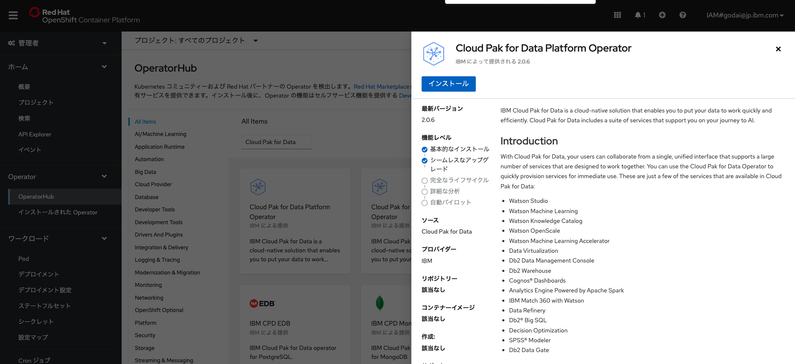

~~2. namespace: ibm-common-service を選択し、「インストール」をクリック~~
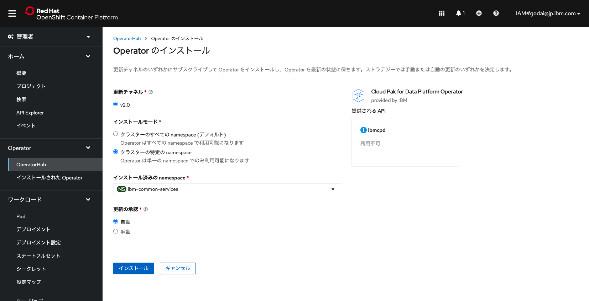


~~数分経つと、Operatorが「インストールされた Operator」に表示されるようになります~~
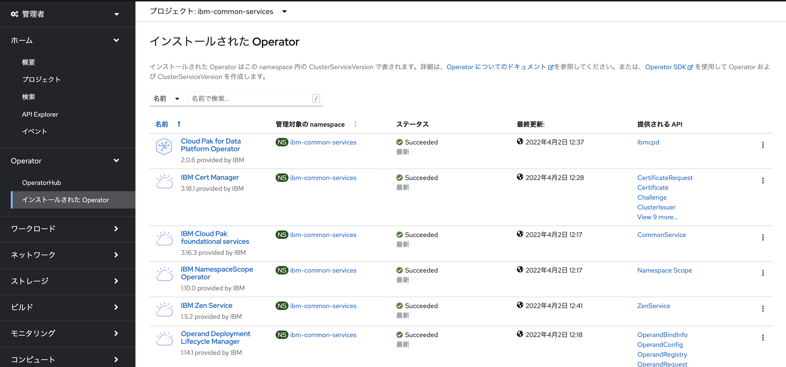

## ~~CloudPak for Data 4.0 のインスタンスの作成~~
~~1. 「インストールされた Operator」から 「Cloud Pak for Data Platform Operator」を開き、「インスタンスの作成」をクリック~~
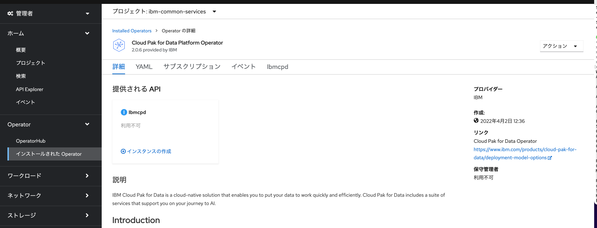

~~2. 名前を指定し(当手順ではibmcpd-mas)、Licenseを「Standard」を指定、「Accept license」をtrueにします~~
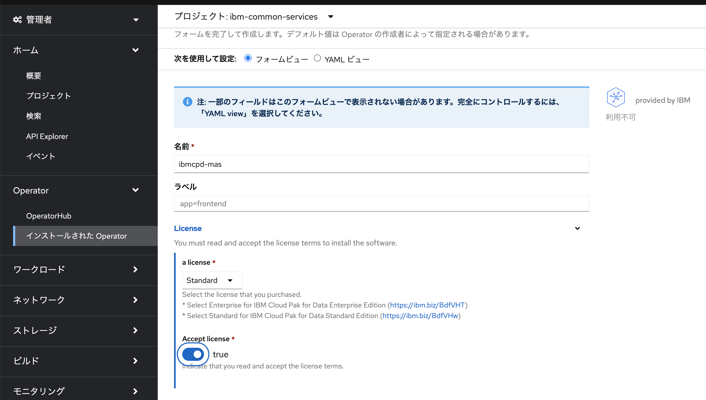

~~3. 「YAML ビュー」をj開き、必要に応じストレージクラスを指定~~

~~Cloud pak for data のコントロールプレーンで利用可能なストレージクラスは以下を参照ください。~~

参考. https://www.ibm.com/docs/en/cloud-paks/cp-data/4.0?topic=installing-cloud-pak-data

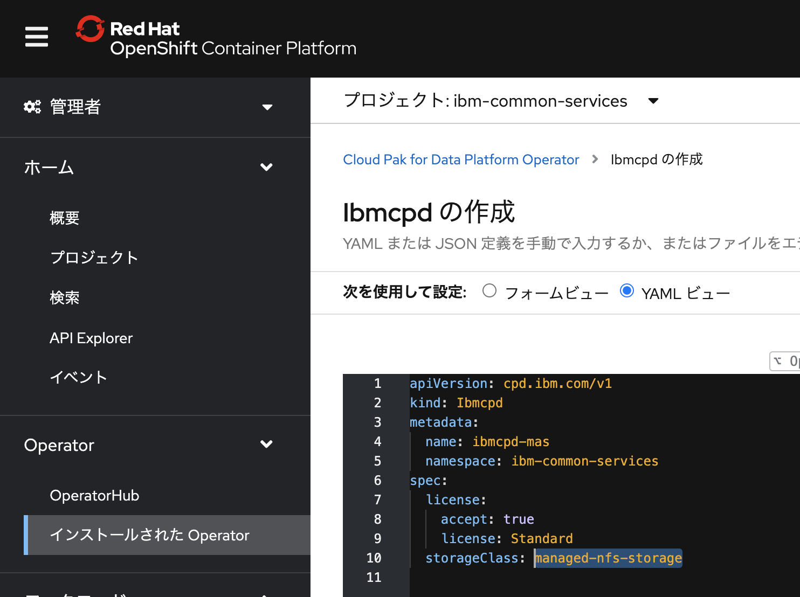

~~4. 「作成」をクリック~~


~~5. 作成されたインスタンスの確認~~

 「Condition : Running」になります。
次の手順のダッシュボードへのアクセスが可能になるまでに、40-60分程度かかる場合があります。
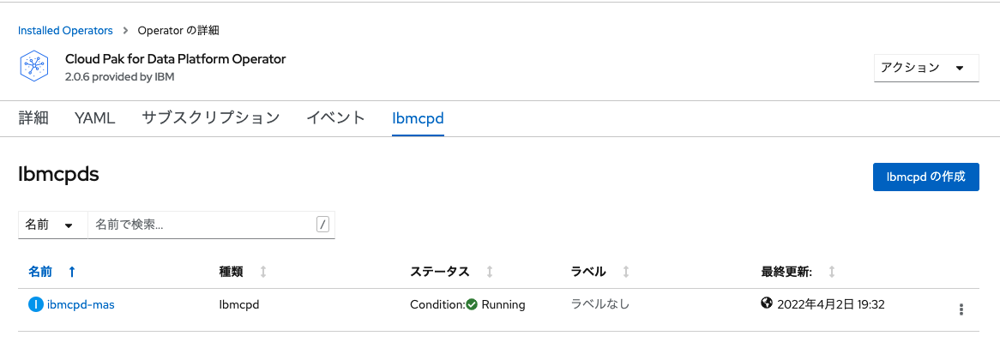

## Cloud Pak for Data のダッシュボードへのアクセス
1. cp4dのダッシュボードURLの確認

cp4dのインスタンスを作成したプロジェクト(当手順では「ibm-common-services」)のルートをを確認します。
「cpd」のルートにダッシュボードのURLが記載されています。
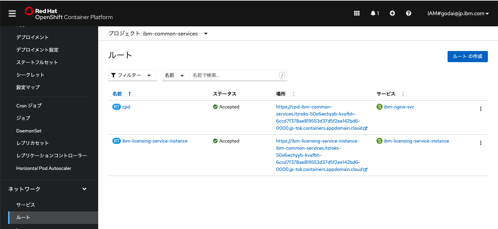

2. admin パスワードの確認
「シークレット」 > 「admin-user-details」から「initial_admin_password」を確認します。
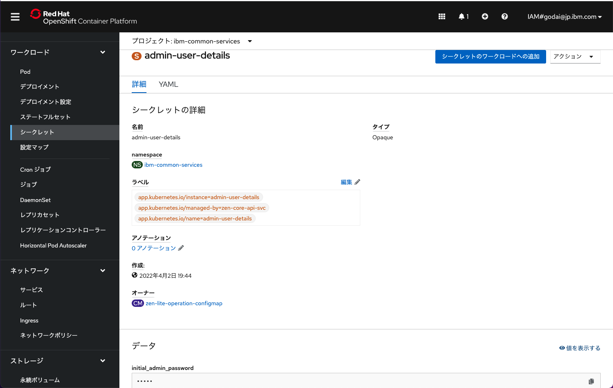

3. ダッシュボードへのログイン
ルートで確認したURLを開き、ユーザー名に「admin」、パスワードに「admin-user-details」で確認したパスワードを入力します
※自己署名証明書によるSSLのエラーはブラウザの機能で許可してアクセスします
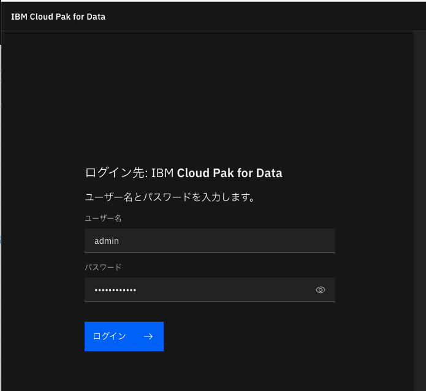

cp4dのダッシュボードのトップ画面が表示されます。
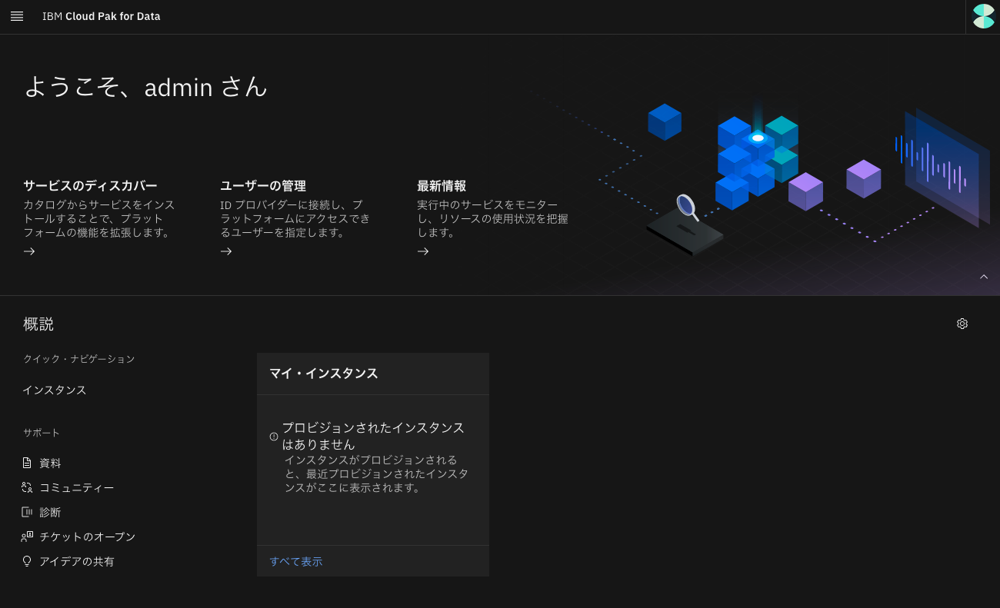

### 次項
- [10_DB2warehouseのインストールと構成](../10_db2/index.md)
