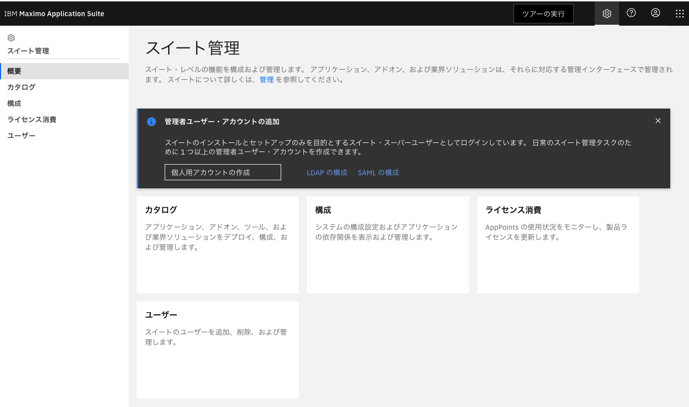
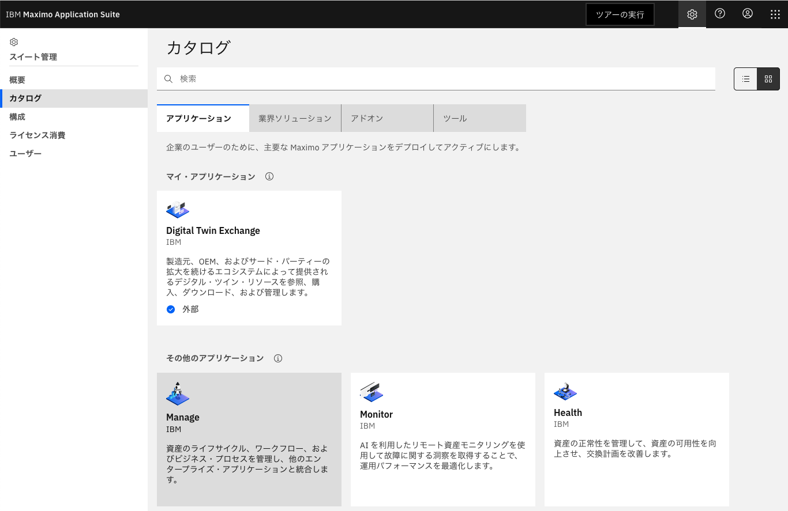
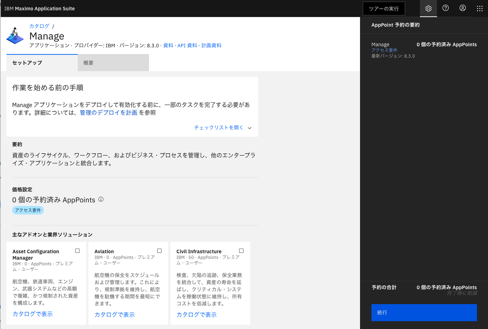
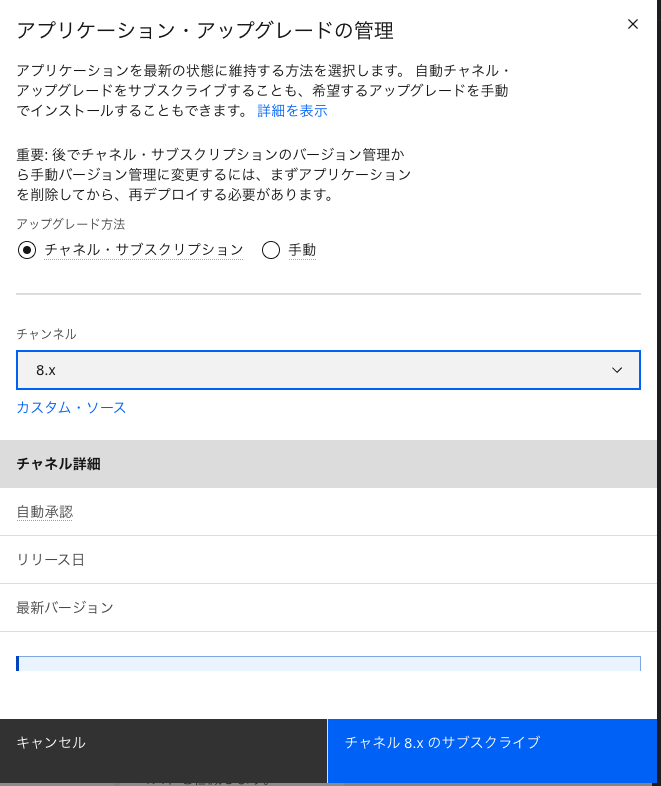
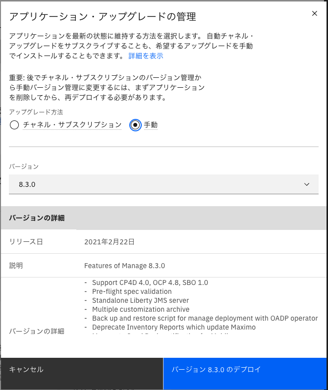
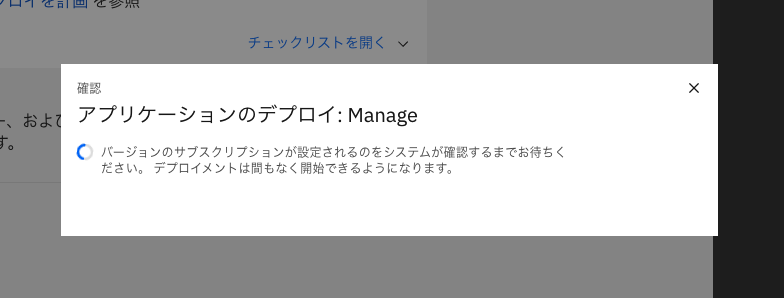
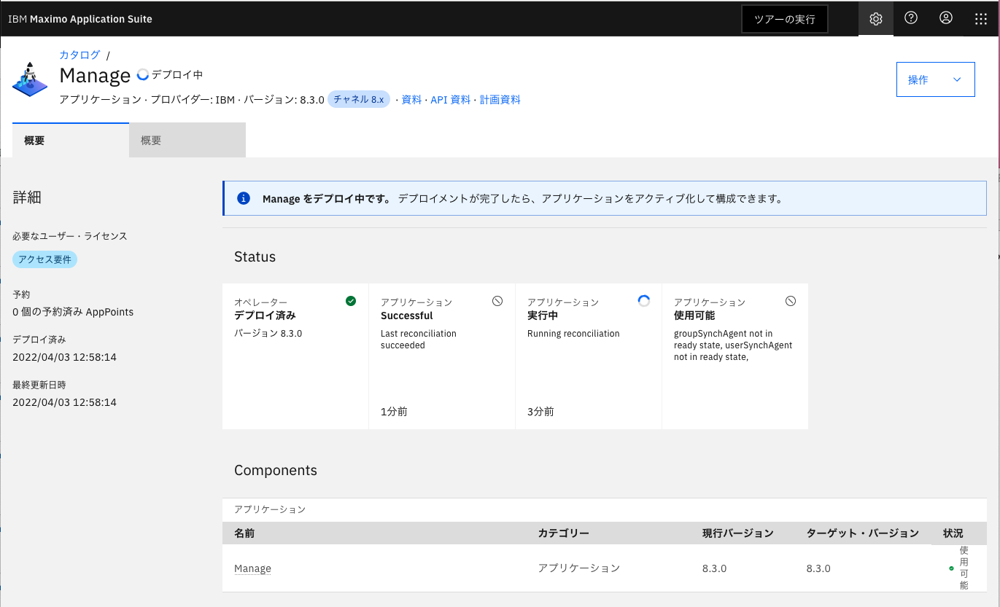
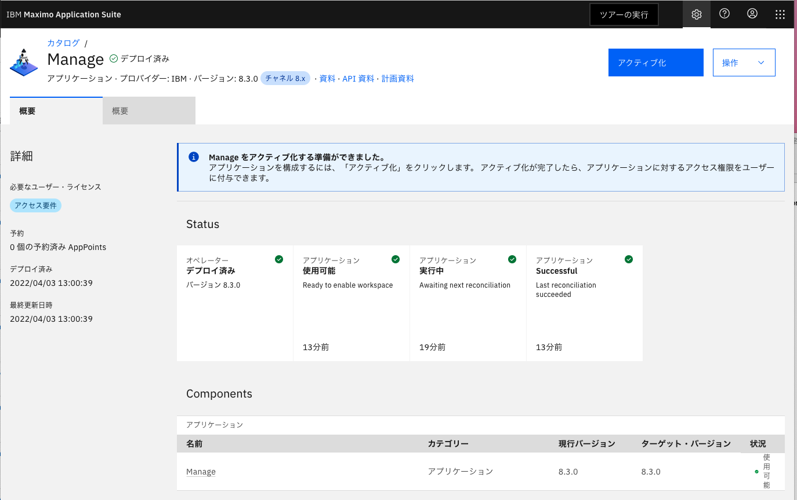

## 11.Manage Operatorデプロイ
MASにMANAGEをデプロイする。

参考手順：Deployment Overview

https://www.ibm.com/docs/en/maximo-manage/8.3.0?topic=suite-deployment-overview

1. masadminユーザーで、MASのスイート管理画面にアクセス

    スイート管理画面のURLは「08_Maximo Application Suite(MAS) のインストール」で確認したものを利用

    

2. カタログからManageを選択

    

3. 「続行」をクリック

    

4. アップグレード方法を選択してデプロイ (当手順ではサブスクライブを選択)

    

    

5. デプロイが進行する

    

    

    

    下記の画像の状態になればデプロイ完了
    

### 次項
- [12_永続ボリュームの作成](../12_pvc/index.md)
