### 1.Manageの構成変更
アクティベート後、Manageの構成は再度アクティベート(構成の更新)を実施することで変更できます。

構成変更は MAS スイート管理 > Workspace > Manage を開き、操作(Actions) > 構成の更新 (Update Configuration)から実施できます。

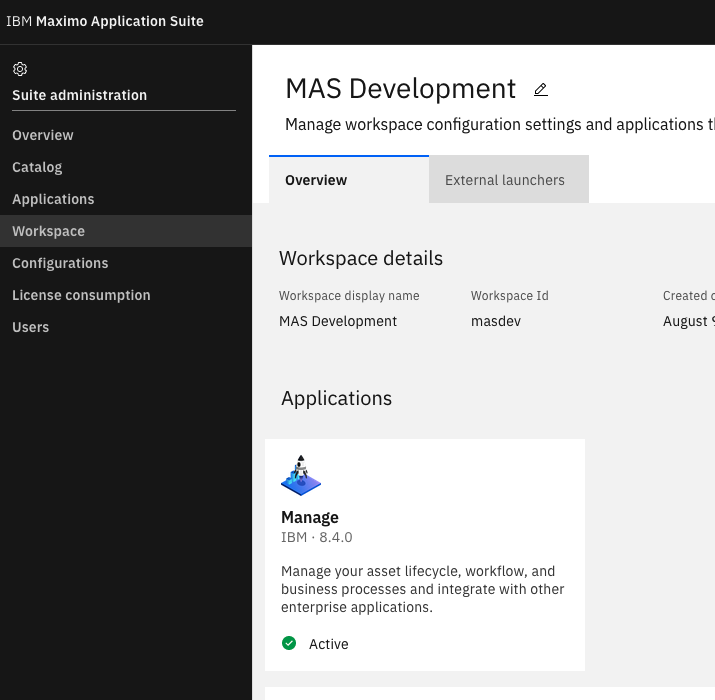

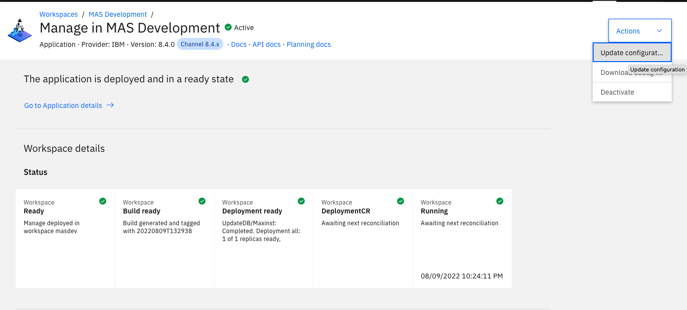


## 2.構成変更例
必要な項目を変更した後、[3.アクティブ化](#3アクティブ化) を実施します。

- [2.構成変更例](#2構成変更例)
	- [言語設定](#言語設定)
	- [コンポーネントの変更](#コンポーネントの変更)
	- [サーバーバンドル](#サーバーバンドル)
		- [補足.サーバーバンドルのJVMオプションの設定](#補足サーバーバンドルのjvmオプションの設定)
	- [データベースの変更](#データベースの変更)
		- [1.接続設定の変更](#1接続設定の変更)
		- [2.データベース](#2データベース)
	- [3.アクティブ化](#3アクティブ化)
	- [前項](#前項)
	- [次項](#次項)


参考手順：Deployment Overview

https://www.ibm.com/docs/en/maximo-manage/8.3.0?topic=suite-deployment-overview

### 言語設定
1. 言語(Languages)を選択

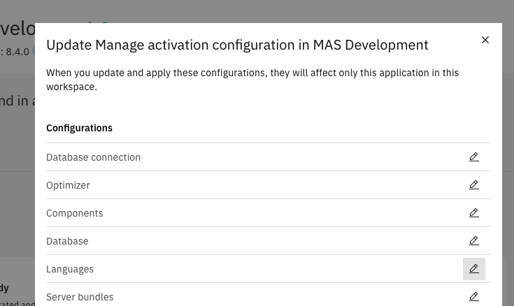

2. システム管理(System Managed)をオフにし、ベース言語、追加言語を選択する

	※ベース言語を日本語にする場合、各サーバーバンドルにJVMオプションに追加の設定をしないとログが文字化けする場合があります、その場合は以下の方法を実施します。
	アクティベートの場合の設定方法は1点目,アクティベート後の設定方法は2点目のリンク参照。

	- [補足.サーバーバンドルのJVMオプションの設定](#補足サーバーバンドルのjvmオプションの設定)
	- [外部サイト.Maximo Manage 8でログやファイル名が文字化けする場合の対応方法](https://maximopro.tumblr.com/post/680770947831169024/maximo-manage-8%E3%81%A7%E3%83%AD%E3%82%B0%E3%82%84%E3%83%95%E3%82%A1%E3%82%A4%E3%83%AB%E5%90%8D%E3%81%8C%E6%96%87%E5%AD%97%E5%8C%96%E3%81%91%E3%81%99%E3%82%8B%E5%A0%B4%E5%90%88%E3%81%AE%E5%AF%BE%E5%BF%9C%E6%96%B9%E6%B3%95)

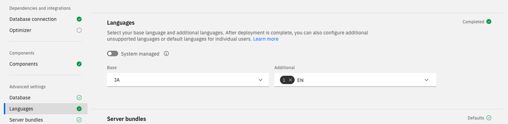

### コンポーネントの変更

1. コンポーネント(Components)を選択する。構成画面をすでに開いている場合はコンポーネント(Components)までスクロールする

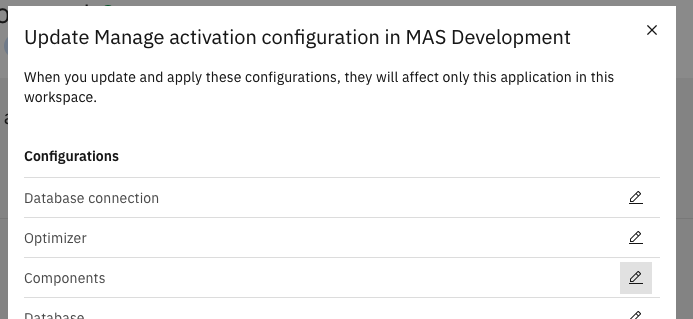

2. 導入済みのコンポーネントのバージョンの指定や、追加のコンポーネントを指定する

※当手順では、Manageのバージョンを、自動アップグレードから固定に変更するため"latest"から"8.4.0"へ変更している

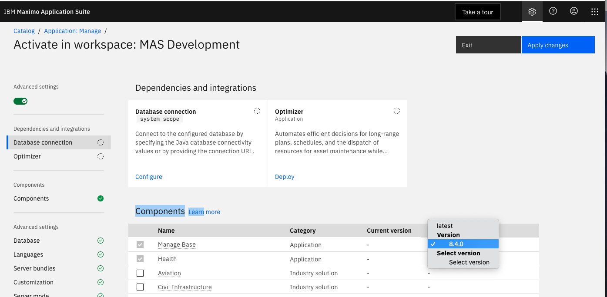

### サーバーバンドル
1. サーバーバンドル(Server Bundles)を選択する。構成画面をすでに開いている場合はサーバーバンドル(Server Bundles)までスクロールする

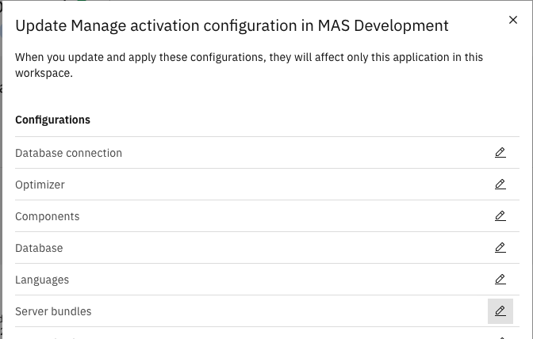

2. システムで管理(System Managed)をOFFにし、サーバーバンドルの設定を行う
※ 当手順では4つのサーバーバンドルを設定する例を記載します。サーバーバンドルの詳細は以下を参照ください

	- [参考.Server bundle overview](https://www.ibm.com/docs/en/maximo-manage/continuous-delivery?topic=deploy-server-bundle-overview)
	- [参考.Deployment Configuration Server Bundle](https://ibm-mas-manage.github.io/playbook/upgrade/configuration/)


| 名前         | タイプ           |
| ------------ | ---------------- |
| uibundle     | ui               |
| meabundle    | mea              |
| cronbundle   | cron             |
| reportbundle | report(レポート) |

それぞれ、追加のプロパティーで経路サブドメインにタイプと同じものを指定する。reportbundleの場合、経路サブドメインには「report」を指定

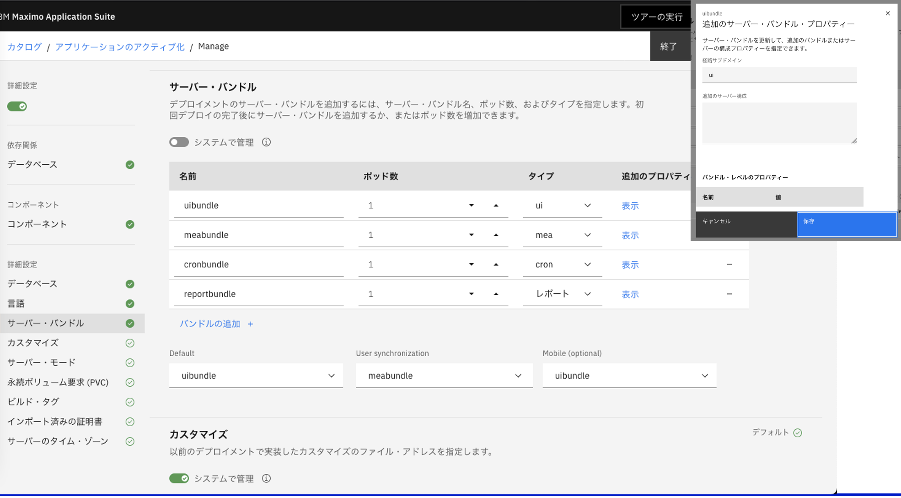

#### 補足.サーバーバンドルのJVMオプションの設定
ベース言語を日本語にする場合、各サーバーバンドルにJVMオプションに追加の設定をしないとログが文字化けする場合があります。podのログの文字化け回避のため、エンコードの設定を修正します。

すべてのサーバー・バンドルのバンドル・レベルのプロパティーで以下を設定
* 名前:jvmOptions
* 値:-Dfile.encoding=UTF-8

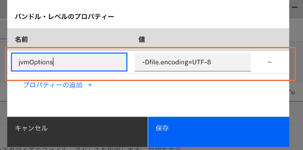

jvmOptionsはアクティベート後の修正も可能です。詳細は以下を参照ください。

参考.JVM Options Configuration

 https://www.ibm.com/docs/ja/maximo-manage/8.2.0?topic=application-configuring-jvm-options


参考.Maximo Manage 8でログやファイル名が文字化けする場合の対応方法

 https://maximopro.tumblr.com/post/680770947831169024/maximo-manage-8%E3%81%A7%E3%83%AD%E3%82%B0%E3%82%84%E3%83%95%E3%82%A1%E3%82%A4%E3%83%AB%E5%90%8D%E3%81%8C%E6%96%87%E5%AD%97%E5%8C%96%E3%81%91%E3%81%99%E3%82%8B%E5%A0%B4%E5%90%88%E3%81%AE%E5%AF%BE%E5%BF%9C%E6%96%B9%E6%B3%95


### データベースの変更
当手順では、前提として、CP4DのDb2WarehouseのDBへの設定変更を例に記載する。

#### 1.接続設定の変更

1. データベース接続(Database Connection)を選択し、データベースの設定を行う。
	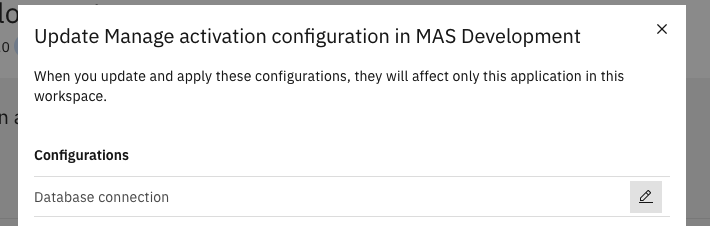

	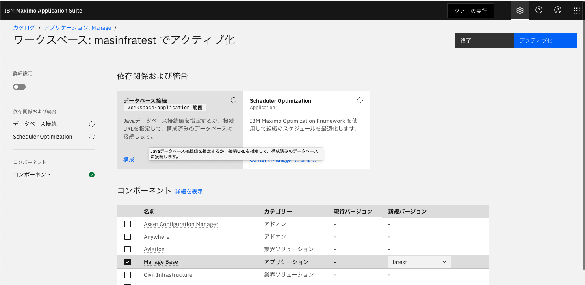

3. 構成

	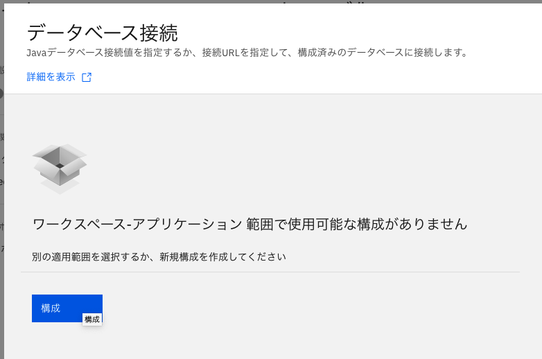


4. URLは以下のように設定する(末尾の;含む)

	```bash 
	jdbc:db2://c-[DB2WHのデプロイメントID]-db2u-engn-svc.[CP4Dのプロジェクト名].svc:50001/MANAGEDB:sslConnection=true;
	```
	当手順の例.「jdbc:db2://c-db2wh-1648941110207627-db2u-engn-svc.ibm-common-services.svc:50001/MANAGEDB:sslConnection=true;」

	参考. OpenShift Webコンソール > Networking > services > project:(CP4Dのプロジェクト) > c-db2wh-~~~~-db2u-engn-svcから確認
	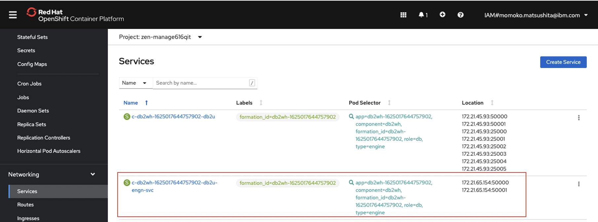

5. 接続するDBのユーザー名、パスワード

	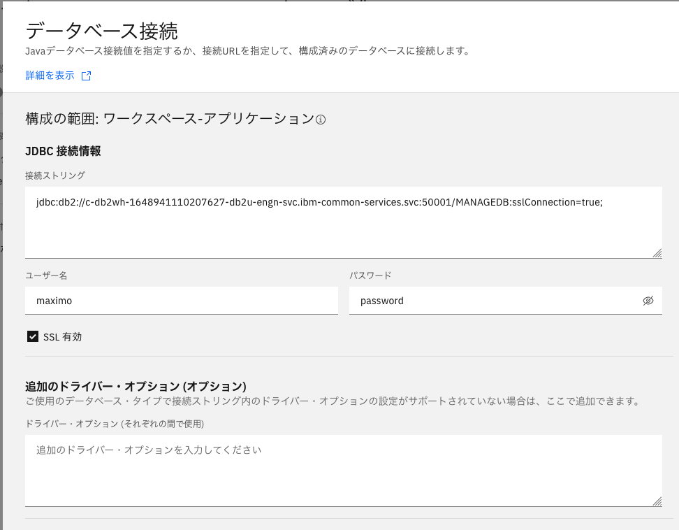

6. DBの証明書を設定する

	

7. 保存をクリック

	

	しばらくすると「状況」にチェックマークが表示されます。
	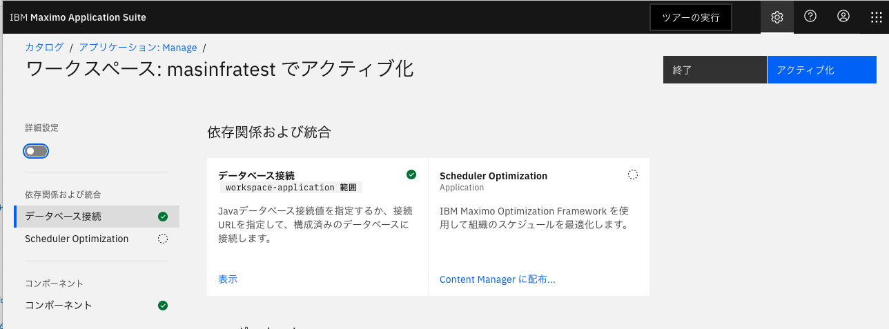

#### 2.データベース
システムで管理　のボタンをOFFにすると編集可能になるので以下を設定

<InlineNotification>

* スキーマ:(DB2WH定義時に設定したもの)				当手順の例ではmaximo

* 表スペース: (DB2WH定義時に設定したもの)				当手順書の例ではMAXDATA

* 索引スペース: (DB2WH定義時に設定したもの)				当手順書の例ではMAXINDEX

* (必要に応じ)デモ・データのインストールをチェックする	

* (英語以外の言語を使用する場合)Db2 Vargraphicをチェックする

* アップグレードバージョンチェックをバイパス: 通常はチェック不要。データベースへのネットワーク接続などが原因でアクティブ化が失敗した際のトラブルシューティングで利用する場合がある。詳細は以下参照。
  
  参考.Troubleshooting database deployment
  https://www.ibm.com/docs/en/maximo-manage/8.3.0?topic=database-troubleshooting-deployment
</InlineNotification>

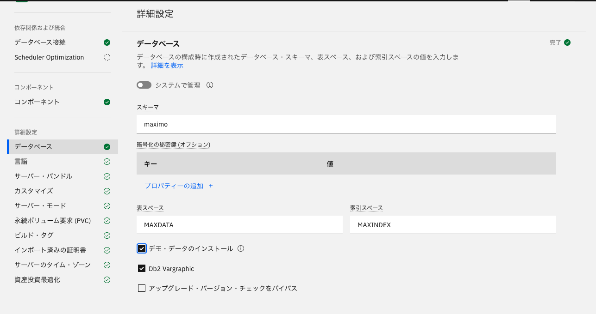


### 3.アクティブ化
1. 右上のアクティブ化ボタンから、Manageをアクティブ化

	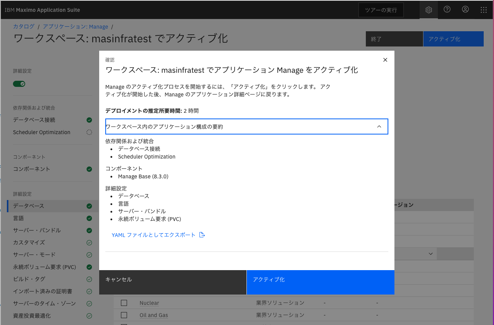

	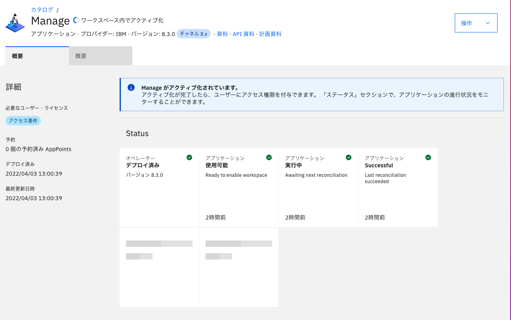

	アクティブ化には時間がかかる(2時間程度、またはもっと長い場合もある)

	アクティブ化が正常に進行しているかどうかの確認方法											
		OpenShift Webコンソール > WorkLoads > Pods > project:mas-(MASのワークスペース名)-manage のpod作成日時を確認

		アクティブ化押下以降に、admin-build-config, ui-~~,mea~~,cron~~,report~~が順に作成され、										
		(MASのワークスペース名)-manage-maxinst-~~というPodが作成されれば正常に進行している										
		上記maxinst podの詳細画面からログを監視する										


	最終的にこのような表示になれば、アクティブ化完了

	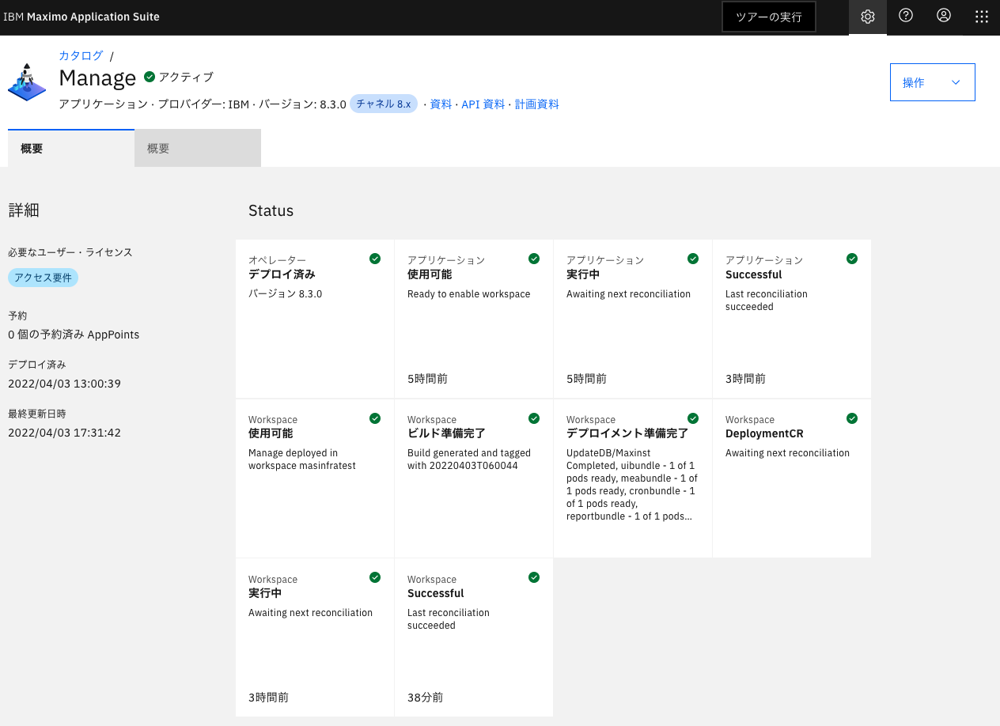


### 前項
- [ 05_導入後環境の確認 ](../05_confirm/index.md)

### 次項
- [ 12_参考.添付ファイルダウンロードの設定 ](../12_attach/index.md)
