TODO:検証。デモデータの導入を前提とするか

TODO:PVCの作成、定義が必要？

## 12.添付ファイルダウンロードの設定

Manageの資産(Assets)アプリケーションを例に、添付ファイルのダウンロード機能を利用するために必要な設定について記載します。資産以外のアプリケーションの場合でも、ダウンロード機能を利用するためには、同様の設定が必要です。

### 1. システムプロパティの設定

ここでは、以下のようにManageのシステムプロパティを設定します。
| プロパティ名                       | グローバル値                                                                                                                                                                |
| ---------------------------------- | --------------------------------------------------------------------------------------------------------------------------------------------------------------------------- |
| mxe.doclink.doctypes.topLevelPaths | /mnt/doclinks                                                                                                                                                               |
| mxe.doclink.path01                 | /mnt/doclinks=ManageのURL/maximo<br>例 /mnt/doclinks=`https://masinfratest.manage.mas87infra.itzroks-6630035f1i-v8vw8j-6...6-0000.jp-tok.containers.appdomain.cloud/maximo` |
| mxe.doclink.securedAttachment      | true                                                                                                                                                                        |
| mxe.doclink.securedAttachmentDebug | true                                                                                                                                                                        |

Manageのメニュー システムの構成 > プラットフォームの構成 > システムのプロパティを開いてください。
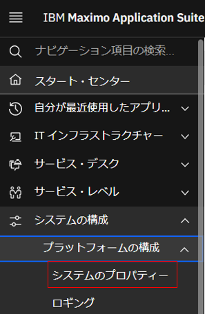

#### 1-1.mxe.doclink.doctypes.topLevelPathsプロパティの設定
mxe.doclink.doctypes.topLevelPathsを探して、グローバル値に/mnt/doclinksを設定
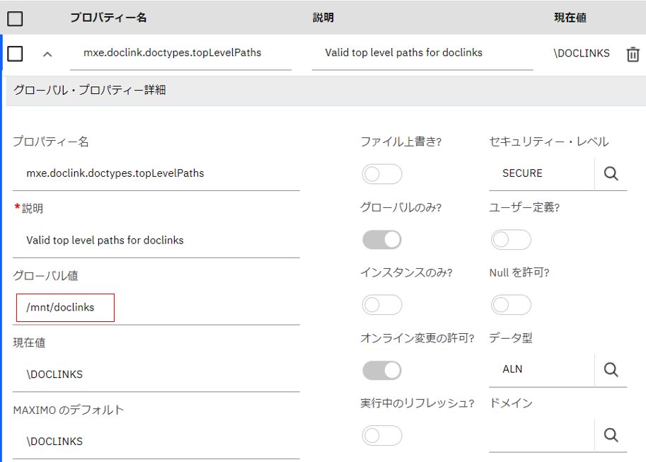

プロパティの保存を押下  
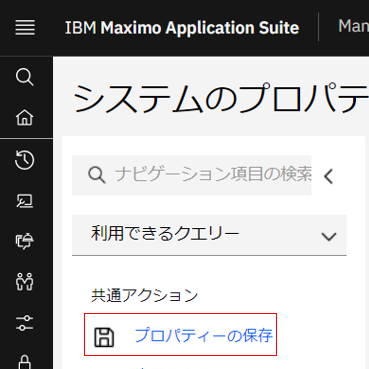

CLIからPodを再起動  
※サーババンドルの構成で指定したPod数分を再起動してください。以下は本手順に従って構築した場合のコマンドです。(サーバーバンドルの指定については「13.MANAGE アクティブ化 - サーバー・バンドル」を参照)
```
oc scale deployment mas87infra-masinfratest-uibundle -n mas-mas87infra-manage --replicas=0
oc scale deployment mas87infra-masinfratest-uibundle -n mas-mas87infra-manage --replicas=2
```
※Pod名については、OpenShift Webコンソール > ワークロード > Podにて、プロジェクト:mas-mas87infra-manageのmas87infra-masinfratestでフィルターして確認。本手順に従って構築した場合は、名前にuibundleを含むPod名が該当します。サーババンドルでタイプにallを指定した場合は、allを含むPod名が該当します。 (下のOpenShift Webコンソールのキャプチャも参照)
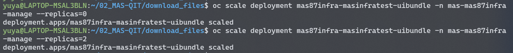

OpenShift Webコンソールより、Podの再起動が完了したことを確認。ステータスがRunning、準備状態が2/2になったらPodの再起動は完了している。
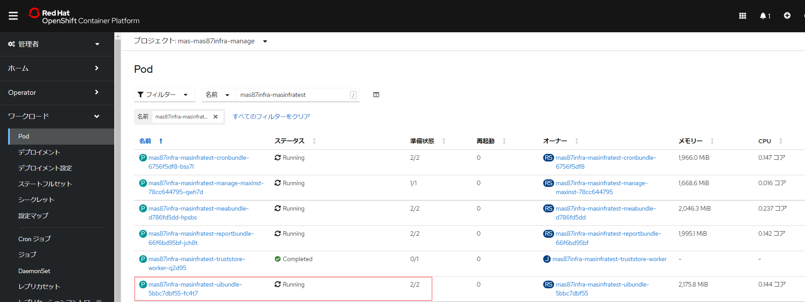

システムプロパティの現在値にグローバル値が反映されていることを確認
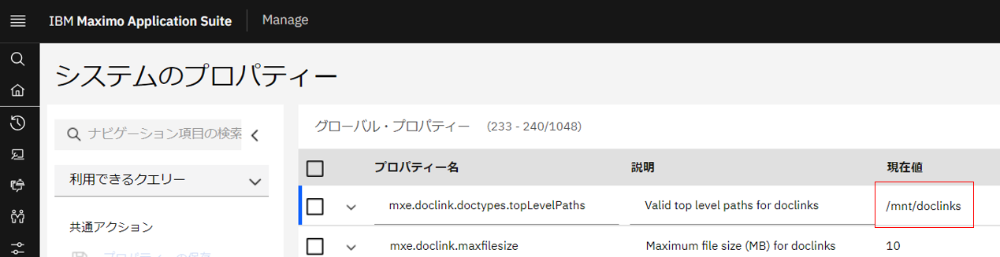

#### 1-2.mxe.doclink.path01プロパティの設定
mxe.doclink.path01を探して、グローバル値に/mnt/doclinks=ManageのURL/maximoを設定
ここでは例として、`/mnt/doclinks=https://masinfratest.manage.mas87infra.itzroks-6630035f1i-v8vw8j-6...6-0000.jp-tok.containers.appdomain.cloud/maximo`を設定する。各自のManageのURLに読み替えること。
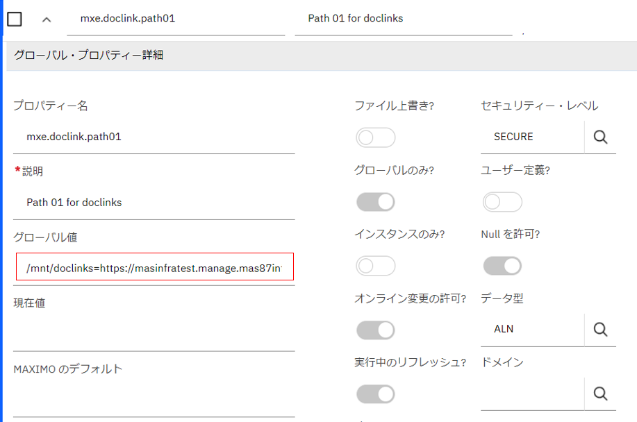

プロパティの保存を押下  


実行中のリフレッシュを押下  
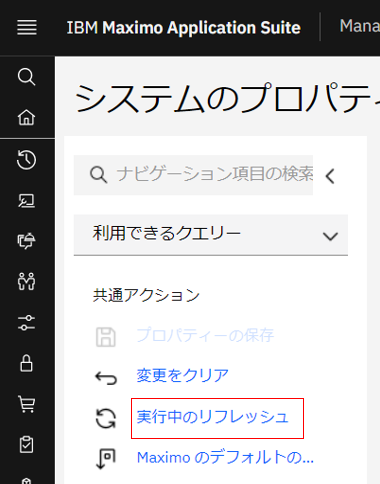

OKを押下
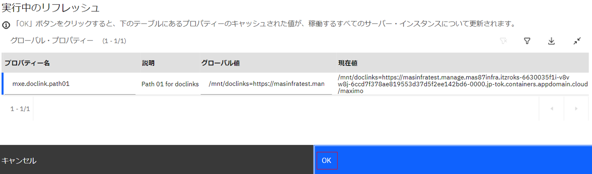

現在値に反映されていることを確認
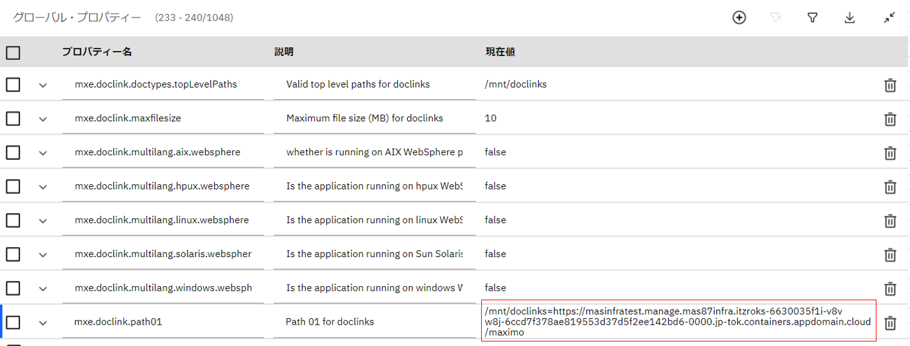

#### 1-3.mxe.doclink.securedAttachmentおよびmxe.doclink.securedAttachmentDebugプロパティの設定
mxe.doclink.securedAttachmentを探して、グローバル値にtrueを設定
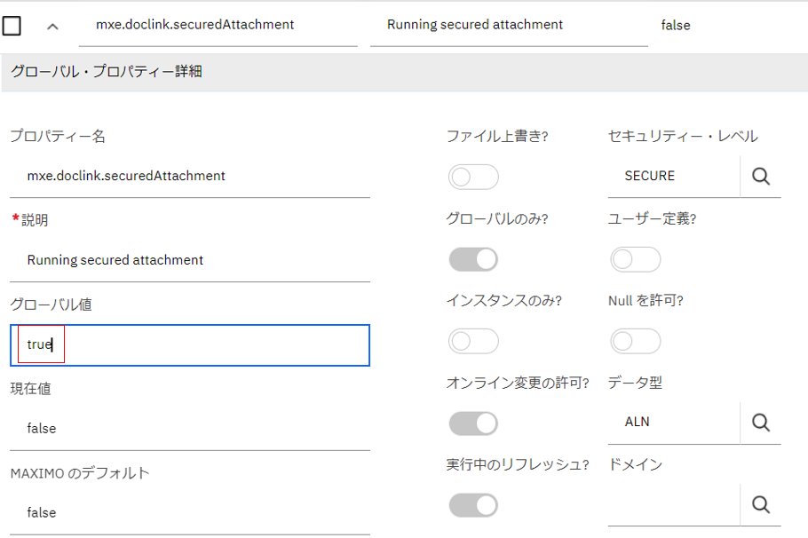

プロパティの保存を押下  


実行中のリフレッシュを押下  


現在値に反映されていることを確認
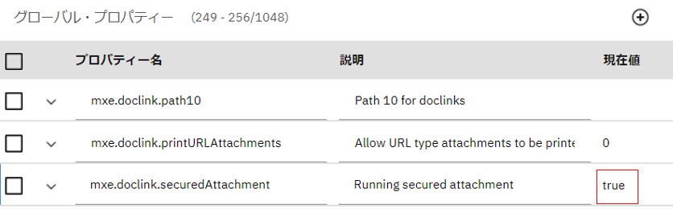

mxe.doclink.securedAttachmentDebugも同様の手順でグローバル値にtrueを設定
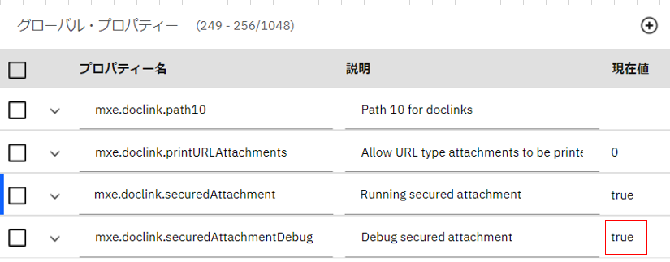

#### 1-4.補足.日本語ファイル名対応(ファイルストレージを利用している場合)
当手順のようにファイルストレージを利用している場合、ファイルストレージ上で日本語ファイル名が文字化けしないようにする対応を実施します。
1. Openshift Webコンソール > WorkLoads > デプロイメント を開き、all または uiバンドルのpodを選択します
   
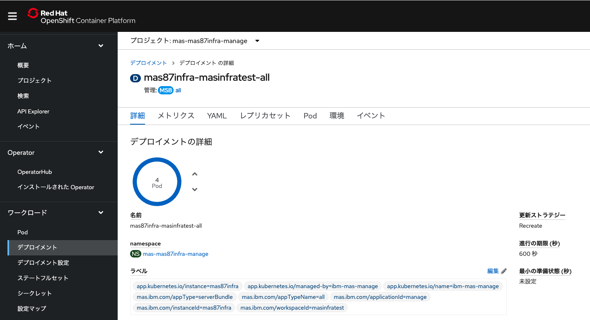   

2. [環境]タブを開き、以下の設定を追加して保存します
- 名前:LC_ALL
- 値:en_US.UTF-8

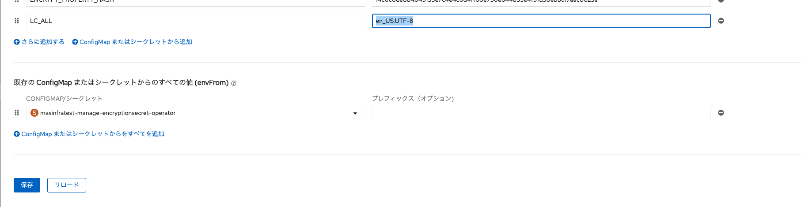

3. 参考.後述の手順でファイルをアップロード後、allまたはuiバンドルのpodのterminalから、マウントしたパスを参照すると保存されているファイルを確認できます (当手順では /mnt/doclinks/Attachments)
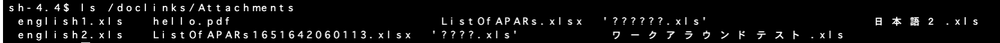
   
### 2.資産アプリケーションの設定

#### 2-1.文書フォルダーのパスを設定
Manageのナビゲーションより資産アプリケーションを選択  
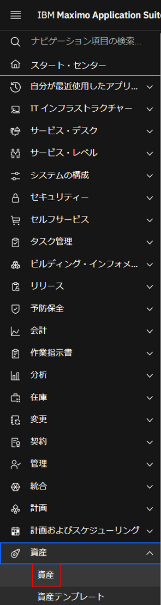

追加アクション - 添付ライブラリー/フォルダー - フォルダーの管理 を選択  
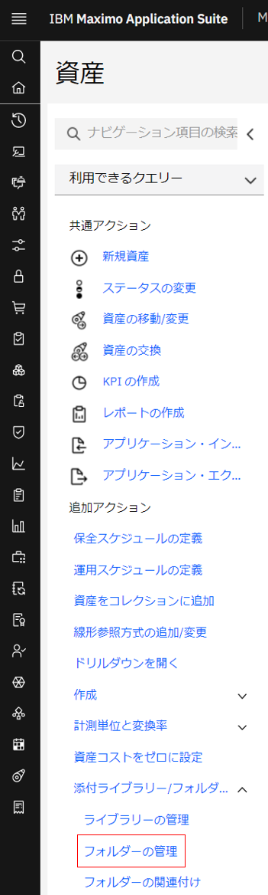

デフォルトのファイル・パスに /mnt/doclinks/Attachments を設定し、OKを押下  
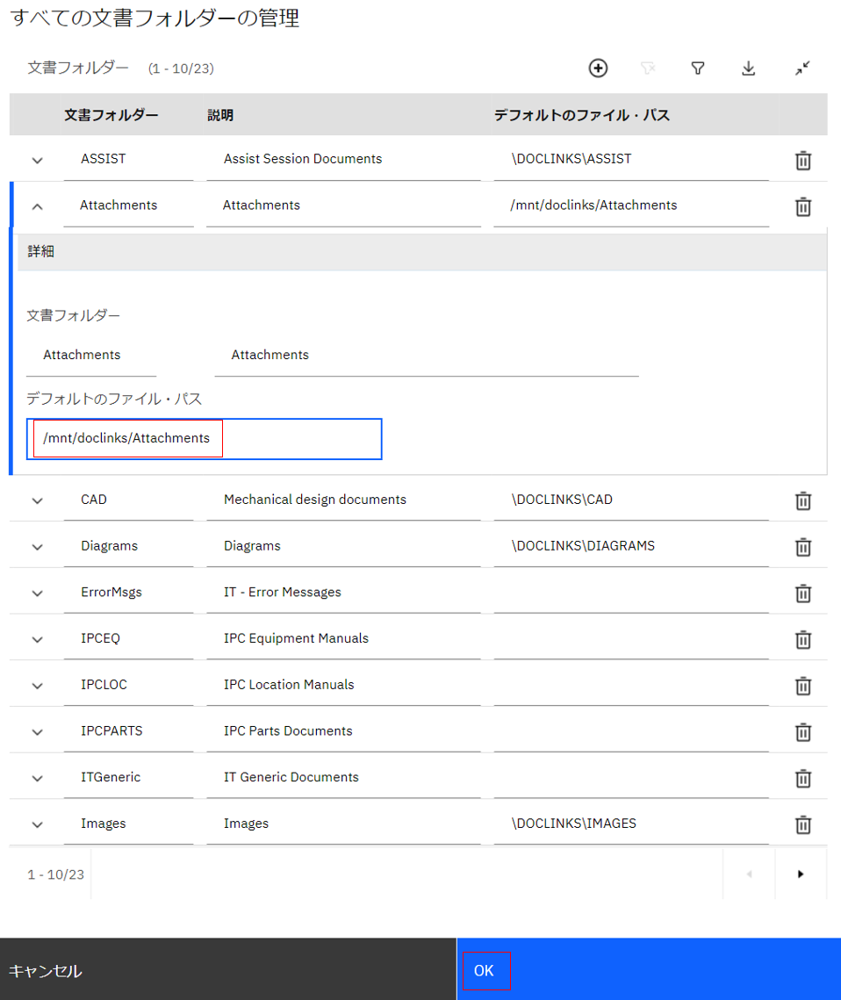

#### 2-2.添付ファイルのアップロードの確認
資産を選択して、Enterを押下。ここでは 11400 を例に説明する。
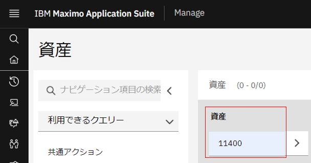

添付アイコンを押下して、新規ファイルの追加を選択
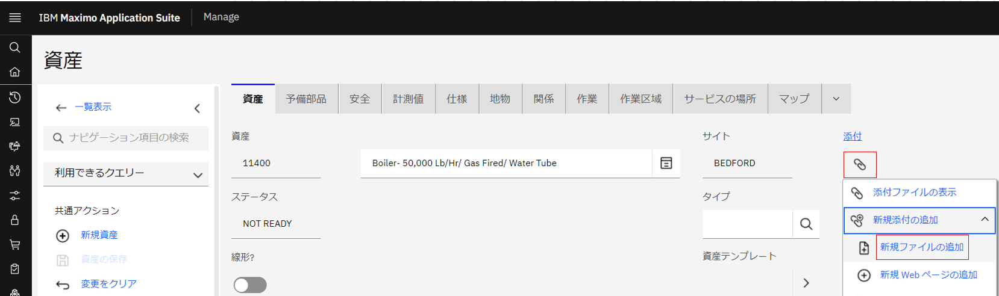

ファイルの選択ボタンより、添付するファイルを選択して、OKを押下
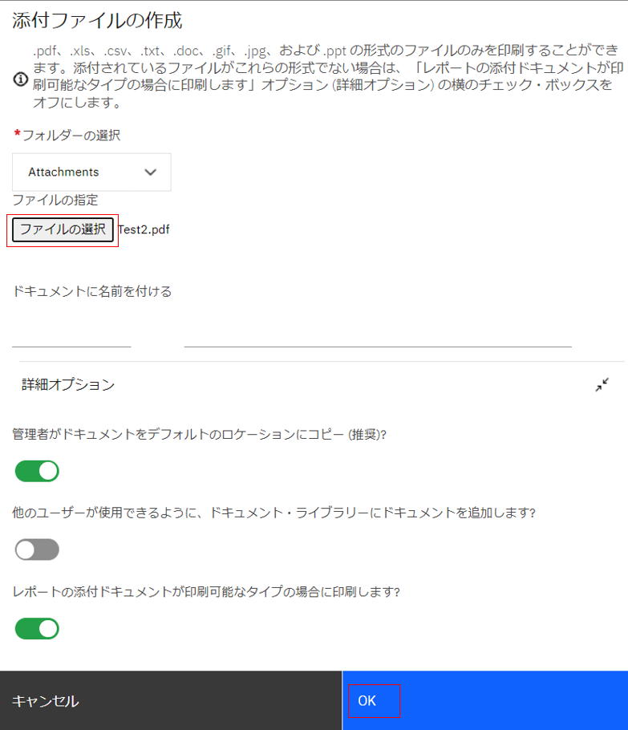

OpenShift Webコンソールより、永続ボリューム要求(manage-doc-pvc)を確認すると、仕様済みのサイズが増えていることが分かる。
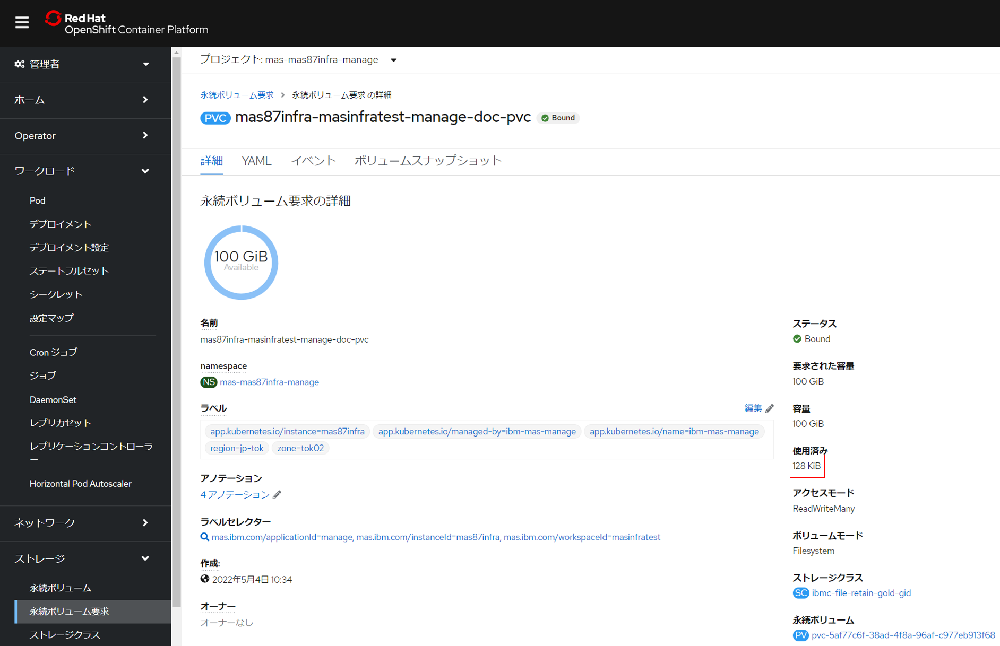

#### 2-3.添付ファイルのダウンロードの確認
添付リンクを押下して、添付したファイルのドキュメント名を押下
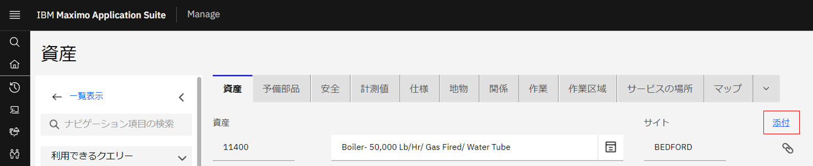

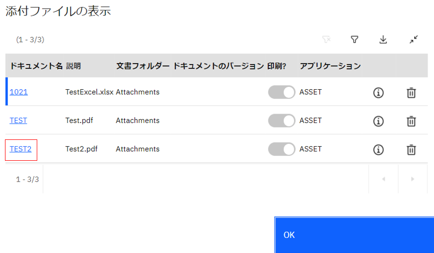
  
添付したファイルがダウンロードされて、正常に閲覧できることを確認


### 前項
- [ 11_参考.Manageの構成変更 ](../11_reactivate/index.md)


### 次項
- [ 50_参考.SQLクライアントの接続 ](../50_dbclient/index.md)
