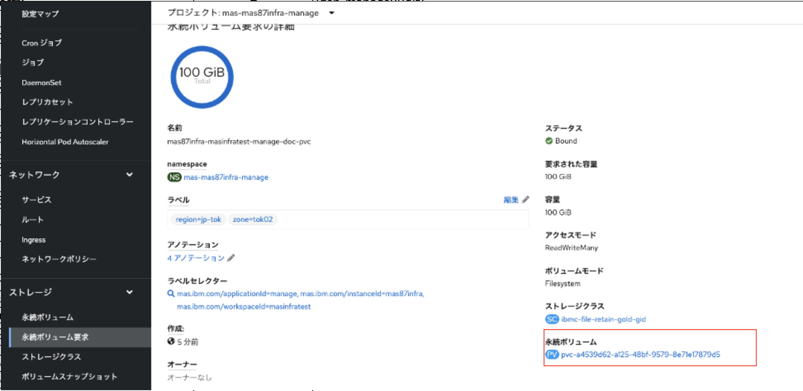
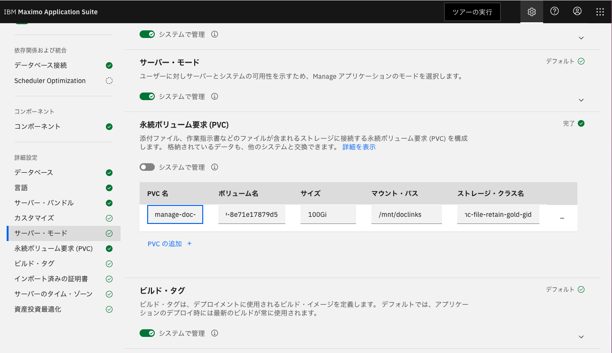

## 12_参考.添付ファイルダウンロードの設定

当手順はデモデータの導入を前提としています。
Manageの資産(Assets)アプリケーションを例に、添付ファイルのダウンロード機能を利用するために必要な設定について記載します。資産以外のアプリケーションの場合でも、ダウンロード機能を利用するためには、同様の設定が必要です。

事前準備として、添付ファイルを格納するPVCを作成し、そのPVCをManageから利用できるようにアクティベートします。

### 1.PVCの作成
1. StorageClassを作成

    OpenShift WEBコンソール > import YAML から以下のyamlをインポートします。
    ```bash 
    kind: StorageClass
    apiVersion: storage.k8s.io/v1
    metadata: 
      name: ibmc-file-retain-gold-gid
    parameters: 
      billingType: hourly
      classVersion: "2"
      gidAllocate: "true"
      iopsPerGB: "10"
      sizeRange: "[20-4000]Gi"
      type: Endurance
    provisioner: ibm.io/ibmc-file
    reclaimPolicy: Retain
    volumeBindingMode: Immediate
    ```

    

2. PVCのYamlを定義
PVCのyamlを以下の項目を編集して定義します。
* instance IDとworkspace IDについては[参考.用語解説](../99_yougo/index.md) 参照 
* instance IDの確認方法はmas coreをインストールしたprojectを参照する「mas-{instance ID}-manage」。当手順の場合、プロジェクト名は「mas-inst1-core」であるため、Instance Idは「inst1」
* workspace IDはMASのホームのURLの構成要素。「https://{workspace ID}.home.~」。当手順の場合、MASのホームのURLは「https://masdev.home.inst1.itzroks-50x6wchyyb-kvafbh...」であるため、workspace Idは「masdev」 
* 任意の「アクティベート時の入力値」=Manageアクティベート時にPVC欄に入力する文字列を先に決めます(詳細後述)。当手順の場合、「manage-doc-pvc」としています。
  


    yaml編集項目
    | 項目       |  入力値 |
    | ------------- | ----- |
    spec.selector.matchLabels.mas.ibm.com/instanceId | {instance ID}
    spec.selector.matchLabels.mas.ibm.com/workspaceId  | {workspace ID}
    metadata.namespace | mas-{instance ID}-manage
    metadata.name | {instance ID}-{workspace ID}-{アクティベート時の入力値}　

    yaml定義
    ```bash 
    kind: PersistentVolumeClaim
    apiVersion: v1
    metadata:
      name: {instance ID}-{workspace ID}-{アクティベート時の入力値}　
      namespace: mas-{instance ID}-manage
    spec:
      accessModes:
        - ReadWriteMany
      selector:
        matchLabels:
          mas.ibm.com/applicationId: manage
          mas.ibm.com/instanceId: {instance ID}
          mas.ibm.com/workspaceId: {workspace ID}
      resources:
        requests:
          storage: 100Gi
      storageClassName: ibmc-file-retain-gold-gid
      volumeMode: Filesystem
    ```

    ※ instance IDとworkspace IDの混同に要注意。下記yamlは参考用の具体例


    参考yaml(当手順の場合のyaml定義):

    ```bash 
    kind: PersistentVolumeClaim
    apiVersion: v1
    metadata:
      name: inst1-masdev-manage-doc-pvc
      namespace: mas-inst1-manage
    spec:
      accessModes:
        - ReadWriteMany
      selector:
        matchLabels:
          mas.ibm.com/applicationId: manage
          mas.ibm.com/instanceId: inst1
          mas.ibm.com/workspaceId: masdev
      resources:
        requests:
          storage: 100Gi
      storageClassName: ibmc-file-retain-gold-gid
      volumeMode: Filesystem
    ```


3. PVCを作成
前手順で作成したyamlをOpenShift WEBコンソール > import YAML からインポートします。
数分で作成が完了します。


4. PV名の確認
アクティベート時に利用するため、PV名を控えておきます。



5. 手順補足
   
    Manageアクティベート時、PVC名の入力値に注意してください。

    自作したPVC名をそのまま入力するのではなく、先に決定しておいた アクティベート時の入力値 だけを入力します。
    
    今回自作したPVC名は inst1-masdev-manage-doc-pvc で、アクティベート時には manage-doc-pvc のみ入力しています。


    ※検証により、Manageが自動生成するPVC名は MASインスタンスID-MASワークスペースID-アクティベート時の入力値 であることを確認。当手順では、同一名のPVCを先んじて用意しておけるように、あらかじめ入力値を定義します。
    

### 2.PVCを有効にするため、永続ボリュームの要求(PVC)を設定してアクティベート
システムで管理をOFFにし、以下の4つを設定


* PVC名:永続ボリューム作成のPVC作成時に指定したもの				当手順の例ではmanage-doc-pvc

* ボリューム名: 永続ボリューム作成で、作成したPVCの定義から確認したPV名			当手順書の例ではpvc-a4539d62-a125-48bf-9579-8e71e17879d5

* サイズ:永続ボリューム作成のPVC作成時に指定したもの				当手順の例では100Gi

* マウントパス:doclinksで指定するパス                                      当手順の例では/mnt/doclinks

* ストレージクラス名:永続ボリューム作成のPVC作成時に指定したもの				当手順の例ではibmc-file-retain-gold-gid

</InlineNotification>



### 3. システムプロパティの設定

ここでは、以下のようにManageのシステムプロパティを設定します。
| プロパティ名                       | グローバル値                                                                                                                                                                |
| ---------------------------------- | --------------------------------------------------------------------------------------------------------------------------------------------------------------------------- |
| mxe.doclink.doctypes.topLevelPaths | /mnt/doclinks                                                                                                                                                               |
| mxe.doclink.path01                 | /mnt/doclinks=ManageのURL/maximo<br>例 /mnt/doclinks=`https://masdev.manage.inst1.itzroks-6630035f1i-v8vw8j-6...6-0000.jp-tok.containers.appdomain.cloud/maximo` |
| mxe.doclink.securedAttachment      | true                                                                                                                                                                        |
| mxe.doclink.securedAttachmentDebug | true                                                                                                                                                                        |

Manageのメニュー システムの構成 > プラットフォームの構成 > システムのプロパティを開いてください。


#### 3-1.mxe.doclink.doctypes.topLevelPathsプロパティの設定
mxe.doclink.doctypes.topLevelPathsを探して、グローバル値に/mnt/doclinksを設定


プロパティの保存を押下  


CLIからPodを再起動  
※サーババンドルの構成で指定したPod数分を再起動してください。以下は本手順に従って構築した場合のコマンドです。(サーバーバンドルの指定については「11.Manageの構成変更 - サーバー・バンドル」を参照)
```
oc scale deployment inst1-masdev-uibundle -n mas-inst1-manage --replicas=0
oc scale deployment inst1-masdev-uibundle -n mas-inst1-manage --replicas=2
```
※Pod名については、OpenShift Webコンソール > ワークロード > Podにて、プロジェクト:mas-inst1-manageのinst1-masdevでフィルターして確認。本手順に従って構築した場合は、名前にuibundleを含むPod名が該当します。サーババンドルでタイプにallを指定した場合は、allを含むPod名が該当します。 (下のOpenShift Webコンソールのキャプチャも参照)


OpenShift Webコンソールより、Podの再起動が完了したことを確認。ステータスがRunning、準備状態が2/2になったらPodの再起動は完了している。


システムプロパティの現在値にグローバル値が反映されていることを確認


#### 3-2.mxe.doclink.path01プロパティの設定
mxe.doclink.path01を探して、グローバル値に/mnt/doclinks=ManageのURL/maximoを設定
ここでは例として、`/mnt/doclinks=https://masdev.manage.inst1.itzroks-6630035f1i-v8vw8j-6...6-0000.jp-tok.containers.appdomain.cloud/maximo`を設定する。各自のManageのURLに読み替えること。


プロパティの保存を押下  


実行中のリフレッシュを押下  


OKを押下


現在値に反映されていることを確認


#### 3-3.mxe.doclink.securedAttachmentおよびmxe.doclink.securedAttachmentDebugプロパティの設定
mxe.doclink.securedAttachmentを探して、グローバル値にtrueを設定


プロパティの保存を押下  


実行中のリフレッシュを押下  


現在値に反映されていることを確認


mxe.doclink.securedAttachmentDebugも同様の手順でグローバル値にtrueを設定


#### 3-4.補足.日本語ファイル名対応(ファイルストレージを利用している場合)
当手順のようにファイルストレージを利用している場合、ファイルストレージ上で日本語ファイル名が文字化けしないようにする対応を実施します。
1. Openshift Webコンソール > WorkLoads > デプロイメント を開き、all または uiバンドルのpodを選択します
   
   

2. [環境]タブを開き、以下の設定を追加して保存します
- 名前:LC_ALL
- 値:en_US.UTF-8


3. 参考.後述の手順でファイルをアップロード後、allまたはuiバンドルのpodのterminalから、マウントしたパスを参照すると保存されているファイルを確認できます (当手順では /mnt/doclinks/Attachments)

   
### 4.資産アプリケーションの設定

#### 4-1.文書フォルダーのパスを設定
Manageのナビゲーションより資産アプリケーションを選択  


追加アクション - 添付ライブラリー/フォルダー - フォルダーの管理 を選択  


デフォルトのファイル・パスに /mnt/doclinks/Attachments を設定し、OKを押下  


#### 4-2.添付ファイルのアップロードの確認
資産を選択して、Enterを押下。ここでは 11400 を例に説明する。


添付アイコンを押下して、新規ファイルの追加を選択


ファイルの選択ボタンより、添付するファイルを選択して、OKを押下


OpenShift Webコンソールより、永続ボリューム要求(manage-doc-pvc)を確認すると、仕様済みのサイズが増えていることが分かる。


#### 4-3.添付ファイルのダウンロードの確認
添付リンクを押下して、添付したファイルのドキュメント名を押下


  
添付したファイルがダウンロードされて、正常に閲覧できることを確認


### 前項
- [ 11_参考:Manageの構成変更](../11_reactivate/index.md)


### 次項
- [ 50_参考.SQLクライアントの接続 ](../50_dbclient/index.md)
