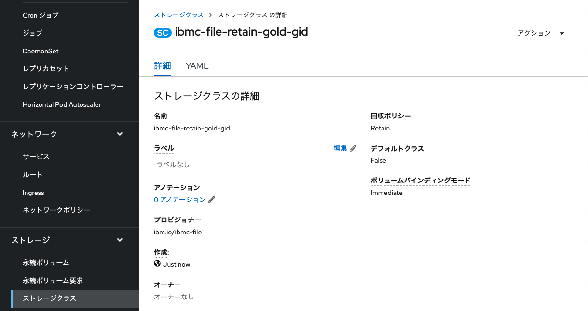
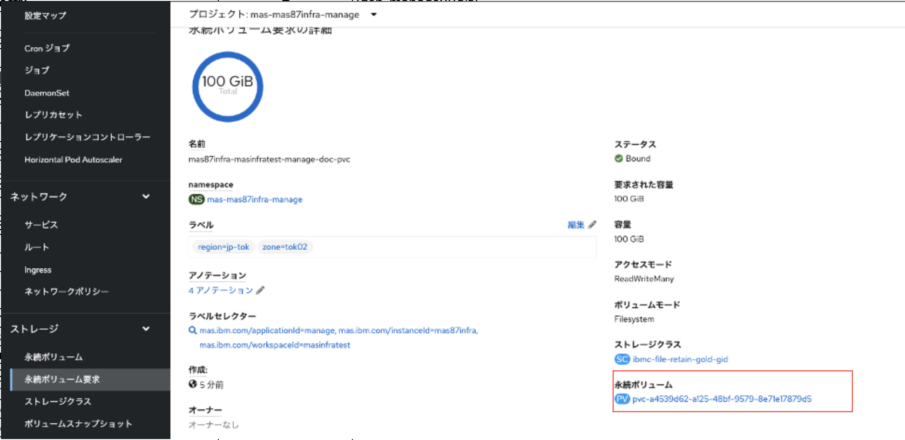
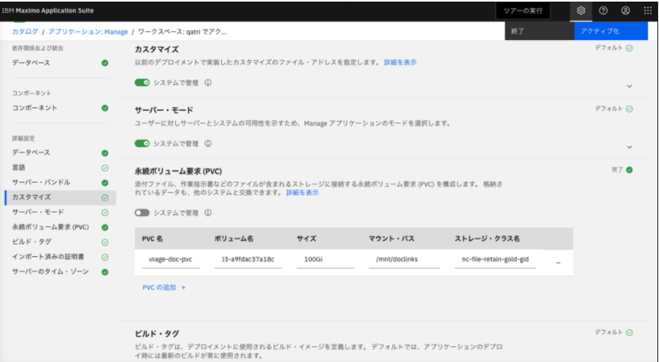

## 12.永続ボリュームの作成
MAS Manageはアクティベート時に永続ボリューム(Persistent Volume)を自動生成しますが、それが正しく作成されずアクティベートが失敗することがあります。
そのため、当手順ではあらかじめMAS Manageが利用するPVC/PVを作成します。

1. StorageClassを作成

    OpenShift WEBコンソール > import YAML から以下のyamlをインポートします。
    ```bash 
    kind: StorageClass
    apiVersion: storage.k8s.io/v1
    metadata: 
      name: ibmc-file-retain-gold-gid
    parameters: 
      billingType: hourly
      classVersion: "2"
      gidAllocate: "true"
      iopsPerGB: "10"
      sizeRange: "[20-4000]Gi"
      type: Endurance
    provisioner: ibm.io/ibmc-file
    reclaimPolicy: Retain
    volumeBindingMode: Immediate
    ```

    

2. PVCのYamlを定義
PVCのyamlを以下の項目を編集して定義します。
* instance IDとworkspace IDについては[参考.用語解説](../99_yougo/index.md) 参照 
* instance IDの確認方法はmas coreをインストールしたprojectを参照する「mas-{instance ID}-manage」。当手順の場合、プロジェクト名は「mas-mas87infra-core」であるため、Instance Idは「mas87infra」
* workspace IDはMASのホームのURLの構成要素。「https://{workspace ID}.home.~」。当手順の場合、MASのホームのURLは「https://masinfratest.home.mas87infra.itzroks-50x6wchyyb-kvafbh...」であるため、workspace Idは「masinfratest」 
* 任意の「アクティベート時の入力値」=Manageアクティベート時にPVC欄に入力する文字列を先に決めます(詳細後述)。当手順の場合、「manage-doc-pvc」としています。
  


    yaml編集項目
    | 項目       |  入力値 |
    | ------------- | ----- |
    spec.selector.matchLabels.mas.ibm.com/instanceId | {instance ID}
    spec.selector.matchLabels.mas.ibm.com/workspaceId  | {workspace ID}
    metadata.namespace | mas-{instance ID}-manage
    metadata.name | {instance ID}-{workspace ID}-{アクティベート時の入力値}　

    yaml定義
    ```bash 
    kind: PersistentVolumeClaim
    apiVersion: v1
    metadata:
      name: {instance ID}-{workspace ID}-{アクティベート時の入力値}　
      namespace: mas-{instance ID}-manage
    spec:
      accessModes:
        - ReadWriteMany
      selector:
        matchLabels:
          mas.ibm.com/applicationId: manage
          mas.ibm.com/instanceId: {instance ID}
          mas.ibm.com/workspaceId: {workspace ID}
      resources:
        requests:
          storage: 100Gi
      storageClassName: ibmc-file-retain-gold-gid
      volumeMode: Filesystem
    ```

    ※ instance IDとworkspace IDの混同に要注意。下記yamlは参考用の具体例


    参考yaml(当手順の場合のyaml定義):

    ```bash 
    kind: PersistentVolumeClaim
    apiVersion: v1
    metadata:
      name: mas87infra-masinfratest-manage-doc-pvc
      namespace: mas-mas87infra-manage
    spec:
      accessModes:
        - ReadWriteMany
      selector:
        matchLabels:
          mas.ibm.com/applicationId: manage
          mas.ibm.com/instanceId: mas87infra
          mas.ibm.com/workspaceId: masinfratest
      resources:
        requests:
          storage: 100Gi
      storageClassName: ibmc-file-retain-gold-gid
      volumeMode: Filesystem
    ```


3. PVCを作成
前手順で作成したyamlをOpenShift WEBコンソール > import YAML からインポートします。
数分で作成が完了します。


4. PV名の確認
アクティベート時に利用するため、PV名を控えておきます。



5. 手順補足
   
    Manageアクティベート時、PVC名の入力値に注意してください。

    自作したPVC名をそのまま入力するのではなく、先に決定しておいた アクティベート時の入力値 だけを入力します。
    
    今回自作したPVC名は mas87infra-masinfratest-manage-doc-pvc で、アクティベート時には manage-doc-pvc のみ入力しています。


    ※検証により、Manageが自動生成するPVC名は MASインスタンスID-MASワークスペースID-アクティベート時の入力値 であることを確認。当手順では、同一名のPVCを先んじて用意しておけるように、あらかじめ入力値を定義します。
    

### 次項
- [13_Manageのアクティブ化](../13_activate/index.md)
