## 13.MANAGE アクティブ化

参考手順：Deployment Overview

https://www.ibm.com/docs/en/maximo-manage/8.3.0?topic=suite-deployment-overview

### 1.データベース接続設定

1. MAS スイート管理 > カタログ > Manageを開き、右上のアクティブ化をクリック

	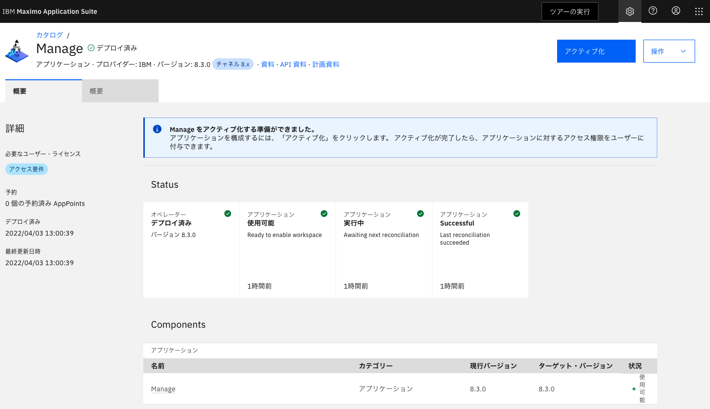

2. データベースの設定を行う。ここでは、前の手順で作成したDB2WHの情報をセットします。

	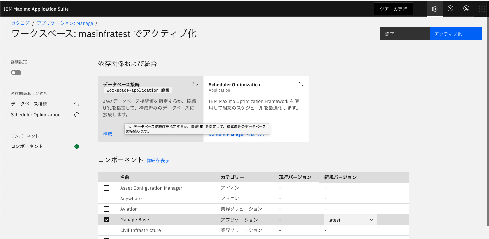

3. 作成

	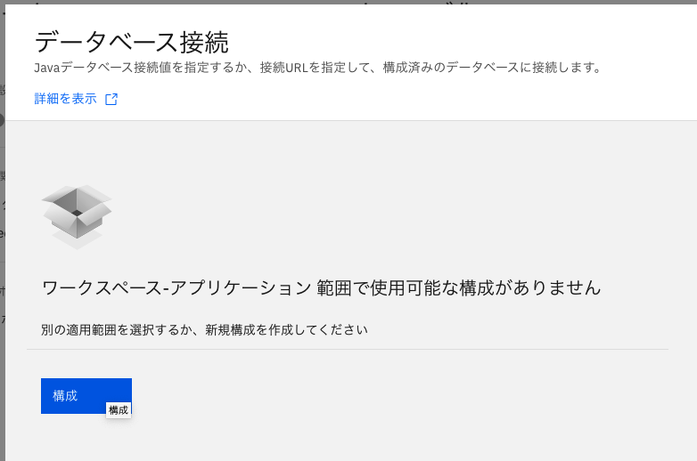


4. URLは以下のように設定する(末尾の;含む)

	```bash 
	jdbc:db2://c-[DB2WHのデプロイメントID]-db2u-engn-svc.[CP4Dのプロジェクト名].svc:50001/MANAGEDB:sslConnection=true;
	```
	当手順の例.「jdbc:db2://c-db2wh-1648941110207627-db2u-engn-svc.ibm-common-services.svc:50001/MANAGEDB:sslConnection=true;」

	参考. OpenShift Webコンソール > Networking > services > project:(CP4Dのプロジェクト) > c-db2wh-~~~~-db2u-engn-svcから確認
	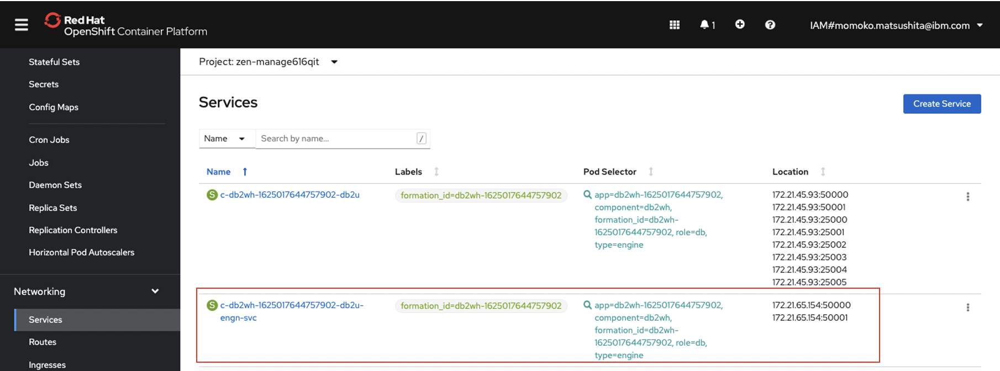

5. 接続するDBのユーザー名、パスワード

	「10_DB2warehouseのインストールと構成」で作成したユーザ名とそのパスワードを指定
]

	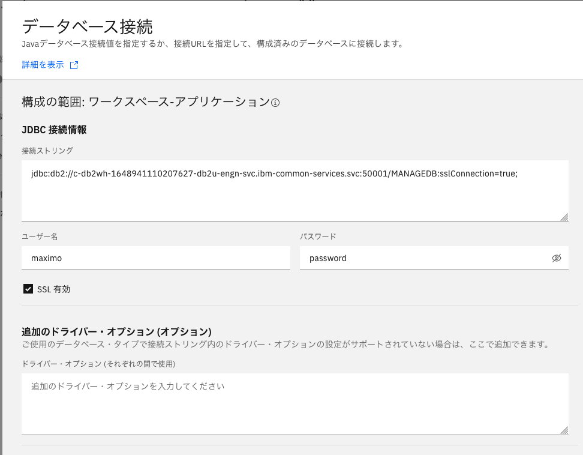

6. DBの証明書を設定する

	証明書は「10_DB2warehouseのインストールと構成」の「データベースの作成」の最後にダウンロードした証明書の内容をコピー
	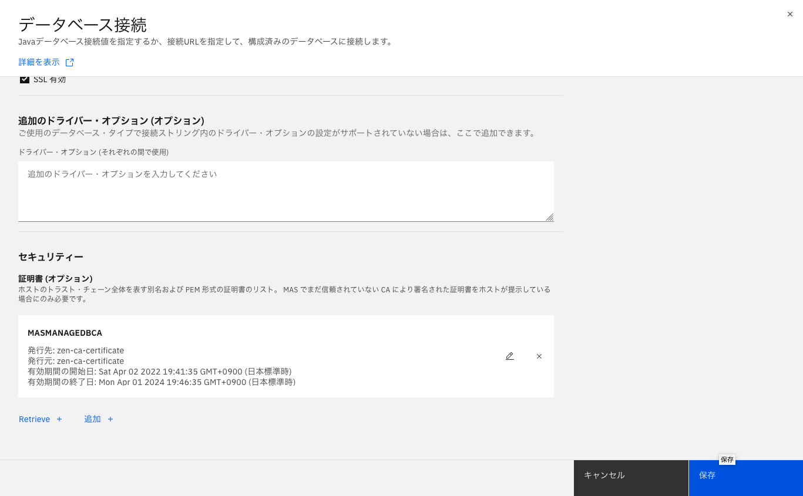

7. 保存をクリック

	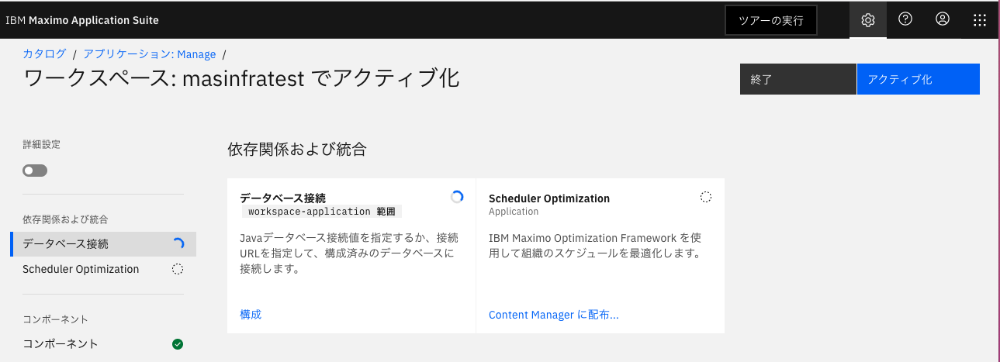

	しばらくすると「状況」にチェックマークが表示されます。
	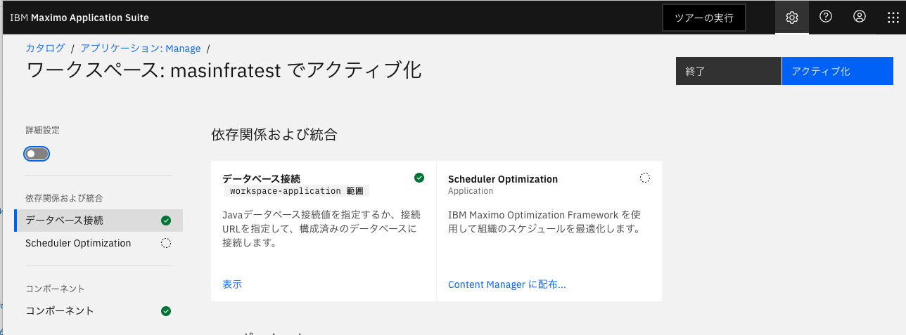

### 2.コンポーネントの指定
必要に応じ、Manage Baseのバージョンを指定する。当手順では「8.3.0」を指定


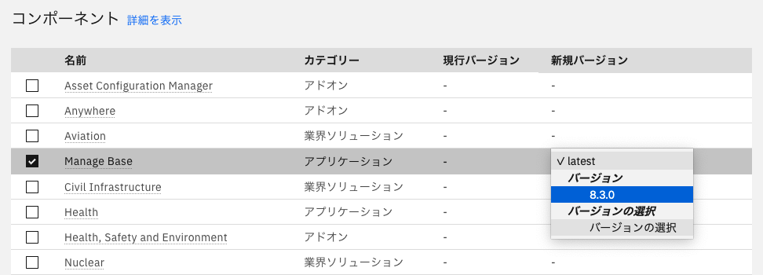

### 3.詳細設定
「詳細設定の表示」をクリックし、後続の詳細設定を実施

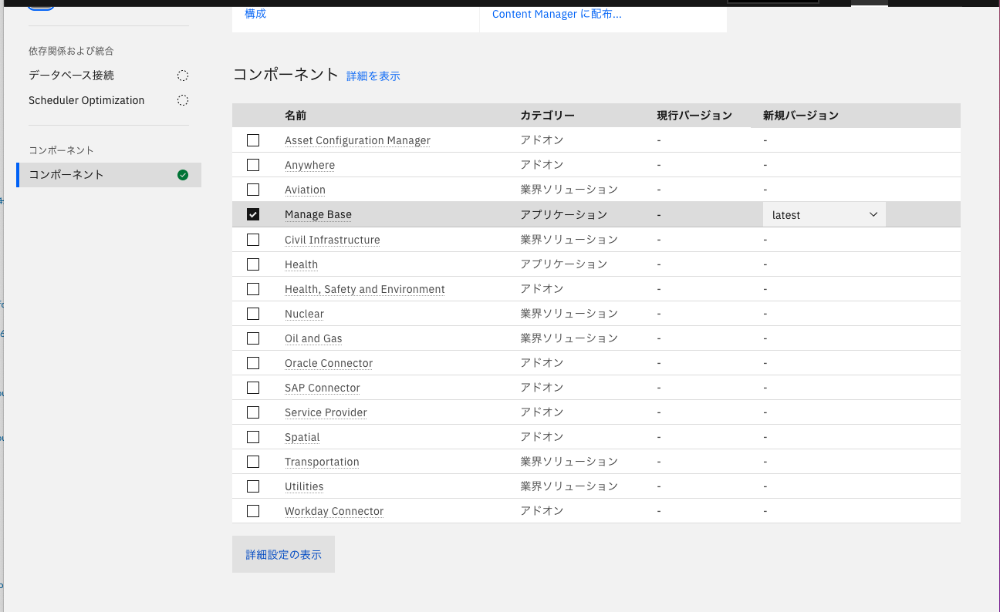

### 4.データベース
システムで管理　のボタンをOFFにすると編集可能になるので以下を設定

<InlineNotification>

* スキーマ:(DB2WH定義時に設定したもの)				当手順の例ではmaximo

* 表スペース: (DB2WH定義時に設定したもの)				当手順書の例ではMAXDATA

* 索引スペース: (DB2WH定義時に設定したもの)				当手順書の例ではMAXINDEX

* (必要に応じ)デモ・データのインストールをチェックする	

* (英語以外の言語を使用する場合)Db2 Vargraphicをチェックする

* アップグレードバージョンチェックをバイパス: 通常はチェック不要。データベースへのネットワーク接続などが原因でアクティブ化が失敗した際のトラブルシューティングで利用する場合がある。詳細は以下参照。
  
  参考.Troubleshooting database deployment
  https://www.ibm.com/docs/en/maximo-manage/8.3.0?topic=database-troubleshooting-deployment
</InlineNotification>

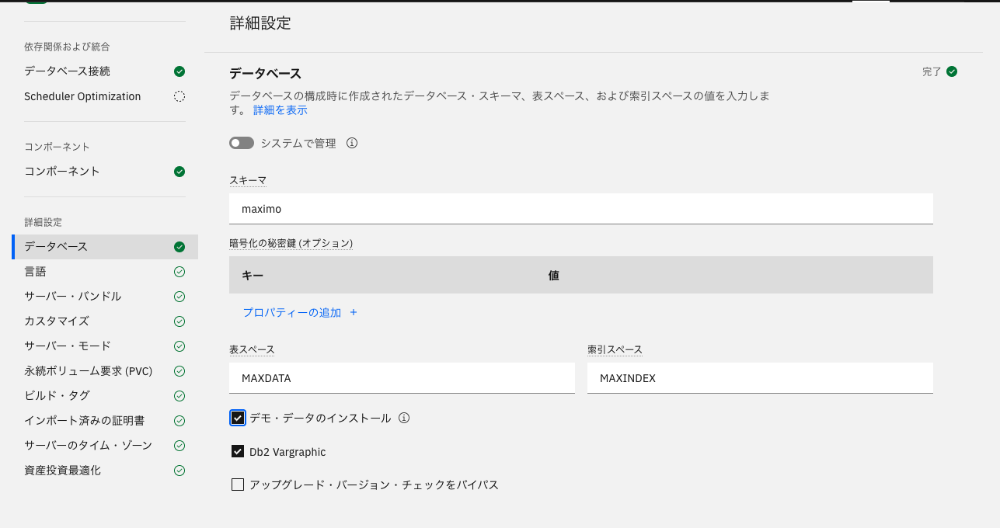


### 5.追加言語
システムで管理をOFFにする。必要に応じてJA(日本語)を追加
	
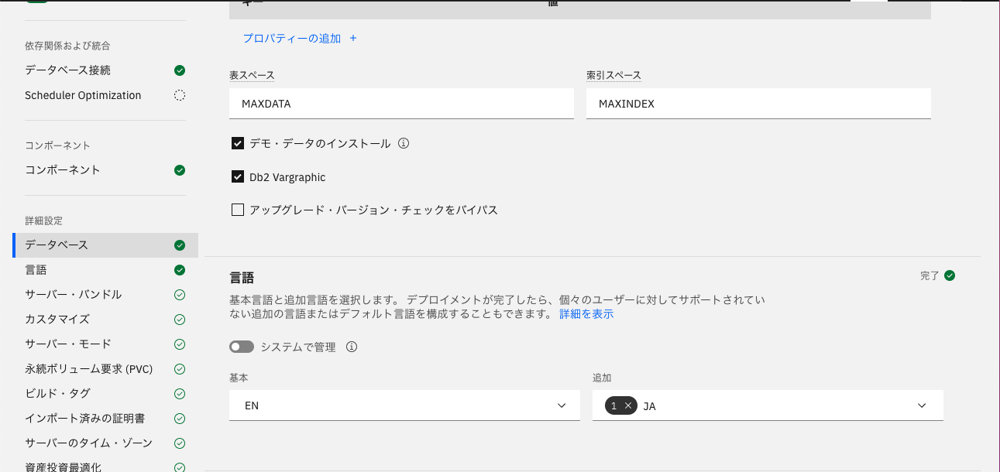

### 6.サーバー・バンドル
システムで管理をOFFにし、以下の4つを追加
	

| 名前       |  タイプ |
| ------------- | ----- |
uibundle  | ui
meabundle  |  mea
cronbundle  | cron
reportbundle | report(レポート)

それぞれ、追加のプロパティーで経路サブドメインにタイプと同じものを指定する。reportbundleの場合、経路サブドメインには「report」を指定

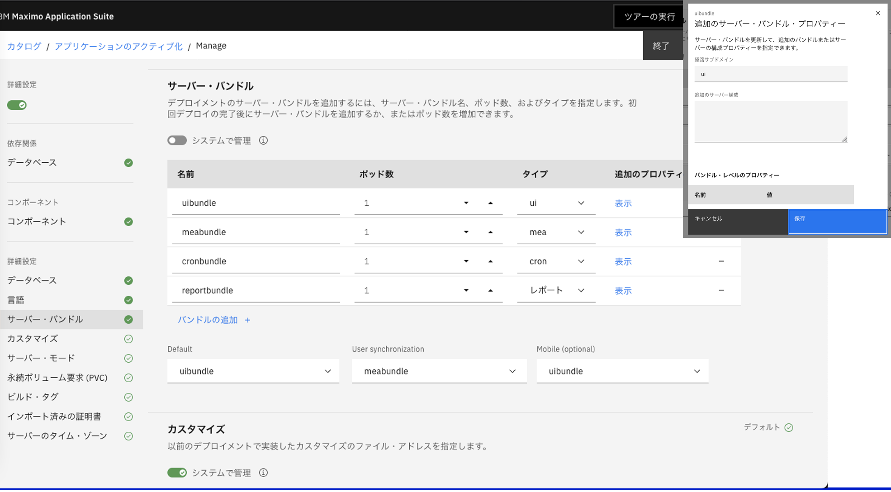

### 7.永続ボリュームの要求(PVC)
システムで管理をOFFにし、以下の4つを設定


* PVC名:永続ボリューム作成のPVC作成時に指定したもの				当手順の例ではmanage-doc-pvc

* ボリューム名: 永続ボリューム作成で、作成したPVCの定義から確認したPV名			当手順書の例ではpvc-a4539d62-a125-48bf-9579-8e71e17879d5

* サイズ:永続ボリューム作成のPVC作成時に指定したもの				当手順の例では100Gi

* マウントパス:doclinksで指定するパス                                      当手順の例では/mnt/doclinks

* ストレージクラス名:永続ボリューム作成のPVC作成時に指定したもの				当手順の例ではibmc-file-retain-gold-gid

</InlineNotification>

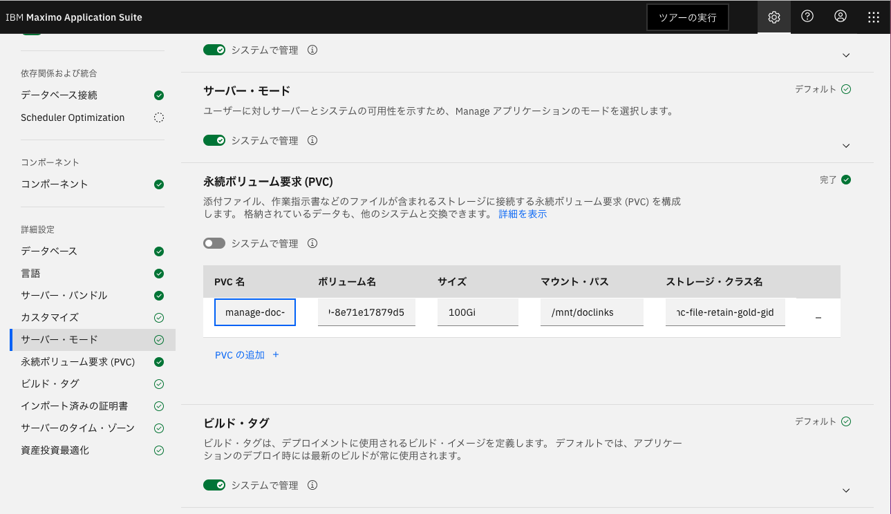

### 8.アクティブ化
1. 右上のアクティブ化ボタンから、Manageをアクティブ化

	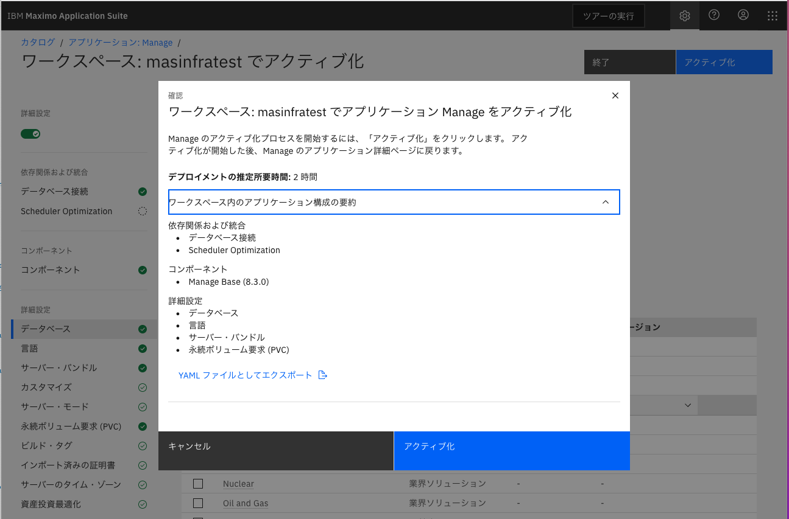

	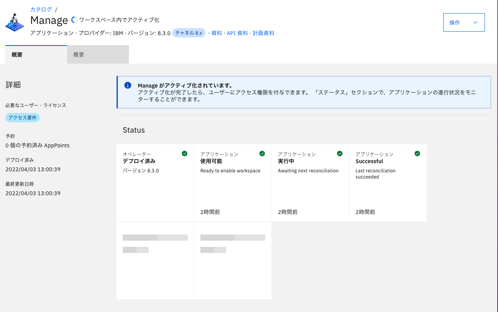

	アクティブ化には時間がかかる(2時間程度、またはもっと長い場合もある)

	アクティブ化が正常に進行しているかどうかの確認方法											
		OpenShift Webコンソール > WorkLoads > Pods > project:mas-(MASのワークスペース名)-manage のpod作成日時を確認

		アクティブ化押下以降に、admin-build-config, ui-~~,mea~~,cron~~,report~~が順に作成され、										
		(MASのワークスペース名)-manage-maxinst-~~というPodが作成されれば正常に進行している										
		上記maxinst podの詳細画面からログを監視する										


	最終的にこのような表示になれば、アクティブ化完了

	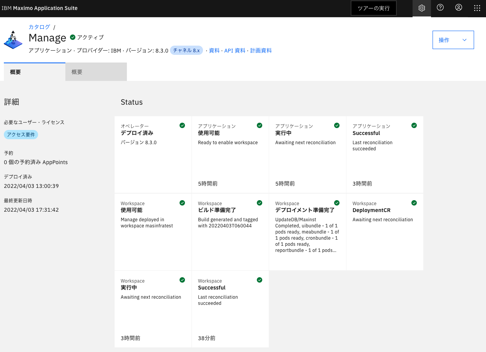

### 9.maxadminユーザー(Manage用ユーザー)に権限を付与
Manageのデプロイが完了した時点で、MAS coreに自動的にmaxadminユーザーが作成されます。

管理権限の付与、パスワード変更のためこの手順を実施します。

1. MASAdminのロケール変更をする
   
	ブラウザ言語が日本語の場合、この手順を行う際バグでエラーになる箇所があるので、右上Profile > プロファイルの管理 > 言語と地域のロケールを英語に変更しておきます。

	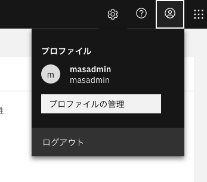

	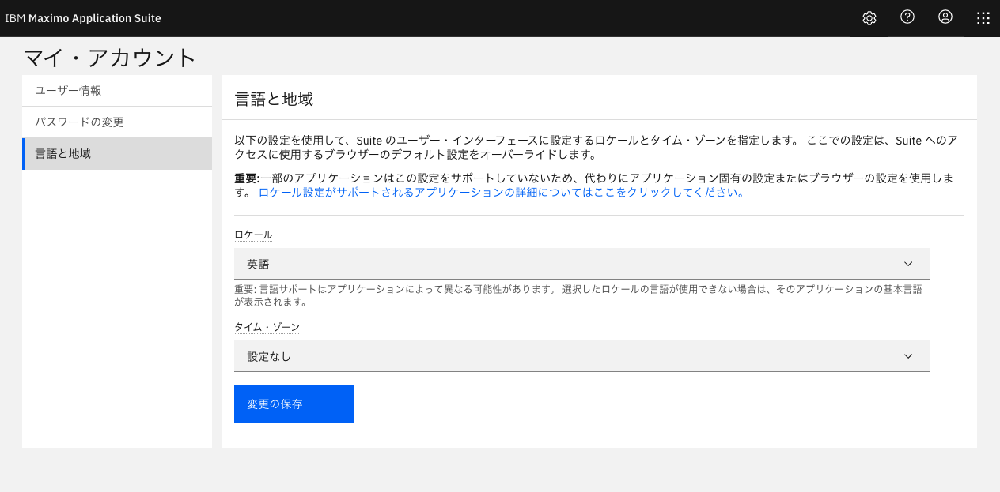

	保存するとUIが英語に変更されます。

	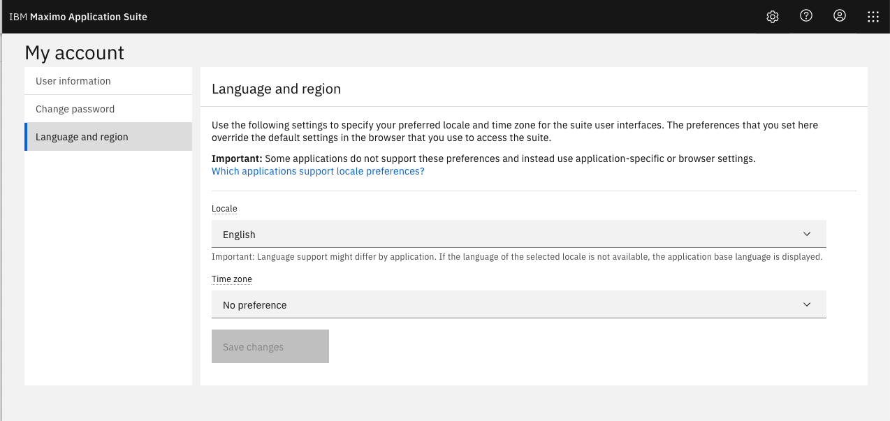

2. 右上の設定アイコン(Administration) > Users から「maxadmin」を選択

	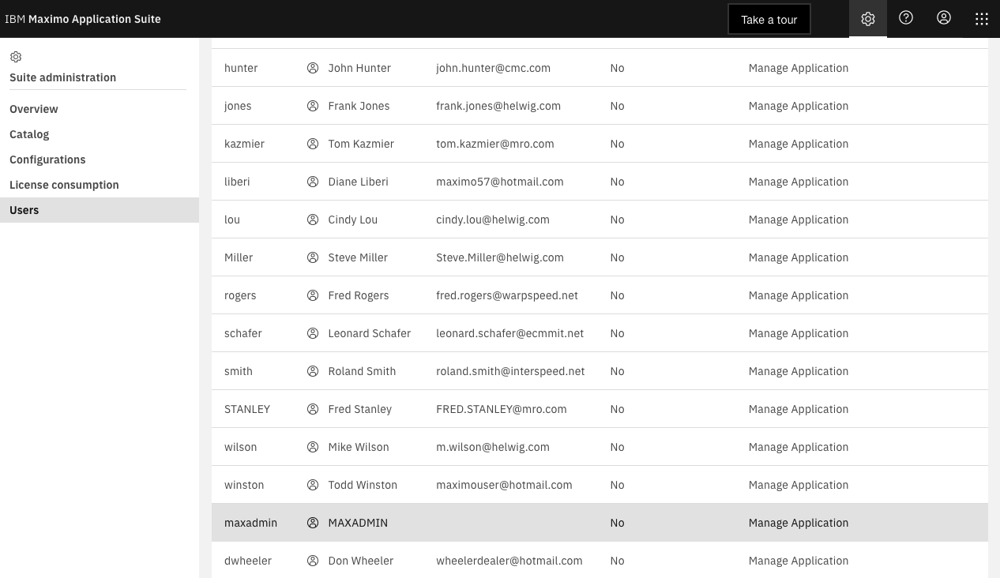

3. 編集アイコン(鉛筆マーク)をクリックし、以下の画像のように設定して「Save changes」

   * メールアドレス：任意のものを入力

   * Entitlement:ApplicationとAdministrationをPremiumに

   * Access:System configrationとUser managementの両方にチェック

   * パスワードは、Replace forgotten passwordから新しいものを設定できます。

	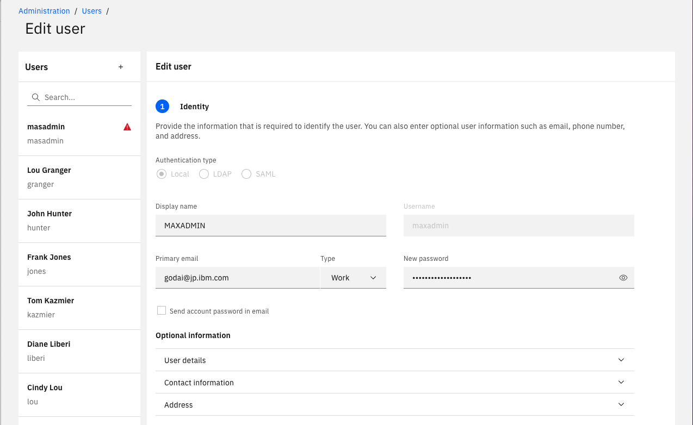

	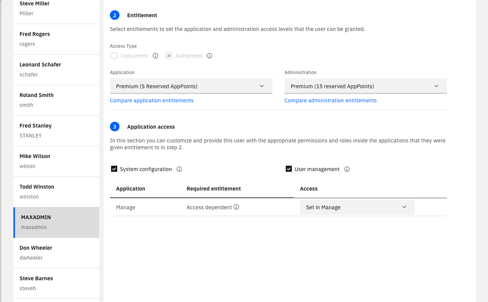

	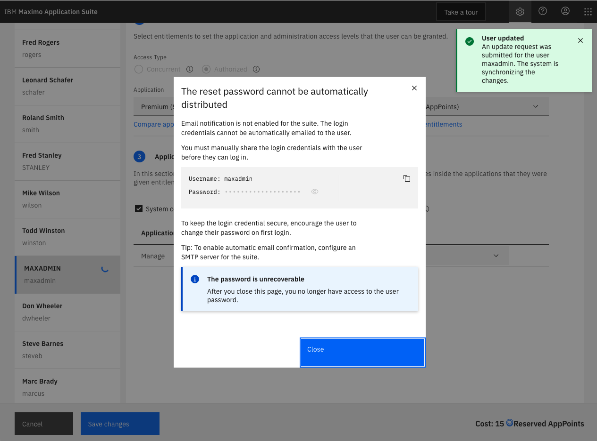

1. maxadminユーザーでログインし直すと、Manageを開くことができるようになります。これで導入は終了です。お疲れさまでした。添付ファイルのダウンロード機能を利用する場合は、次項の設定を行ってください。

	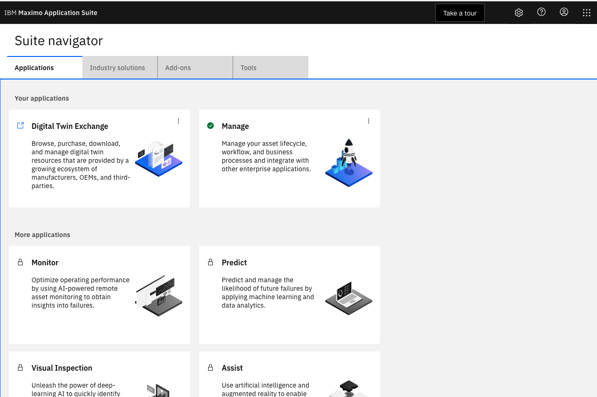

	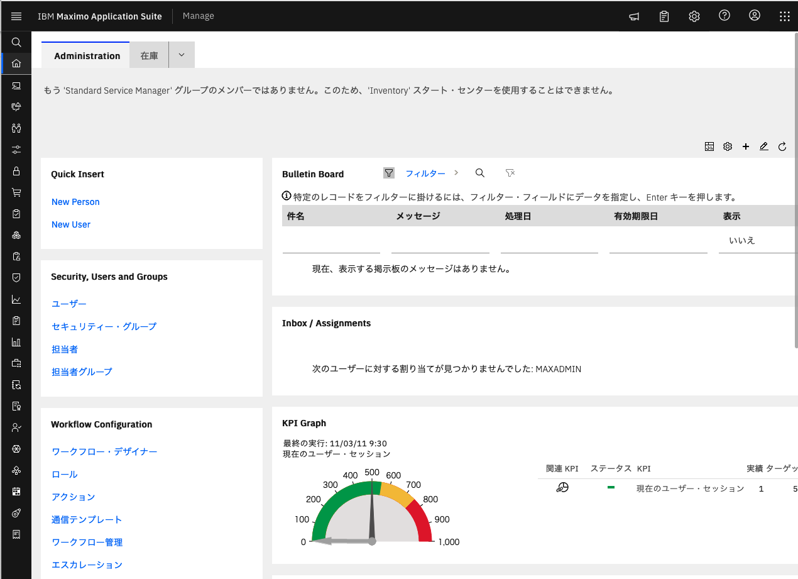

### 次項
- [14_添付ファイルダウンロードの設定](../14_attach/index.md)
