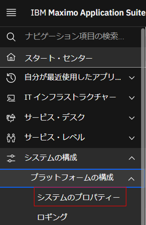
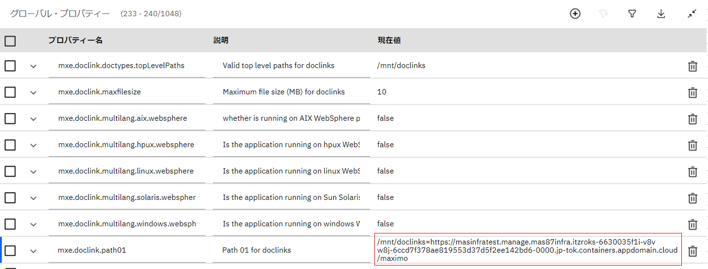
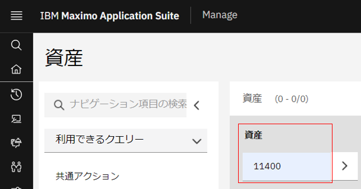
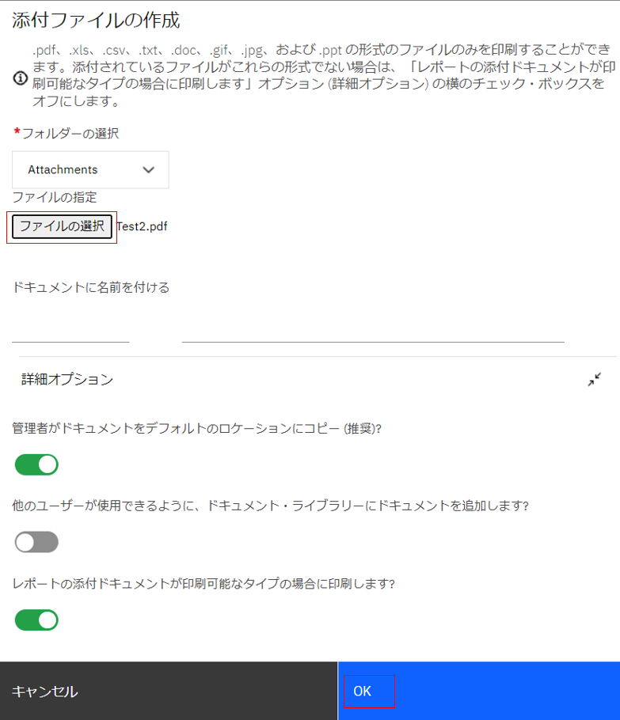

## 14.添付ファイルダウンロードの設定

Manageの資産(Assets)アプリケーションを例に、添付ファイルのダウンロード機能を利用するために必要な設定について記載します。資産以外のアプリケーションの場合でも、ダウンロード機能を利用するためには、同様の設定が必要です。

### 1. システムプロパティの設定

ここでは、以下のようにManageのシステムプロパティを設定します。
| プロパティ名       |  グローバル値 |
| ------------- | ----- |
mxe.doclink.doctypes.topLevelPaths  | /mnt/doclinks
mxe.doclink.path01  |  /mnt/doclinks=ManageのURL/maximo<br>例 /mnt/doclinks=`https://masinfratest.manage.mas87infra.itzroks-6630035f1i-v8vw8j-6...6-0000.jp-tok.containers.appdomain.cloud/maximo`
mxe.doclink.securedAttachment  | true
mxe.doclink.securedAttachmentDebug | true

Manageのメニュー システムの構成 > プラットフォームの構成 > システムのプロパティを開いてください。


#### 1-1.mxe.doclink.doctypes.topLevelPathsプロパティの設定
mxe.doclink.doctypes.topLevelPathsを探して、グローバル値に``/mnt/doclinks``を設定


プロパティの保存を押下


CLIからPodを再起動
```
oc scale deployment mas87infra-masinfratest-uibundle -n mas-mas87infra-manage --replicas=0
oc scale deployment mas87infra-masinfratest-uibundle -n mas-mas87infra-manage --replicas=2
```
※Pod名については、OpenShift Webコンソール > ワークロード > Podにて、プロジェクト:mas-mas87infra-manageのmas87infra-masinfratestでフィルターして確認。名前にuibundleを含むPod。 (下のOpenShift Webコンソールのキャプチャも参照)


OpenShift Webコンソールより、Podの再起動が完了したことを確認。ステータスがRunning、準備状態が2/2になったらPodの再起動は完了している。


システムプロパティの現在値にグローバル値が反映されていることを確認


#### 1-2.mxe.doclink.path01プロパティの設定
mxe.doclink.path01を探して、グローバル値に`` /mnt/doclinks=ManageのURL/maximo``を設定
ここでは例として、/mnt/doclinks=https://masinfratest.manage.mas87infra.itzroks-6630035f1i-v8vw8j-6...6-0000.jp-tok.containers.appdomain.cloud/maximoを設定する。各自のManageのURLに読み替えること。


プロパティの保存を押下


実行中のリフレッシュを押下


OKを押下


現在値に反映されていることを確認


#### 1-3.mxe.doclink.securedAttachmentおよびmxe.doclink.securedAttachmentDebugプロパティの設定
mxe.doclink.securedAttachmentを探して、グローバル値に``true``を設定
グローバル値にtrueを設定


プロパティの保存を押下


実行中のリフレッシュを押下


現在値に反映されていることを確認


mxe.doclink.securedAttachmentDebugも同様の手順でグローバル値に``true``を設定


### 2.資産アプリケーションの設定

#### 2-1.文書フォルダーのパスを設定
Manageのナビゲーションより資産アプリケーションを選択


追加アクション - 添付ライブラリー/フォルダー - フォルダーの管理 を選択


デフォルトのファイル・パスに /mnt/doclinks/Attachments を設定し、OKを押下


#### 2-2.添付ファイルのアップロードの確認
資産を選択して、Enterを押下。ここでは 11400 を例に説明する。


添付アイコンを押下して、新規ファイルの追加を選択


ファイルの選択ボタンより、添付するファイルを選択して、OKを押下


OpenShift Webコンソールより、永続ボリューム要求(manage-doc-pvc)を確認すると、仕様済みのサイズが増えていることが分かる。


#### 2-3.添付ファイルのダウンロードの確認
添付リンクを押下して、添付したファイルのドキュメント名を押下


添付したファイルがダウンロードされて、正常に閲覧できることを確認
