## 参考.SQLクライアントからの接続

この章では外部からSQLクライアントから接続する設定方法について記載します。

SQLクライントとしては、OSSの dbeaver community edtionを例に記載します。

https://dbeaver.io/

### 1. 外部から接続するポート番号の確認
1. Openshift Webコンソール > サービスを開く
   
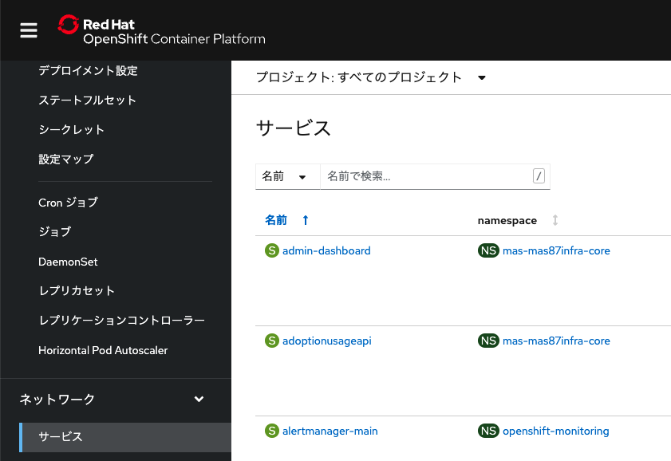

1. db2uのプロジェクトを指定し、「db2」でフィルタし、末尾が「db2u-engn-svc」のサービスを選択

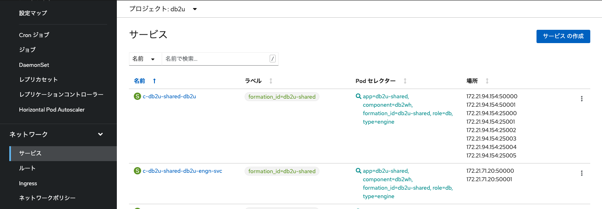

2. 「クラスター外からアクセス可能」となっているポートを確認(当手順では 32596)
   

### 2. 外部から接続するIPアドレスの確認

1. Openshiftのクラスターの管理画面を開き、Ingressサブドメインを確認
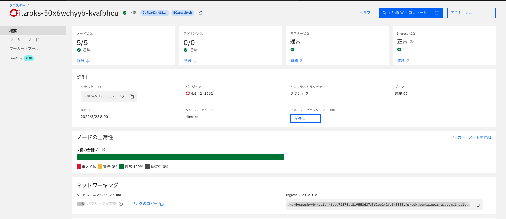

2. Ingressサブドメインに対してpingコマンドをうち、IPアドレスを確認

### 3. DB名の確認
1. Openshift Webコンソール > 設定マップを開く

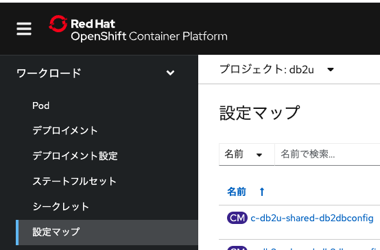

2. db2uのプロジェクトを指定し、「c-db2u-shared-db2uconfig」を選択

3. 「データ」の db2u-var からDB名を確認する(当手順では BLUDB)

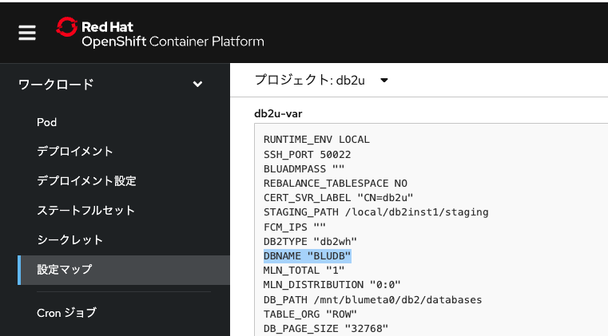

### 4. DBのCredentialの確認
1. Openshift Webコンソール > シークレットを開く
   
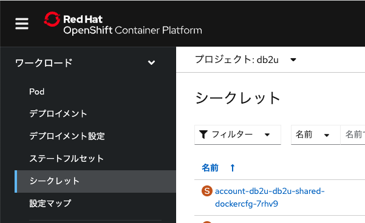

2. すべてのプロジェクトを指定し、「jdbc」でフィルタし、末尾が「jdbc-db2u-shared-credentials」を選択

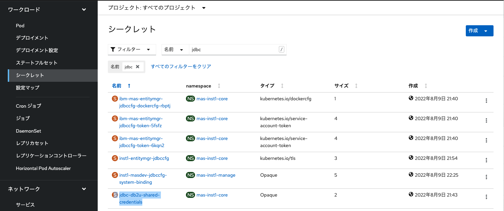

3. 「データ」からusernameとpasswordを確認

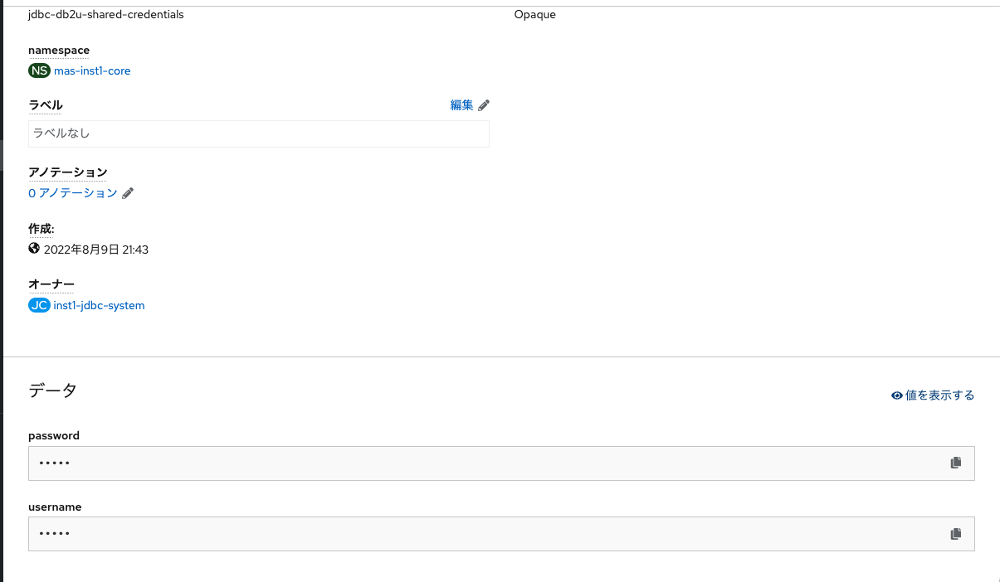
   

### 5. SQLクライアントから接続

1. Dbeaver ( https://dbeaver.io/ )を起動し,[データーベース]-[新しい接続]を選択
   
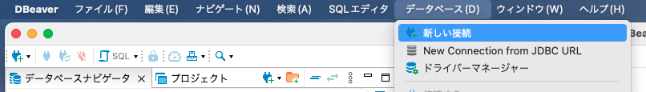

2. [DB2LUW]を選択して次へをクリック

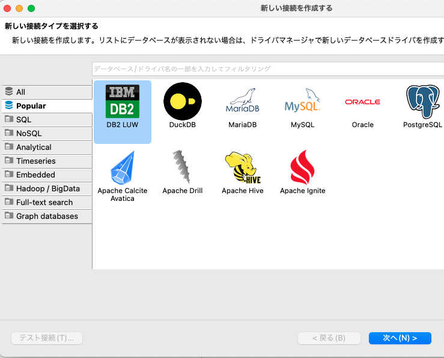

3. 各項目を以下のように設定し、「終了」をクリック
* Host:手順2で確認したIPアドレスを指定

* Port:手順1で確認したポート番号を指定 			当手順書の例では32191

* Database:手順3で確認したDB名を指定				当手順書の例では「BLUDB」

* ユーザー名:手順4で確認したユーザ名を指定

* パスワード:手順4パスワードを指定

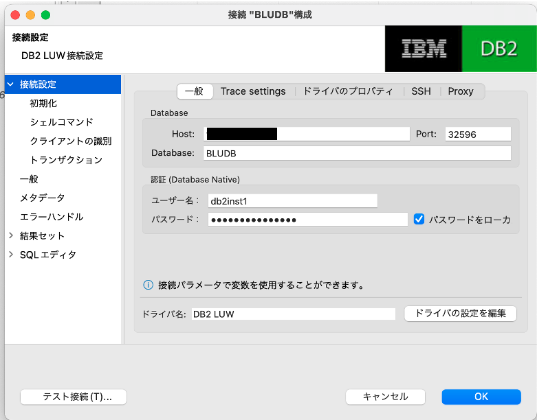

1. DBに接続されたことを確認
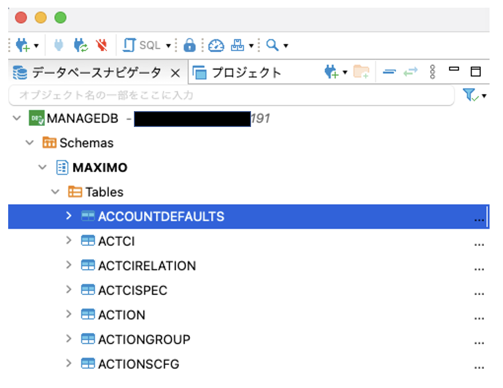

### 前項
- [ 12_参考.添付ファイルダウンロードの設定(今後更新予定) ](../12_attach/index.md)

### 次項
- [ 51_参考.DB2インスタンスへのアクセス ](../51_dbinstance/index.md)
