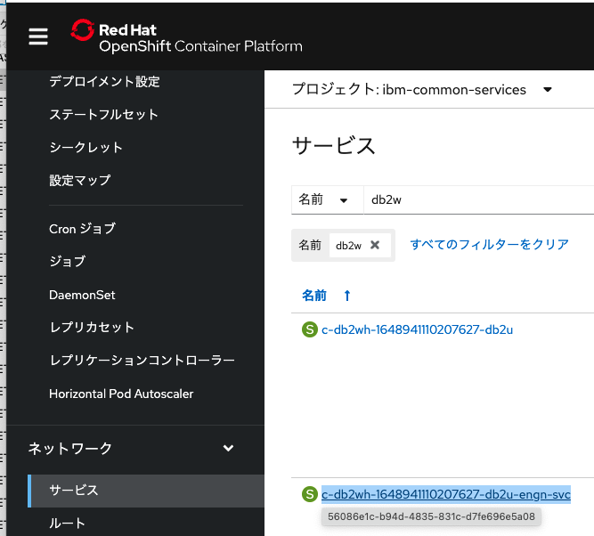
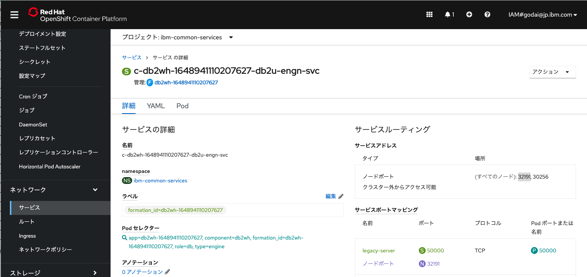
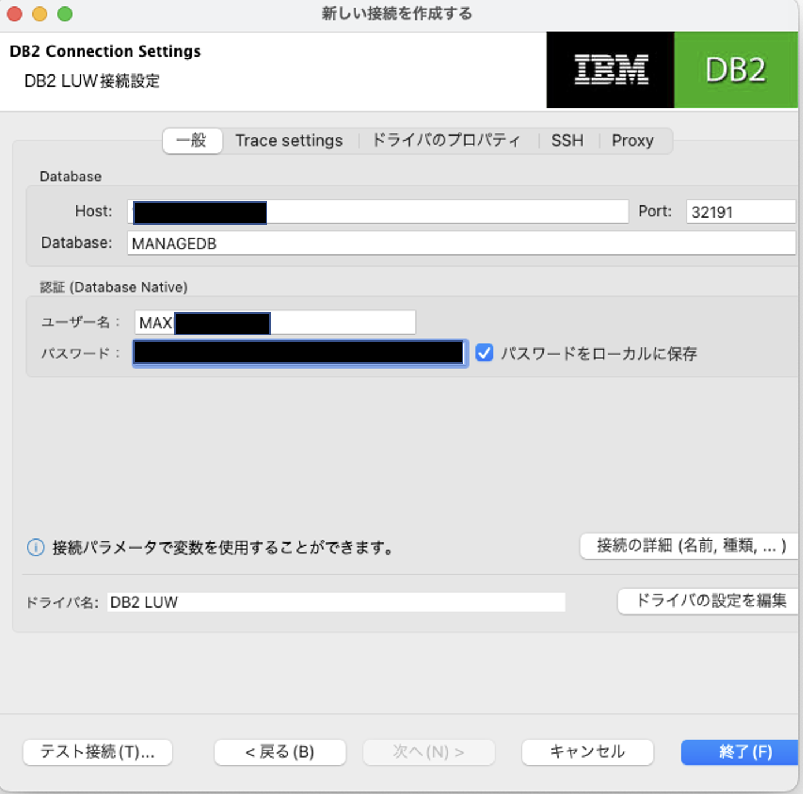

## 参考.SQLクライアントからの接続

この章では外部からSQLクライアントから接続する設定方法について記載します。

SQLクライントとしては、OSSの dbeaver community edtionを例に記載します。

https://dbeaver.io/

### 1. 外部から接続するポート番号の確認
1. Openshift Webコンソール > サービスを開く
   

2. cp4dのプロジェクトを指定し(当手順では ibm-common-services)、「db2w」でフィルタし、末尾が「db2u-engn-svc」のサービスを選択

3. 「クラスター外からアクセス可能」となっているポートを確認(当手順では 32191)
   

### 2. 外部から接続するIPアドレスの確認

1. Openshiftのクラスターの管理画面を開き、Ingressサブドメインを確認

2. Ingressサブドメインに対してpingコマンドをうち、IPアドレスを確認

### 3. SQLクライアントから接続

1. Dbeaver ( https://dbeaver.io/ )を起動し,[データーベース]-[新しい接続]を選択
   

2. [DB2LUW]を選択して次へをクリック

3. 各項目を以下のように設定し、「終了」をクリック
* Host:手順2で確認したIPアドレスを指定

* Port:手順1で確認したポート番号を指定 			当手順書の例では32191

* Database:「10_DB2warehouseのインストールと構成」で作成したDB名を指定				当手順書の例では「MANAGEDB」

* ユーザー名:「10_DB2warehouseのインストールと構成」で作成したユーザ名を指定

* パスワード:「10_DB2warehouseのインストールと構成」で作成したパスワードを指定

4. DBに接続されたことを確認

