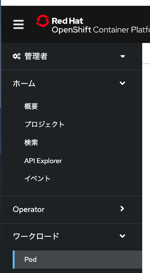
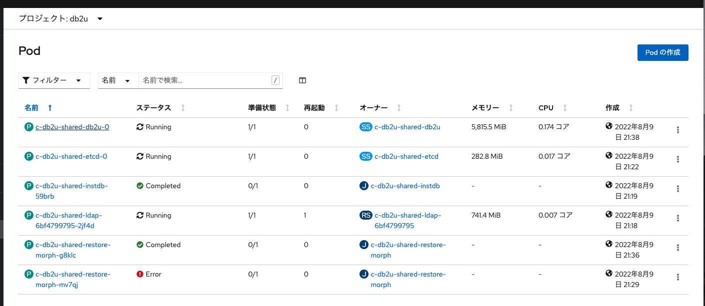
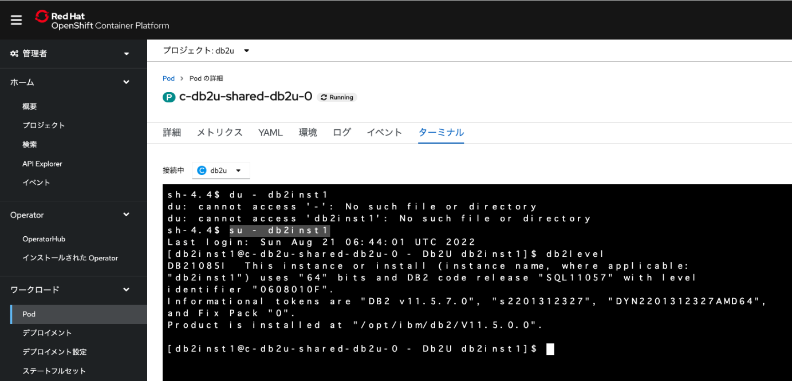

### DB2インスタンスへのアクセス

## 1.Db2のインスタンスへのアクセス

1. Openshift Webコンソール > Podを開く



2. プロジェクトで「db2u」を指定し、末尾が「db2u-0」のPodを開く


3. ターミナルタブを開く。 以下のコマンドを発行し、db2コマンドが利用可能なことを確認する

    ```bash
    su - db2inst1
    db2level
    ```




### 前項
- [ 50_参考.SQLクライアントの接続 ](../50_dbclient/index.md)

### 次項
- [ 90_FAQ ](../90_faq/index.md)
