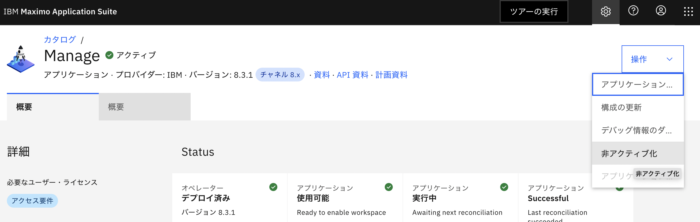
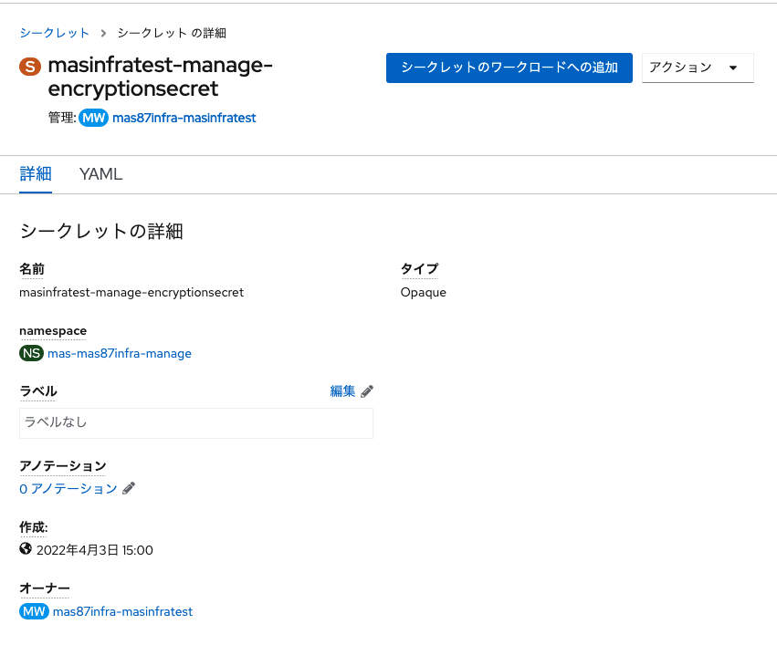
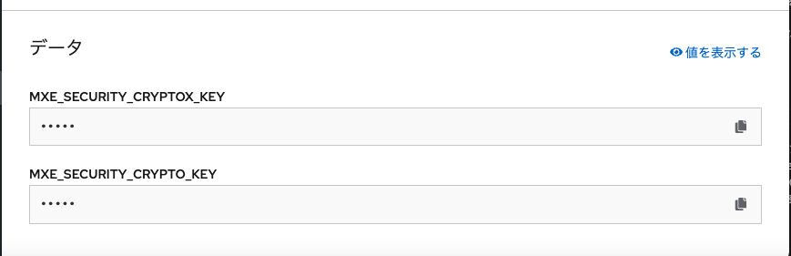
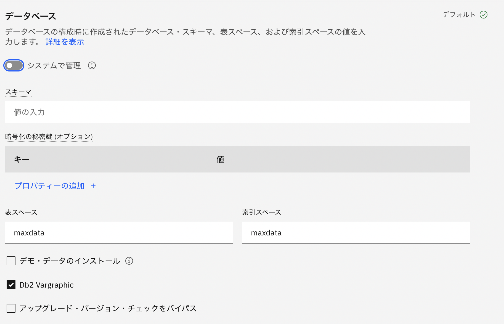

## FAQ

この章ではFAQについて記載します。

### 1.Manageの非アクティブ化について
Manageインスタンスを完全に削除する必要がある場合、「非アクティブ化」を実行します。

※構成を変更するだけの場合は、非アクティブ化は実施しないでください。「1.Manageの構成変更について」を参照ください。

「非アクティブ化」はMAS スイート管理 > カタログ > Manage を開き、操作 > 構成の更新 から実施できます。

非アクティブ化はDBの情報は残りますが、すべての構成が失われます。
また、DBは暗号化されているので、もし同じDBの情報を利用して、再度アクティブ化する場合、あらかじめ暗号化キーのコピーを安全な場所に保管しておく必要があります。

暗号化キーは、以下の操作で確認できます。

Openshiftコンソール > シークレット > <workspaceId>-manage-encryptionsecret を開き「MXE_SECURITY_CRYPTOX_KEY」と「MXE_SECURITY_CRYPTO_KEY」の値を控えておきます。

再度アクティブ化する場合、「暗号化の秘密鍵」で上記で保存した「MXE_SECURITY_CRYPTOX_KEY」と「MXE_SECURITY_CRYPTO_KEY」を指定します。

### 前項
- [ 51_参考.DB2インスタンスへのアクセス ](../51_dbinstance/index.md)

### 次項
- [ 参考.用語解説 ](../99_yougo/index.md)